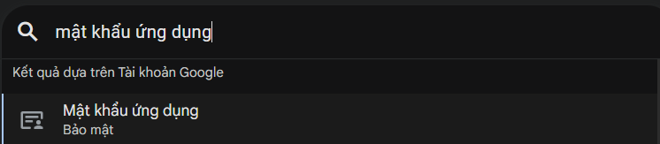
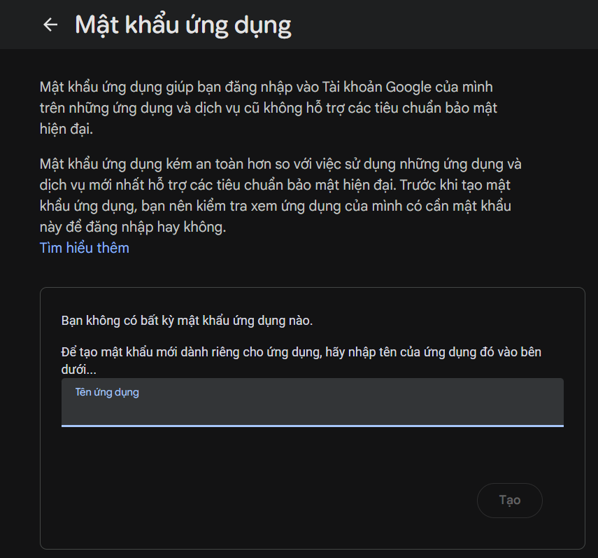

# Hướng dẫn tạo Google App Password để cấu hình SMTP

Tài liệu này cung cấp các bước tạo App Password từ tài khoản Google, nhằm cấp quyền cho ứng dụng thực hiện chức năng gửi email qua SMTP server.

## Yêu cầu bắt buộc
Tài khoản Google được sử dụng để gửi email **phải được bật Xác minh 2 bước (2-Step Verification)**.

## Các bước thực hiện

1. Truy cập vào trang quản lý [Tài khoản Google](https://myaccount.google.com/)

2. Đăng nhập vào tài khoản email sẽ được dùng làm địa chỉ gửi thư

3. Trên thanh công cụ tìm kiếm ở trên cùng, nhập từ khóa **App passwords** (Mật khẩu ứng dụng) và chọn kết quả tương ứng
   


4. Tại ô **App name** (Tên ứng dụng), nhập tên ứng dụng để dễ dàng quản lý (ví dụ: `Mail Scheduler App`) và sau đó nhấn **Create** (Tạo)
   


5. Hệ thống sẽ hiển thị một bảng chứa mật khẩu gồm 16 chữ cái

   **Lưu ý quan trọng:** Sao chép mật khẩu này và lưu vào file cấu hình môi trường của dự án. Mã này chỉ được hiển thị một lần duy nhất

## Cấu hình vào dự án
Sau khi lấy được mã xác thực, tiến hành cập nhật các thông số sau vào file cấu hình SMTP:
```properties
# resource/application.properties
mail.username=yourEmail
mail.password=yourAppPassword
```