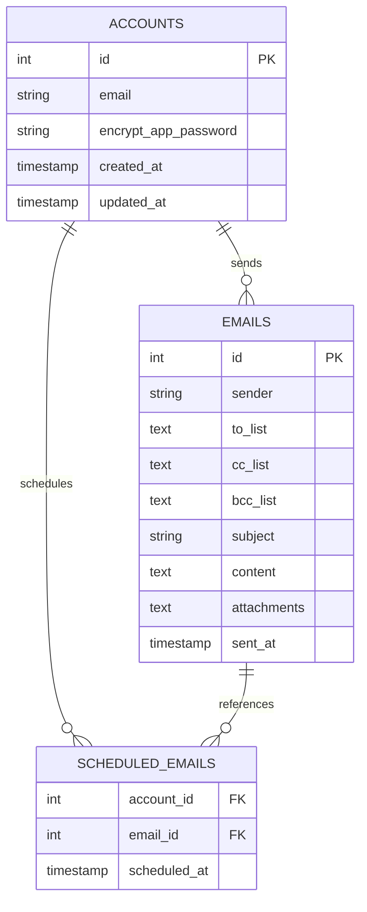
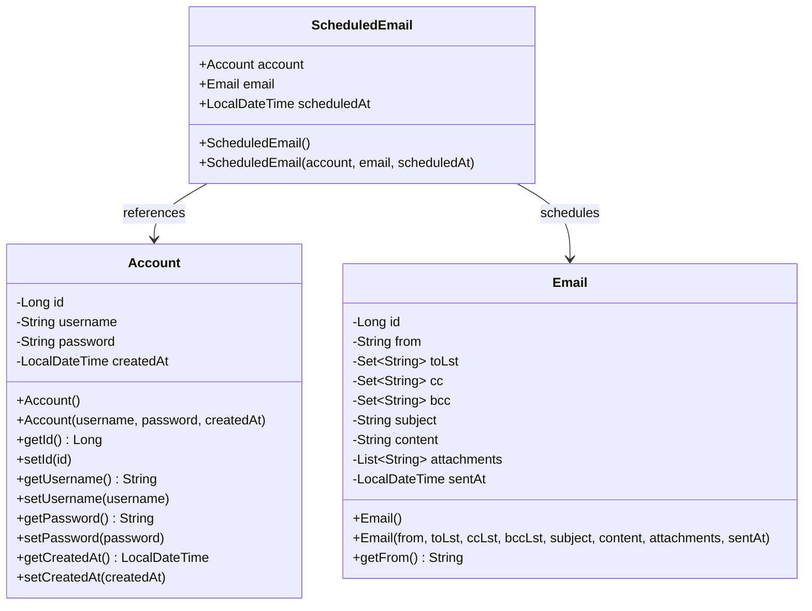

```mermaid
erDiagram
    ACCOUNTS ||--o{ EMAILS : sends
    ACCOUNTS ||--o{ SCHEDULED_EMAILS : schedules
    EMAILS ||--o{ SCHEDULED_EMAILS : references

    ACCOUNTS {
        int id PK
        string email
        string encrypt_app_password
        timestamp created_at
        timestamp updated_at
    }

    EMAILS {
        int id PK
        string sender
        text to_list
        text cc_list
        text bcc_list
        string subject
        text content
        text attachments
        timestamp sent_at
    }

    SCHEDULED_EMAILS {
        int account_id FK
        int email_id FK
        timestamp scheduled_at
    }
```

```mermaid
classDiagram
    class Account {
        -Long id
        -String username
        -String password
        -LocalDateTime createdAt
        +Account()
        +Account(username, password, createdAt)
        +getId() Long
        +setId(id)
        +getUsername() String
        +setUsername(username)
        +getPassword() String
        +setPassword(password)
        +getCreatedAt() LocalDateTime
        +setCreatedAt(createdAt)
    }

    class Email {
        -Long id
        -String from
        -Set~String~ toLst
        -Set~String~ cc
        -Set~String~ bcc
        -String subject
        -String content
        -List~String~ attachments
        -LocalDateTime sentAt
        +Email()
        +Email(from, toLst, ccLst, bccLst, subject, content, attachments, sentAt)
        +getFrom() String
    }

    class ScheduledEmail {
        +Account account
        +Email email
        +LocalDateTime scheduledAt
        +ScheduledEmail()
        +ScheduledEmail(account, email, scheduledAt)
    }

    ScheduledEmail --> Account : references
    ScheduledEmail --> Email : schedules
```