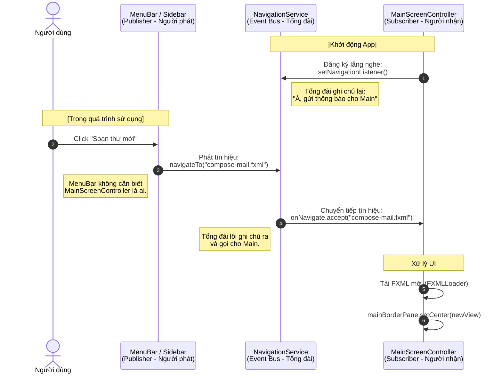

**Publisher - Subscriber** (Người phát - Người đăng ký), hay còn gọi là kiến trúc **Event Bus**.

Bạn có thể tưởng tượng `NavigationService` chính là một **Tổng đài viên**.
* **MainScreenController** là anh thợ chuyên thay màn hình, lúc nào cũng dặn dò: *"Có ai gọi thay màn hình thì hú tôi nhé"*.
* **MenuBar / Sidebar** là khách hàng, chỉ biết nhấc máy gọi Tổng đài: *"Tôi muốn xem trang Soạn Thư"*. Khách hàng không hề biết anh thợ tên gì hay ở đâu.

Dưới đây là sơ đồ trực quan hóa bằng Mermaid để bạn dễ hình dung dòng chảy của dữ liệu:



### Tại sao cơ chế này lại "thần kỳ" và tối ưu?

1. **Khử sự phụ thuộc (Decoupling):** Như bạn thấy trong sơ đồ, `MenuBar` (Publisher) gửi tín hiệu đi nhưng không bao giờ trỏ trực tiếp đến `MainScreenController` (Subscriber). Nhờ mũi tên đi qua `NavigationService`, bạn có thể xóa hẳn file `MainScreenController` đi, viết lại một file mới, mà code ở `MenuBar` **không cần phải sửa một dòng nào**.
2. **Quyền lực của Singleton:** Vì `NavigationService` dùng mẫu thiết kế Singleton (chỉ có 1 bản sao duy nhất tồn tại trong suốt quá trình app chạy), nên dù bạn gọi `NavigationService.getInstance()` ở hàng trăm Controller khác nhau, chúng đều kết nối về đúng **một cái Tổng đài duy nhất**. Không có chuyện tín hiệu bị thất lạc.
3. **Mở rộng dễ dàng (Scalability):** Giả sử sau này bạn muốn khi đổi màn hình, app phải tự động phát một tiếng "Bíp" hoặc lưu lại lịch sử (History) để làm nút Back. Bạn chỉ cần sửa logic đúng ở một chỗ là bên trong hàm `MapsTo()` của `NavigationService`.

## Triển khai để truyền dữ liệu

### Bước 1: Tạo Interface chuẩn hóa việc nhận dữ liệuliệu

Tạo một interface để đánh dấu những Controller nào "muốn nhận dữ liệu" khi được mở lên.

**`DataReceiver.java` (Nằm trong package util hoặc controller)**
```java
package nlu.fit.soft.gr5.precisionMail.util;

public interface DataReceiver {
    // Hàm này sẽ được gọi ngay sau khi file FXML load xong
    void receiveData(Object data);
}
```

### Bước 2: Nâng cấp "Tổng đài" (NavigationService)

Chúng ta sửa lại hàm `MapsTo` để nó có thể nhận thêm một tham số thứ 2: `payload` (Gói dữ liệu đi kèm). Đồng thời tạo một class nội bộ `NavEvent` để gói gọn thông tin.

**`NavigationService.java`**
```java
package nlu.fit.soft.gr5.precisionMail.service;

import java.util.function.Consumer;

public class NavigationService {

    private static NavigationService instance;
    private Consumer<NavEvent> onNavigate; // Đổi từ String sang NavEvent

    private NavigationService() {}

    public static NavigationService getInstance() {
        if (instance == null) {
            instance = new NavigationService();
        }
        return instance;
    }

    public void setNavigationListener(Consumer<NavEvent> listener) {
        this.onNavigate = listener;
    }

    // Nạp chồng phương thức (Overload): Chỉ chuyển trang, không kèm dữ liệu
    public void navigateTo(String fxmlFileName) {
        navigateTo(fxmlFileName, null);
    }

    // Chuyển trang CÓ kèm dữ liệu
    public void navigateTo(String fxmlFileName, Object payload) {
        if (onNavigate != null) {
            onNavigate.accept(new NavEvent(fxmlFileName, payload));
        }
    }

    // Class nội bộ để bọc dữ liệu
    public static class NavEvent {
        public final String fxml;
        public final Object payload;

        public NavEvent(String fxml, Object payload) {
            this.fxml = fxml;
            this.payload = payload;
        }
    }
}
```

### Bước 3: Cập nhật người chuyển tiếp (MainScreenController)

Đây là bước quan trọng nhất. `MainScreenController` sẽ lấy Controller của cái màn hình vừa được load lên (ví dụ: `ReadMailController`). Nếu Controller đó có cài đặt interface `DataReceiver`, nó sẽ "tiêm" dữ liệu vào.

**`MainScreenController.java`**
```java
package nlu.fit.soft.gr5.precisionMail.controller;

import javafx.fxml.FXML;
import javafx.fxml.FXMLLoader;
import javafx.scene.Parent;
import javafx.scene.layout.BorderPane;
import nlu.fit.soft.gr5.precisionMail.service.NavigationService;
import nlu.fit.soft.gr5.precisionMail.util.DataReceiver;

import java.io.IOException;

public class MainScreenController {

    @FXML
    private BorderPane mainBorderPane;

    @FXML
    public void initialize() {
        // Lắng nghe sự kiện bọc trong NavEvent
        NavigationService.getInstance().setNavigationListener(event -> {
            changeCenterView(event.fxml, event.payload);
        });
    }

    private void changeCenterView(String fxmlFileName, Object payload) {
        try {
            FXMLLoader loader = new FXMLLoader(getClass().getResource("/nlu/fit/soft/gr5/precisionMail/view/include/" + fxmlFileName));
            Parent newView = loader.load();
            
            // ĐIỂM MẤU CHỐT Ở ĐÂY:
            // 1. Lấy controller của màn hình vừa load
            Object controller = loader.getController();
            
            // 2. Kiểm tra xem controller đó có muốn nhận dữ liệu không và dữ liệu có tồn tại không
            if (payload != null && controller instanceof DataReceiver) {
                // Ép kiểu và gọi hàm truyền dữ liệu
                ((DataReceiver) controller).receiveData(payload);
            }

            mainBorderPane.setCenter(newView);
        } catch (IOException e) {
            e.printStackTrace();
        }
    }
}
```

### Bước 4: Ứng dụng thực tế (Gửi và Nhận)

Bây giờ giả sử bạn đang ở màn hình **Hộp thư đến (Inbox)** và người dùng click đúp vào một bức thư. Bạn muốn mở màn hình **Đọc thư (ReadMail)**.

**1. Nơi Gửi (Ví dụ: `InboxController.java`)**
```java
public void onEmailDoubleClick(Email selectedEmail) {
    // Gọi tổng đài, đưa tên trang muốn đến và đưa luôn đối tượng Email
    NavigationService.getInstance().navigateTo("center/read-mail.fxml", selectedEmail);
}
```

**2. Nơi Nhận (`ReadMailController.java`)**
Để nhận được dữ liệu, Controller này chỉ cần `implements DataReceiver`.

```java
import nlu.fit.soft.gr5.precisionMail.util.DataReceiver;
import javafx.scene.control.Label;
// ... các import khác

public class ReadMailController implements DataReceiver {

    @FXML private Label subjectLabel;
    @FXML private Label senderLabel;
    
    private Email currentEmail;

    // Hàm này tự động được MainScreenController gọi và nhét dữ liệu vào
    @Override
    public void receiveData(Object data) {
        if (data instanceof Email) {
            this.currentEmail = (Email) data;
            
            // Đổ dữ liệu lên UI ngay lập tức
            subjectLabel.setText(currentEmail.getSubject());
            senderLabel.setText(currentEmail.getSender());
        }
    }
}
```

### 💡 Tổng kết sức mạnh của luồng này:
Toàn bộ chu trình sẽ chạy như sau:
1. Bạn nhấn vào thư `Email A` ở `InboxController`.
2. `NavigationService` báo cho `MainScreenController`: "Mở trang ReadMail đi, và nhớ mang theo `Email A` này".
3. `MainScreenController` đọc FXML, tạo ra `ReadMailController`.
4. Nhìn thấy `ReadMailController` có gắn bảng `DataReceiver`, `MainScreenController` liền nhét `Email A` vào qua hàm `receiveData()`.
5. Màn hình giữa chuyển sang trang Đọc thư với đầy đủ thông tin nội dung!

Cơ chế này sẽ đi theo bạn trong suốt quá trình xây dựng các ứng dụng lớn, không chỉ riêng JavaFX mà còn trên Android hay các Framework khác.