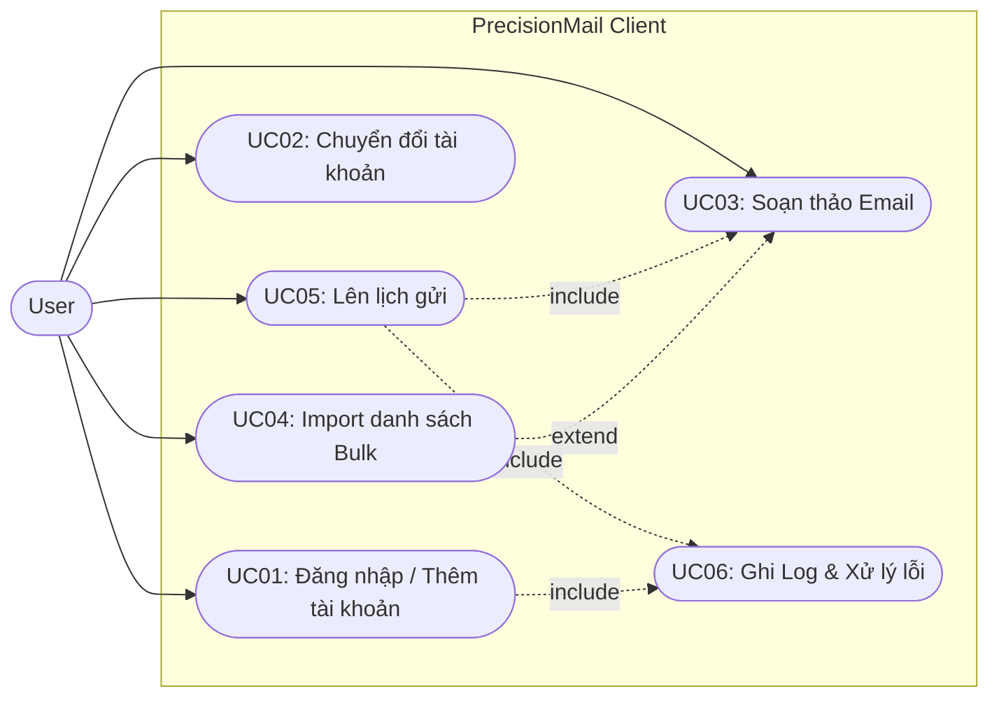
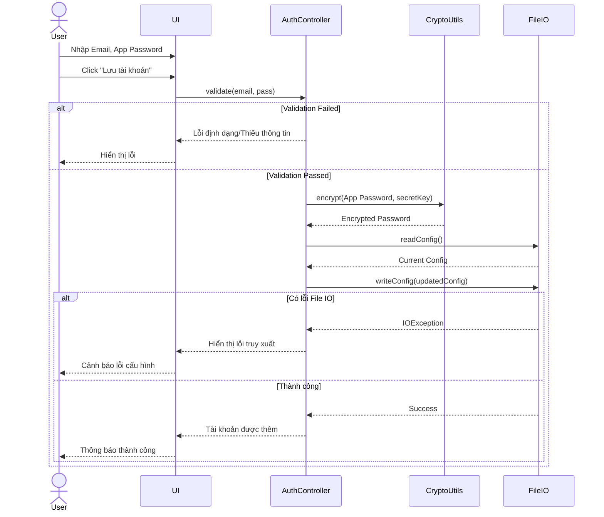
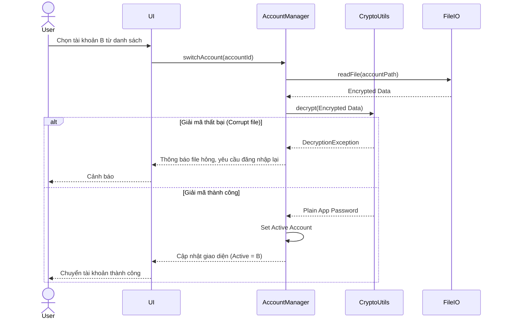
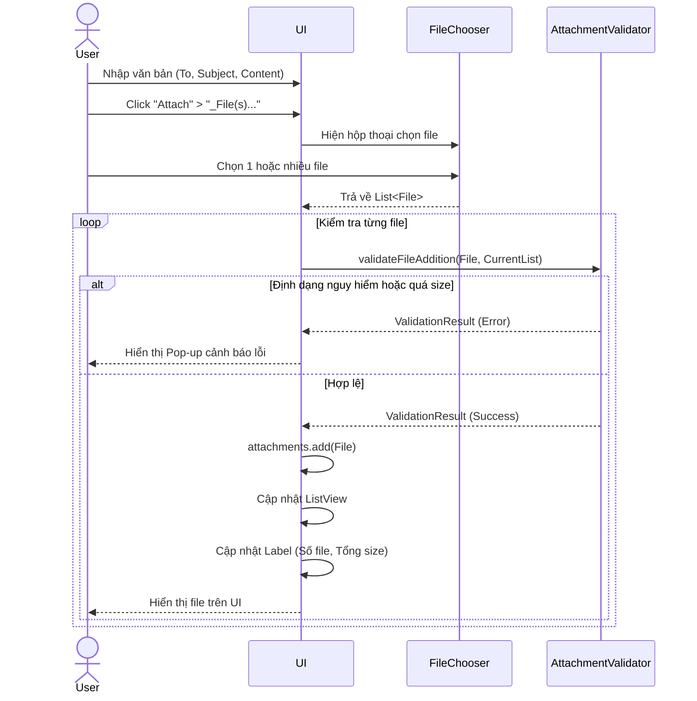
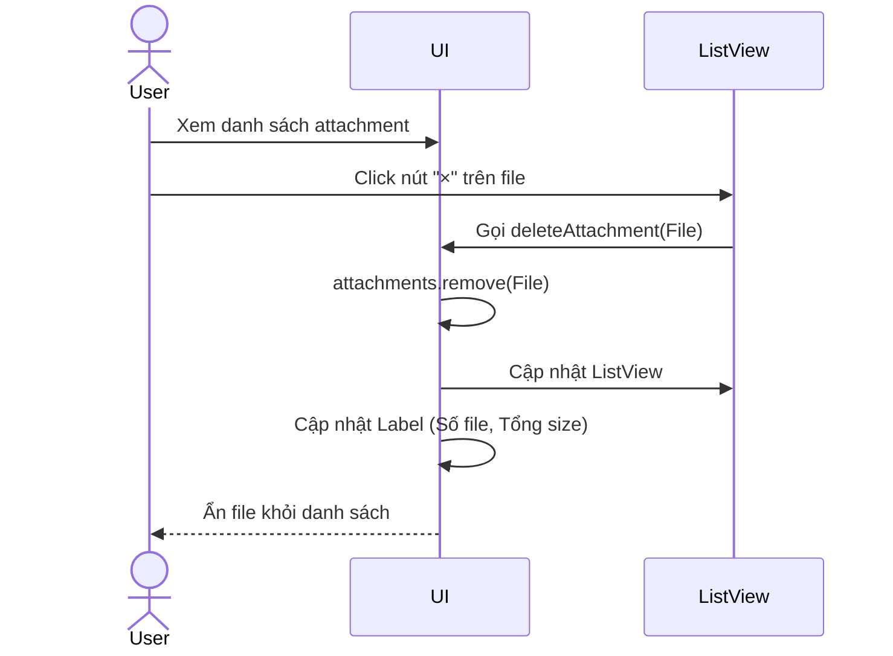
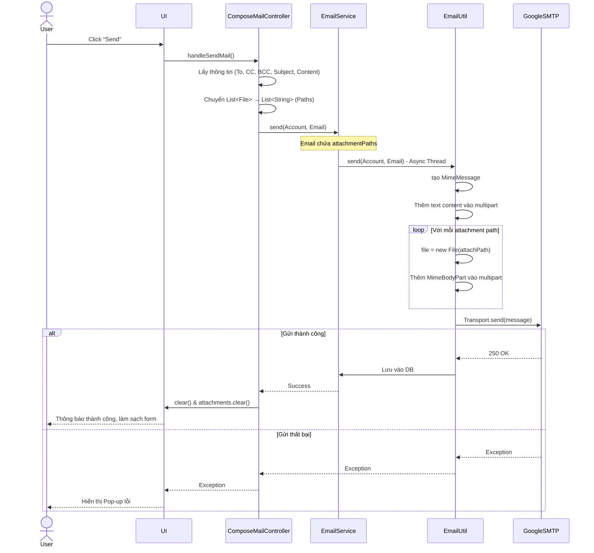
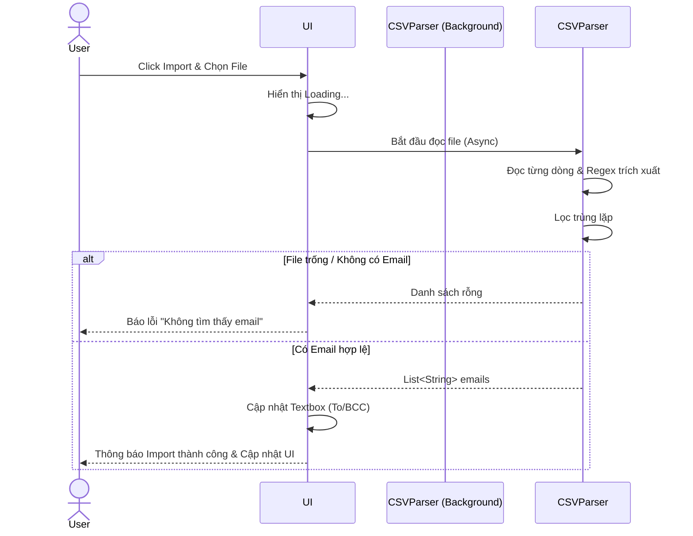
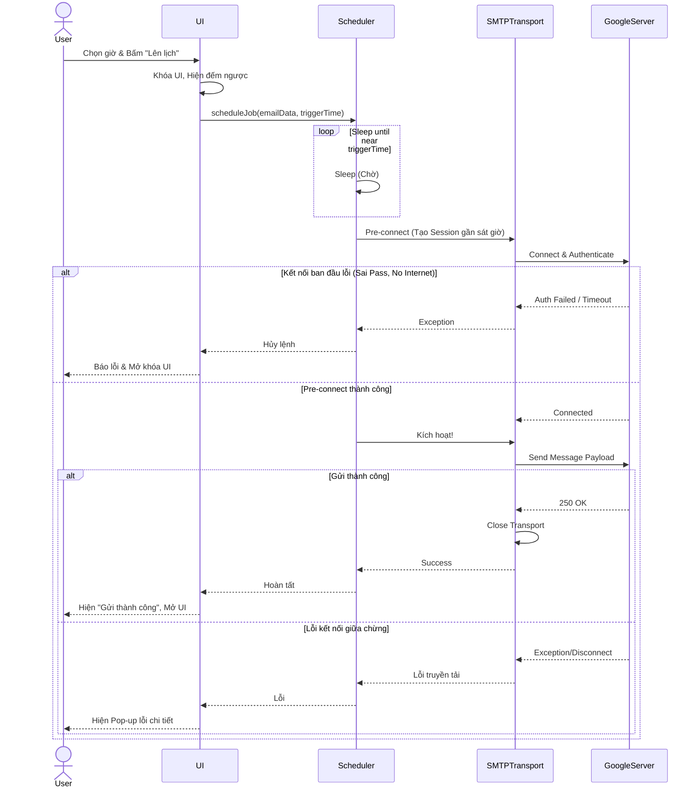

# System Use Cases & Specifications
**Dự án:** Ứng dụng Gửi Email Lên Lịch Độ Trễ Thấp (Low-Latency Scheduled Email Client)

> [!IMPORTANT]
> **QUY TẮC DỰ ÁN (PROJECT CONVENTION):**
> Các Sequence Diagram trong tài liệu này đóng vai trò hướng dẫn triển khai. Tuy nhiên, trong quá trình thực thi, nếu source code thực tế có sự thay đổi về luồng (Flow), tên Component, hay Class (để tối ưu hoặc phù hợp với framework), **Sequence Diagram phải được cập nhật lại ngay lập tức** để đảm bảo tài liệu luôn đồng bộ với mã nguồn thực tế.

## 0. Ghi chú đồng bộ triển khai hiện tại

Các điểm dưới đây phản ánh implementation hiện tại trong source code và được dùng để diễn giải lại các use case/sequence diagram gốc:

- `UC01` và `UC02` hiện không còn lưu account bằng file cấu hình dùng chung. Ứng dụng dùng SQLite (`precisionmail.db`, bảng `accounts`) để lưu account. App Password được mã hóa AES trước khi persist và được giải mã ở tầng service trước khi nạp vào menu chọn account.
- `UC01` hỗ trợ hành vi upsert theo email: nếu account đã tồn tại thì hệ thống cập nhật App Password mới thay vì tạo bản ghi trùng.
- `UC02` hiện được triển khai theo mô hình: tải danh sách account trên background thread, sau đó người dùng chuyển account ngay trên `MenuButton` của màn hình soạn thư. Việc giải mã diễn ra khi nạp danh sách account, không phải tại thời điểm click chọn từng item.
- `UC03` hiện vẫn lưu lịch sử email đã gửi vào file JSON cục bộ (`emails.json`) thông qua `EmailDaoImpl`, chưa lưu vào bảng `emails` trong SQLite như một số sơ đồ/phác thảo cũ ngụ ý.
- `UC04` đã được triển khai trong màn hình soạn thư bằng nút `Import List`. File `.txt`/`.csv` được đọc trên background thread, regex trích xuất email hợp lệ, lọc trùng, rồi điền vào ô đang dùng: ưu tiên `BCC` nếu ô đó đang được focus, ngược lại điền vào `To`.
- `UC05` hiện dùng `ScheduledExecutorService` để chờ đến thời điểm gửi, khóa các trường chính trên UI trong lúc chờ và cho phép người dùng bấm lại nút `Schedule send` để hủy lệnh trước giờ gửi. Implementation hiện tại chưa có cơ chế pre-connect SMTP ngay trước trigger time như sequence diagram gốc; kết nối SMTP vẫn được thiết lập khi job thực thi.

## 1. Use Case Tổng (Overall Use Case Diagram)

Dưới đây là biểu đồ Use Case tổng thể của hệ thống, thể hiện các tương tác chính của người dùng với ứng dụng.

---

## 2. Đặc tả chi tiết và Sequence Diagram

### UC01: Đăng nhập / Thêm tài khoản (Add Account)

**1. Đặc tả**
- **Use Case ID:** UC01
- **Use Case Name:** Đăng nhập / Thêm tài khoản
- **Actor(s):** User
- **Priority:** High
- **Trigger:** Người dùng mở ứng dụng lần đầu hoặc chọn tính năng "Thêm tài khoản mới".
- **Pre-Condition:** Ứng dụng đang chạy bình thường.
- **Post-Condition:** Thông tin tài khoản được mã hóa và lưu trữ an toàn dưới dạng file. Tài khoản được thêm vào danh sách sẵn sàng sử dụng.
- **Basic Flow:**
  1. Người dùng nhập Email và Google App Password.
  2. Người dùng bấm xác nhận.
  3. Hệ thống kiểm tra tính hợp lệ của định dạng Email và độ dài Password.
  4. Hệ thống mã hóa mật khẩu bằng khóa AES (lấy từ `application.properties`).
  5. Hệ thống đọc tệp cấu hình tài khoản dùng chung (nếu chưa có sẽ tạo mới).
  6. Hệ thống thêm/cập nhật thông tin vào tệp cấu hình và lưu lại.
  7. Hệ thống thông báo thành công và cập nhật danh sách tài khoản hiển thị.
- **Alternative Flow:**
  - *Tài khoản đã tồn tại:* Ở bước 6, nếu tài khoản đã tồn tại trong cấu hình, hệ thống sẽ ghi đè cập nhật App Password mới.
- **Exception Flow:**
  - *Lỗi truy xuất file:* Nếu hệ thống không thể đọc/ghi tệp cấu hình, hiển thị lỗi và yêu cầu cấp quyền.
- **Business Rules:** (FR1.1) Chỉ yêu cầu nhập App Password, không hỗ trợ mật khẩu thường. (FR1.5) Chỉ xác thực SMTP, không quan tâm IMAP/POP3.
- **Non-Functional Requirement:** (NFR1) Dữ liệu lưu xuống file phải được mã hóa chuẩn (ví dụ: AES) để đảm bảo bảo mật. Khóa AES lưu trong `application.properties`.

**2. Sequence Diagram**

---

### UC02: Chuyển đổi tài khoản (Switch Account)

**1. Đặc tả**
- **Use Case ID:** UC02
- **Use Case Name:** Chuyển đổi tài khoản
- **Actor(s):** User
- **Priority:** Medium
- **Trigger:** Người dùng muốn gửi email từ một địa chỉ khác đã lưu trong hệ thống.
- **Pre-Condition:** Hệ thống đã lưu ít nhất 2 tài khoản hợp lệ.
- **Post-Condition:** Phiên làm việc hiện tại sử dụng thông tin của tài khoản mới được chọn.
- **Basic Flow:**
  1. Người dùng mở danh sách tài khoản thả xuống (Dropdown/List).
  2. Người dùng chọn tài khoản muốn sử dụng.
  3. Hệ thống tiến hành đọc file của tài khoản đó, giải mã lấy thông tin.
  4. Hệ thống cập nhật tài khoản đang active trên giao diện.
- **Alternative Flow:** None.
- **Exception Flow:**
  - *Lỗi giải mã/Mất file:* Nếu file bị xóa hoặc bị sửa đổi trái phép (giải mã thất bại), hệ thống báo lỗi và yêu cầu đăng nhập lại tài khoản đó.
- **Business Rules:** (FR1.4) Ứng dụng hỗ trợ đa tài khoản để chuyển đổi nhanh chóng.
- **Non-Functional Requirement:** Quá trình giải mã và chuyển đổi phải diễn ra mượt mà, không block UI chính.

**2. Sequence Diagram**

---

### UC03: Soạn thảo Email (Compose Email)

**1. Đặc tả**
- **Use Case ID:** UC03
- **Use Case Name:** Soạn thảo Email
- **Actor(s):** User
- **Priority:** High
- **Trigger:** Người dùng nhập các trường thông tin trên màn hình chính.
- **Pre-Condition:** Đã có tài khoản active.
- **Post-Condition:** Các thông tin gửi (To, CC, BCC, Subject, Content, Attachments) hợp lệ và sẵn sàng.
- **Basic Flow:**
  1. Người dùng nhập địa chỉ vào trường To, CC, BCC.
  2. Người dùng điền Subject và nội dung Content (Plain text).
  3. Người dùng chọn chức năng đính kèm tệp và duyệt tệp từ máy tính.
  4. Hệ thống kiểm tra dung lượng và số lượng tệp.
  5. Tệp được thêm vào danh sách hiển thị trên giao diện.
- **Alternative Flow:**
  - Người dùng xóa tệp đã đính kèm khỏi danh sách.
- **Exception Flow:**
  - Nếu tổng dung lượng > 25MB hoặc số file > 10, hệ thống từ chối file đó và hiển thị Pop-up cảnh báo ngay lập tức.
  - Nếu tệp tải lên có định dạng thực thi nguy hiểm (`.exe`, `.bat`, `.cmd`, `.vbs`), hệ thống từ chối và hiển thị cảnh báo vi phạm bảo mật.
- **Business Rules:** (FR2.1) Nội dung chỉ là Plain Text. (FR2.3) Tối đa 10 tệp, tổng dung lượng <= 25MB.
- **Non-Functional Requirement:** Dung lượng tệp được tính toán nhanh, không load toàn bộ tệp vào RAM khi kiểm tra size.

**2. Sequence Diagram**

**Phần 1: Thêm tệp đính kèm**

**Phần 2: Xóa tệp đính kèm (Alternative Flow)**

**Phần 3: Gửi email với attachment**

---

### UC04: Import danh sách (Bulk Import)

**1. Đặc tả**
- **Use Case ID:** UC04
- **Use Case Name:** Import danh sách người nhận
- **Actor(s):** User
- **Priority:** Medium
- **Trigger:** Người dùng click nút "Import danh sách" trên giao diện.
- **Pre-Condition:** Không có.
- **Post-Condition:** Các địa chỉ email hợp lệ từ tệp được nạp vào trường To hoặc BCC.
- **Basic Flow:**
  1. Người dùng chọn file (.txt hoặc .csv) từ máy tính.
  2. Hệ thống phân tích (parse) nội dung file trên Background Thread.
  3. Quét từng dòng dữ liệu: Giả định 1 dòng là 1 email, hoặc dùng Regex tự động trích xuất chuỗi có định dạng email hợp lệ.
  4. Lọc trùng lặp.
  5. Điền kết quả vào trường văn bản tương ứng trên giao diện.
- **Alternative Flow:**
  - Người dùng hủy việc chọn file ở hộp thoại.
- **Exception Flow:**
  - Nếu file rỗng hoặc không tìm thấy bất kỳ email hợp lệ nào, thông báo lỗi: "Không tìm thấy dữ liệu hợp lệ".
- **Business Rules:** (FR3.1) Hỗ trợ .txt, .csv. (FR3.2) Cần lọc và validate định dạng email.
- **Non-Functional Requirement:** (NFR2) File lớn (hàng trăm dòng) không được làm đơ UI, quá trình parse phải chạy dưới nền (Task/Thread).

**2. Sequence Diagram**

---

### UC05: Lên lịch gửi (Schedule & Low-Latency Send)

**1. Đặc tả**
- **Use Case ID:** UC05
- **Use Case Name:** Lên lịch gửi trễ thấp
- **Actor(s):** User, System Time
- **Priority:** Critical
- **Trigger:** Người dùng ấn nút "Lên lịch/Chuẩn bị" sau khi chọn ngày giờ.
- **Pre-Condition:** Nội dung email hợp lệ (Có người nhận, tiêu đề), tài khoản active đang sẵn sàng, kết nối mạng bình thường.
- **Post-Condition:** Email được gửi đi thành công với độ trễ thấp nhất tại đúng thời điểm đã định.
- **Basic Flow:**
  1. Người dùng chọn ngày, giờ chính xác (tối đa 2 giờ tới) và ấn "Chuẩn bị gửi".
  2. Hệ thống khóa các nút thao tác trên UI, hiển thị đếm ngược (Waiting).
  3. Tác vụ được đưa vào trạng thái "Sleep" (Ngủ) để tránh mở kết nối quá sớm gây timeout.
  4. Khi thời gian hiện tại gần sát với thời gian lên lịch (chênh lệch mili-giây), hệ thống "thức dậy" và tạo ngay một kết nối (Session/Transport) tới Google SMTP Server.
  5. Khi giờ hệ thống khớp hoàn toàn với giờ lên lịch, hệ thống đẩy MimeMessage (payload) đi ngay lập tức.
  6. Nhận phản hồi thành công, đóng kết nối, mở khóa UI và báo thành công.
- **Alternative Flow:**
  - Người dùng bấm "Hủy lệnh" trước khi đến giờ. Kết nối bị đóng, giao diện mở khóa.
- **Exception Flow:**
  - Lỗi kết nối ban đầu (Sai pass, block cổng 587): Báo lỗi ngay lập tức ở bước 3, không đưa vào trạng thái chờ.
  - Lỗi đứt mạng trong lúc chờ: Ghi log, thử retry, nếu thất bại báo Pop-up (FR6.1).
- **Business Rules:** (FR4.2) Phải tạo sẵn kết nối để đạt (FR4.3) độ trễ thấp nhất. (FR5.2) Khóa UI để tránh thao tác sai.
- **Non-Functional Requirement:** (NFR2) Không bị timeout kết nối SMTP. Phản ứng gửi (trigger) phải ngay lập tức tính bằng mili-giây.

**2. Sequence Diagram**

