# TÀI LIỆU ĐẶC TẢ CHI TIẾT USE CASE

## HỆ THỐNG GỬI MAIL TỰ ĐỘNG TRÊN DESKTOP (DESKTOP EMAIL SYSTEM)

**Mã tài liệu:** UC-SPEC-06
 
**Tiêu chuẩn áp dụng:** IEEE Std 830-1998 / IEEE Std 29148-2018
 
**Trạng thái:** Đã hiệu chỉnh theo kiểm tra đồng bộ giữa Use Case Specification và Sequence Diagram

### 1. Thông tin chung (General Information)

* **Use Case ID (Mã định danh Use case):** UC-06 (Ánh xạ trực tiếp từ yêu cầu nghiệp vụ UR-09, UR-10, UR-11, UR-12, UR-13 trong BRD)
* **Use Case Name (Tên Use case):** Theo dõi log hệ thống (System Log Monitoring)
* **Description (Mô tả chức năng):** Cung cấp giao diện quản trị trực quan cho phép người dùng trực tiếp theo dõi, lọc, tìm kiếm và truy vấn các sự kiện vận hành của hệ thống (ở các cấp độ INFO, WARN, ERROR) được ghi nhận thời gian thực từ thư mục log cục bộ. Hỗ trợ tính năng mở nhanh thư mục lưu trữ log trên hệ điều hành và xuất báo cáo sự cố khi cần thiết.
* **Actor(s) (Các tác nhân tham gia):** Người dùng (User / Administrator)
* **Priority (Mức độ ưu tiên):** Trung bình (Medium)
* **Trigger (Điều kiện kích hoạt):** Người dùng khởi động ứng dụng và chọn mục "Log hệ thống" (System Logs) trên thanh menu điều hướng chính của giao diện JavaFX.

### 2. Điều kiện Tiền - Hậu (Pre & Post-Conditions)

* **Pre-Condition(s) (Điều kiện tiên quyết):**
    1. Máy trạm tương thích với hệ điều hành Windows 10/11 hoặc Linux LTS.
    2. JDK 25 đã được cài đặt và có thể thực thi JavaFX 25 theo cấu hình build hiện tại của dự án.
    3. Khung ghi nhật ký SLF4J/Logback đã được cấu hình ở chế độ ghi tệp cục bộ (RollingFileAppender).
* **Post-Condition(s) (Trạng thái hệ thống sau khi thành công):**
    1. Dữ liệu log được tải và kết xuất chính xác lên giao diện người dùng mà không làm rò rỉ bất kỳ thông tin mật khẩu thô nào.
    2. Các sự kiện log mới phát sinh trong quá trình chạy ngầm (gửi thư, lập lịch) được tự động cập nhật liên tục lên màn hình giám sát.
    3. Nếu người dùng yêu cầu mở thư mục log hoặc xuất file log, hệ thống phản hồi trạng thái thành công/thất bại rõ ràng trên giao diện.

### 3. Luồng sự kiện (Flow of Events)

#### 3.1 Basic Flow (Luồng Use case chính - Truy vấn & Xem log thời gian thực)

| Mã bước | Tác nhân | Mô tả |
|---|---|---|
| **BF-6.1.0** | Người dùng | Người dùng khởi động ứng dụng Desktop Email System. |
| **BF-6.1.1** | Hệ thống | Hệ thống khởi tạo giao diện JavaFX, cấu hình Logback/SLF4J và xác định thư mục log cục bộ `~/.precisionmail/logs/`. |
| **BF-6.1.2** | Người dùng | Người dùng chọn tab **"Log hệ thống"** trên thanh điều hướng của giao diện. |
| **BF-6.1.3** | Hệ thống | Hệ thống kích hoạt tiến trình ngầm (Virtual Thread) để đọc bất đồng bộ tối đa `N_records = 1000` bản ghi nhật ký mới nhất từ tệp tin log hiện hành `~/.precisionmail/logs/system.log`. Các dòng Stacktrace continuation được nhóm vào bản ghi log đứng trước. |
| **BF-6.1.4** | Hệ thống | Service nhóm dữ liệu thành bản ghi hoàn chỉnh theo định dạng đầu dòng: `[Timestamp] [LogLevel] [Thread] [Class:Line] - Message`; controller phân tích bản ghi thành `LogEntry`. |
| **BF-6.1.5** | Hệ thống | Service áp dụng quy tắc masking để che thông tin nhạy cảm trước khi chuyển bản ghi cho controller và giao diện. |
| **BF-6.1.6** | Hệ thống | Controller phân tích các bản ghi đã masking và hiển thị danh sách lên `TableView`, kèm màu sắc nhận diện theo cấp độ nghiêm trọng: ERROR, WARN, INFO, DEBUG. |
| **BF-6.1.7** | Hệ thống | Hệ thống kích hoạt File Watcher Service để tự động nạp thêm các dòng log mới phát sinh theo thời gian thực, tương tự cơ chế `tail -f`. |
| **BF-6.1.8** | Người dùng | Người dùng nhập từ khóa tìm kiếm theo tên lớp/nội dung lỗi hoặc chọn lọc theo cấp độ log (LogLevel). |
| **BF-6.1.9** | Hệ thống | Hệ thống lọc dữ liệu tức thời, giới hạn kết quả theo ngưỡng an toàn và cập nhật lại bảng hiển thị. |
| **BF-6.1.10** | Người dùng | Người dùng chọn một dòng log; với dòng ERROR, người dùng có thể xem Stacktrace đã được nhóm cùng bản ghi. |
| **BF-6.1.11** | Hệ thống | Hệ thống hiển thị toàn bộ bản ghi đã masking trong khung chi tiết; với ERROR có Stacktrace, toàn bộ Stacktrace được hiển thị. |
| **BF-6.1.12** | Người dùng | Người dùng nhấn nút **"Mở thư mục Log"** (Open Log Folder). |
| **BF-6.1.13** | Hệ thống | Hệ thống tạo thư mục log nếu chưa tồn tại, sau đó thử gọi Java Desktop API (`Desktop.open`) để mở thư mục chứa log bằng trình quản lý tệp mặc định. |
| **BF-6.1.14** | Hệ thống | Nếu thư mục log được mở thành công bằng Desktop API, hệ thống cập nhật trạng thái trên UI: *"Đã mở thư mục log: <logDir>"*. |
| **BF-6.1.15** | Người dùng | Người dùng nhấn nút **"Xuất file Log"** (Export Log File) khi cần cung cấp log cho hỗ trợ kỹ thuật. |
| **BF-6.1.16** | Hệ thống | Hệ thống mở hộp thoại FileChooser để người dùng chọn vị trí lưu tệp xuất. |
| **BF-6.1.17** | Người dùng | Người dùng chọn thư mục đích và xác nhận lưu tệp. |
| **BF-6.1.18** | Hệ thống | Hệ thống nén tệp log hiện hành thành `.zip`, ghi ra vị trí đã chọn và hiển thị thông báo: *"Xuất tập tin nhật ký kỹ thuật thành công!"*. |

#### 3.2 Alternative Flow (Luồng thay thế)

| Mã luồng | Thay thế từ bước | Điều kiện kích hoạt | Luồng xử lý | Điểm quay lại |
|---|---|---|---|---|
| **AF-6.1.3-A1** | **BF-6.1.3** | Tệp log hiện hành chưa tồn tại khi màn hình log được mở lần đầu. | Service trả danh sách rỗng; hệ thống hiển thị bảng rỗng và vẫn đăng ký `WatchService` để chờ sự kiện tạo/thay đổi tệp. | Tiếp tục tại **BF-6.1.7**. |
| **AF-6.1.13-A1** | **BF-6.1.13** | Java Desktop API không khả dụng hoặc trả lỗi khi mở thư mục log. | Hệ thống chuyển sang cơ chế fallback theo hệ điều hành: Windows dùng `explorer <logDir>`; macOS dùng `open <logDir>`; Linux lần lượt thử `xdg-open <logDir>`, `gio open <logDir>`, `kde-open <logDir>`, `gnome-open <logDir>`. Việc chạy fallback được thực hiện trên tiến trình ngầm để không khóa JavaFX Application Thread. | Nếu mở thành công, quay lại **BF-6.1.14**. Nếu thất bại, chuyển sang **EF-6.1.13-E1**. |
| **AF-6.1.16-A1** | **BF-6.1.16** | Người dùng mở hộp thoại xuất log nhưng bấm Cancel hoặc đóng hộp thoại. | Hệ thống hủy thao tác xuất file, không ghi file mới và hiển thị trạng thái trung tính: *"Đã hủy xuất tập tin nhật ký."*. | Kết thúc nhánh xuất log, use case vẫn ở màn hình log hiện tại. |

#### 3.3 Exception Flow (Luồng ngoại lệ)

| Mã luồng | Phát sinh từ bước | Điều kiện lỗi | Phản hồi hệ thống | Trạng thái sau lỗi |
|---|---|---|---|---|
| **EF-6.1.3-E1** | **BF-6.1.3** | Tệp log tồn tại nhưng bị khóa bởi phần mềm bên thứ ba, hệ thống không có quyền đọc hoặc phát sinh lỗi I/O. | Hệ thống bắt `IOException`, xóa dữ liệu bảng và hiển thị thông báo: *"Không thể truy cập tệp tin nhật ký hệ thống cục bộ. Vui lòng kiểm tra lại quyền ghi tệp trong thư mục cài đặt."*. | Use case tiếp tục tại màn hình log; watcher vẫn có thể nhận thay đổi sau đó. |
| **EF-6.1.3-E2** | **BF-6.1.3** | Kích thước tệp log vượt giới hạn an toàn để hiển thị trên UI, ví dụ `Size_log > 10 MB`. | Hệ thống đọc streaming, chỉ giữ tối đa `1000` bản ghi cuối cùng trong bộ đệm UI và hiển thị tooltip cảnh báo: *"Tệp nhật ký quá lớn. Hệ thống chỉ hiển thị 1000 dòng mới nhất để tối ưu hóa hiệu năng."*. | Use case tiếp tục tại **BF-6.1.4** với tập dữ liệu đã giới hạn. |
| **EF-6.1.7-E1** | **BF-6.1.7** | Không thể tạo hoặc đăng ký `WatchService` cho thư mục log. | Hệ thống ghi WARN và hiển thị trạng thái: *"Không thể kích hoạt theo dõi log thời gian thực."*. | Dữ liệu đã tải vẫn được giữ; người dùng tiếp tục lọc, làm mới hoặc thao tác thủ công trên màn hình log. |
| **EF-6.1.9-E1** | **BF-6.1.9** | Lọc log không trả về kết quả phù hợp với từ khóa hoặc LogLevel. | Hệ thống hiển thị trạng thái rỗng: *"Không tìm thấy log phù hợp với điều kiện lọc."*. | Use case tiếp tục, người dùng có thể thay đổi điều kiện lọc tại **BF-6.1.8**. |
| **EF-6.1.10-E1** | **BF-6.1.10** | Người dùng chọn dòng ERROR không có Stacktrace chi tiết. | Hệ thống hiển thị bản ghi ERROR và thông báo: *"Không có Stacktrace chi tiết cho dòng log này."*. Dòng không phải ERROR vẫn hiển thị toàn bộ nội dung bản ghi. | Use case tiếp tục tại màn hình log hiện tại. |
| **EF-6.1.13-E1** | **BF-6.1.13** / **AF-6.1.13-A1** | Không thể mở thư mục log bằng cả Desktop API và fallback OS. | Hệ thống ghi WARN vào log nội bộ và hiển thị thông báo lỗi: *"Không thể mở thư mục chứa log bằng trình quản lý tệp mặc định."*. | Use case tiếp tục tại màn hình log hiện tại. |
| **EF-6.1.18-E1** | **BF-6.1.18** | Không thể nén hoặc ghi file log ra vị trí đích do thiếu quyền ghi, hết dung lượng đĩa hoặc đường dẫn đích không hợp lệ. | Hệ thống bắt `IOException`, không xóa log gốc và hiển thị thông báo: *"Không thể xuất tập tin nhật ký kỹ thuật. Vui lòng kiểm tra quyền ghi hoặc dung lượng lưu trữ."*. | Use case tiếp tục tại màn hình log hiện tại. |

#### 3.4 Traceability giữa luồng đặc tả và Sequence Diagram

| Nhóm xử lý trong Sequence Diagram | Bước/luồng đặc tả tương ứng |
|---|---|
| Khởi động ứng dụng và mở tab log | **BF-6.1.0 → BF-6.1.2** |
| Đọc 1000 bản ghi log mới nhất | **BF-6.1.3**; thay thế **AF-6.1.3-A1**; lỗi tương ứng **EF-6.1.3-E1**, **EF-6.1.3-E2** |
| Parse, masking và hiển thị log | **BF-6.1.4 → BF-6.1.6** |
| Theo dõi log thời gian thực | **BF-6.1.7**; lỗi **EF-6.1.7-E1** |
| Lọc log theo tiêu chí | **BF-6.1.8 → BF-6.1.9**; lỗi tương ứng **EF-6.1.9-E1** |
| Xem Stacktrace | **BF-6.1.10 → BF-6.1.11**; lỗi tương ứng **EF-6.1.10-E1** |
| Mở thư mục log | **BF-6.1.12 → BF-6.1.14**; thay thế **AF-6.1.13-A1**; lỗi **EF-6.1.13-E1** |
| Xuất file log | **BF-6.1.15 → BF-6.1.18**; thay thế **AF-6.1.16-A1**; lỗi **EF-6.1.18-E1** |

### 4. Quy tắc Nghiệp vụ (Business Rules)

* **BR-06-01 (Mặt nạ bảo mật thông tin nhạy cảm - Data Masking):** Nhằm tuân thủ yêu cầu bảo vệ dữ liệu cá nhân người dùng (UR-13), trước khi hiển thị bất kỳ dòng log nào lên giao diện, hệ thống bắt buộc phải áp dụng bộ lọc regex để kiểm tra và che dấu (Masking) các trường nhạy cảm:
    * Mật khẩu ứng dụng (App Password) phải được chuyển thành chuỗi: `[PROTECTED_PASSWORD]`.
    * Token hoặc khóa truy cập phải được chuyển thành chuỗi: `[PROTECTED_TOKEN]`.
    * Địa chỉ email của khách hàng nhận thư phải được làm mờ, ví dụ: `rec***@domain.com`.
* **BR-06-02 (Quy tắc xoay vòng tự động - Log Rotation):** Để bảo vệ tài nguyên ổ đĩa cứng của máy trạm không bị đầy tràn sau thời gian dài vận hành:
    * Dung lượng tối đa của một tệp tin log hiện hành không được vượt quá `10 MB` trong điều kiện vận hành bình thường.
    * Khi đạt ngưỡng, hệ thống tự động kích hoạt tiến trình nén tệp log cũ thành định dạng `.gz` và khởi tạo một tệp log trống mới để tiếp tục ghi nhận sự kiện.
    * Tổng dung lượng lưu trữ tích lũy cho toàn bộ thư mục chứa log không vượt quá `200 MB`. Nếu vượt ngưỡng này, Logback tự động xóa bỏ các tệp tin nén cũ nhất theo cơ chế FIFO.

### 5. Yêu cầu phi chức năng (Non-Functional Requirements)

* **NFR-06-01 (Hiệu năng xử lý chuỗi và render đồ họa):** Thời gian lọc dữ liệu theo từ khóa hoặc phân tích cú pháp để hiển thị danh sách log phải nhỏ hơn `0.1 giây`. Toàn bộ hoạt động đọc đĩa cứng, nhóm bản ghi, masking và phân tích cú pháp phải chạy trên Virtual Threads của JDK 25 nhằm duy trì giao diện JavaFX ổn định, không gây treo UI.
* **NFR-06-02 (Thread-safe cho tiến trình ghi log):** Việc ghi nhận các dòng log vận hành của các module nghiệp vụ khác (gửi thư, lên lịch) xuống tệp tin text phải được thực hiện thông qua cơ chế bất đồng bộ của Logback (AsyncAppender), đảm bảo tiến trình gửi mail hoặc tương tác UI của người dùng không bị nghẽn do Disk I/O.

### 6. Sequence Diagram

```mermaid
sequenceDiagram
    autonumber
    actor User as Người dùng
    participant App as Desktop Email System
    participant LogView as LogView (JavaFX UI)
    participant LogController as LogController
    participant LogMonitoringService as LogMonitoringService
    participant LogbackEngine as Logback / Log Engine
    participant FileSystem as Local File System
    participant OS as OS File Manager

%% BF-6.1.0 -> BF-6.1.2: KHỞI ĐỘNG ỨNG DỤNG VÀ MỞ TAB LOG
    User->>App: [BF-6.1.0] Khởi động ứng dụng
    App->>LogbackEngine: [BF-6.1.1] Khởi tạo Logback/SLF4J
    App->>LogView: [BF-6.1.1] Hiển thị giao diện JavaFX
    User->>LogView: [BF-6.1.2] Chọn tab "Log hệ thống"
    LogView->>LogController: initializeLogMonitoring()

%% BF-6.1.3 -> BF-6.1.6: ĐỌC, PARSE, MASKING VÀ HIỂN THỊ LOG
    Note over LogController,LogMonitoringService: [BF-6.1.3] Dùng Virtual Thread để xử lý File I/O ngầm
    LogController->>LogMonitoringService: readRecentLines(maxLines=1000)
    LogMonitoringService->>LogbackEngine: activeLogFile()
    LogbackEngine-->>LogMonitoringService: ~/.precisionmail/logs/system.log

    alt [AF-6.1.3-A1] Tệp log chưa tồn tại
        LogMonitoringService-->>LogController: emptyList
        LogController->>LogView: displayEmptyLogTable()
        LogView-->>User: Hiển thị bảng log rỗng
    else [EF-6.1.3-E1] Không thể truy cập tệp log tồn tại
        LogMonitoringService->>FileSystem: readLastNLines(system.log, 1000)
        FileSystem--xLogMonitoringService: IOException
        LogMonitoringService-->>LogController: LOG_ACCESS_ERROR
        LogController->>LogView: showError("Không thể truy cập tệp tin nhật ký hệ thống cục bộ")
        LogView-->>User: Hiển thị lỗi truy cập log
    else [EF-6.1.3-E2] Tệp log vượt giới hạn an toàn
        LogMonitoringService->>FileSystem: streamLogFile(system.log)
        FileSystem-->>LogMonitoringService: rawTextLines
        LogMonitoringService->>LogMonitoringService: group + sanitize + retainLast(1000)
        LogMonitoringService-->>LogController: limitedSanitizedRecords + warning
        LogController->>LogController: LogEntry.parse(record)
        LogController->>LogView: displayLogEntries(entries)
        LogView-->>User: Hiển thị log kèm tooltip cảnh báo dung lượng
    else Đọc log thành công
        LogMonitoringService->>FileSystem: streamLogFile(system.log)
        FileSystem-->>LogMonitoringService: rawTextLines
        LogMonitoringService->>LogMonitoringService: [BF-6.1.4] groupCompleteLogRecords(rawTextLines)
        LogMonitoringService->>LogMonitoringService: [BF-6.1.5] sanitizeSensitiveData(records)
        LogMonitoringService-->>LogController: sanitizedRecords
        LogController->>LogController: [BF-6.1.4] LogEntry.parse(record)
        LogController->>LogView: [BF-6.1.6] displayLogEntries(entries)
        LogView-->>User: Hiển thị tối đa 1000 bản ghi log mới nhất
    end

%% BF-6.1.7: THEO DÕI LOG THỜI GIAN THỰC
    LogController->>LogMonitoringService: [BF-6.1.7] watchActiveLog(newLinesConsumer)
    alt [EF-6.1.7-E1] Không thể đăng ký WatchService
        LogMonitoringService--xLogController: IOException
        LogController->>LogView: updateStatus("Không thể kích hoạt theo dõi log thời gian thực")
        LogView-->>User: Giữ dữ liệu đã tải và hiển thị trạng thái lỗi
    else Đăng ký WatchService thành công
        LogMonitoringService->>FileSystem: register WatchService(LOG_DIR, ENTRY_CREATE, ENTRY_MODIFY)
        FileSystem-->>LogMonitoringService: system.log changed
        LogMonitoringService->>FileSystem: readFrom(lastPosition)
        FileSystem-->>LogMonitoringService: newRawLines
        LogMonitoringService->>LogMonitoringService: groupRecords + sanitizeSensitiveData
        LogMonitoringService-->>LogController: callback sanitizedRecords
        LogController->>LogView: appendLiveEntries(sanitizedRecords)
        LogView-->>User: Bảng log tự cập nhật theo thời gian thực
    end

%% BF-6.1.8 -> BF-6.1.9: LỌC LOG
    User->>LogView: [BF-6.1.8] Nhập từ khóa hoặc chọn LogLevel
    LogView->>LogController: applyFilter() trên dữ liệu đang hiển thị
    opt Người dùng bấm "Lọc" hoặc Enter
        LogView->>LogController: handleFilterLogs(level, keyword)
        LogController->>LogMonitoringService: streamAndFilterLogs(level, keyword, maxLines=1000)
        LogMonitoringService->>FileSystem: openLogStream()
        FileSystem-->>LogMonitoringService: dataStream
        LogMonitoringService-->>LogController: filteredSanitizedRecords
        LogController->>LogController: LogEntry.parse(record)
    end
    alt [EF-6.1.9-E1] Không có kết quả phù hợp
        LogController->>LogView: showEmptyState("Không tìm thấy log phù hợp")
        LogView-->>User: Hiển thị trạng thái rỗng
    else Có kết quả phù hợp
        LogController->>LogView: [BF-6.1.9] updateLogDisplay(filteredEntries)
        LogView-->>User: Cập nhật danh sách log đã lọc
    end

%% BF-6.1.10 -> BF-6.1.11: XEM STACKTRACE
    User->>LogView: [BF-6.1.10] Chọn một dòng log
    LogView->>LogController: handleSelectLogEntry(selectedEntry)
    alt [EF-6.1.10-E1] Dòng ERROR không có Stacktrace
        LogController->>LogView: showDetail(errorRecord + "Không có Stacktrace chi tiết")
        LogView-->>User: Hiển thị thông báo không có chi tiết
    else Có Stacktrace hoặc là dòng log thường
        LogController->>LogView: [BF-6.1.11] displayDetail(maskedRecord)
        LogView-->>User: Hiển thị toàn bộ bản ghi đã masking
    end

%% BF-6.1.12 -> BF-6.1.14, AF-6.1.13-A1, EF-6.1.13-E1: MỞ THƯ MỤC LOG
    User->>LogView: [BF-6.1.12] Nhấn "Mở thư mục Log"
    LogView->>LogController: handleOpenLogFolder()
    LogController->>FileSystem: createDirectories(logDir)
    LogController->>OS: [BF-6.1.13] Desktop.open(logDir)
    alt Desktop API mở thành công
        OS-->>LogController: OPEN_SUCCESS
        LogController->>LogView: [BF-6.1.14] updateStatus("Đã mở thư mục log")
        LogView-->>User: Hiển thị trạng thái thành công
    else [AF-6.1.13-A1] Desktop API thất bại nhưng fallback thành công
        LogController->>OS: fallbackOpen(logDir)
        OS-->>LogController: OPEN_SUCCESS
        LogController->>LogView: [BF-6.1.14] updateStatus("Đã mở thư mục log")
        LogView-->>User: Hiển thị trạng thái thành công
    else [EF-6.1.13-E1] Desktop API và fallback đều thất bại
        OS--xLogController: IOException / UnsupportedOperation
        LogController->>LogView: showError("Không thể mở thư mục chứa log")
        LogView-->>User: Hiển thị lỗi mở thư mục
    end

%% BF-6.1.15 -> BF-6.1.18, AF/EF: XUẤT FILE LOG
    User->>LogView: [BF-6.1.15] Nhấn "Xuất file Log"
    LogView->>LogController: handleExportLog()
    LogController->>LogView: [BF-6.1.16] showFileChooser()
    alt [AF-6.1.16-A1] Người dùng hủy chọn file
        LogView-->>LogController: CANCELLED
        LogController->>LogView: updateStatus("Đã hủy xuất tập tin nhật ký")
        LogView-->>User: Hiển thị trạng thái đã hủy
    else Người dùng chọn vị trí lưu
        User-->>LogView: [BF-6.1.17] Chọn thư mục đích và xác nhận
        LogView-->>LogController: destinationPath
        LogController->>LogMonitoringService: exportActiveLogs(destinationPath)
        alt [EF-6.1.18-E1] Không thể ghi/nén file
            LogMonitoringService->>FileSystem: zipAndWrite(system.log, destinationPath)
            FileSystem--xLogMonitoringService: IOException
            LogMonitoringService-->>LogController: EXPORT_FAILED
            LogController->>LogView: showError("Không thể xuất tập tin nhật ký kỹ thuật")
            LogView-->>User: Hiển thị lỗi xuất file
        else [BF-6.1.18] Xuất thành công
            LogMonitoringService->>FileSystem: zipAndWrite(system.log, destinationPath)
            FileSystem-->>LogMonitoringService: I/O Success
            LogMonitoringService-->>LogController: EXPORT_SUCCESS
            LogController->>LogView: showSuccessAlert("Xuất tập tin nhật ký kỹ thuật thành công!")
            LogView-->>User: Hiển thị thông báo thành công
        end
    end
```

