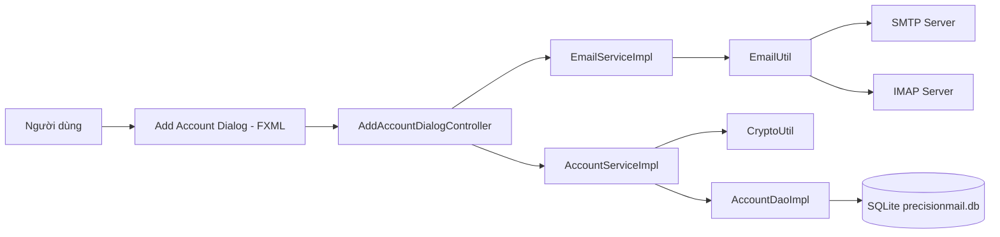
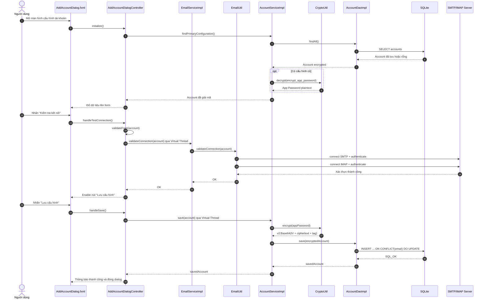
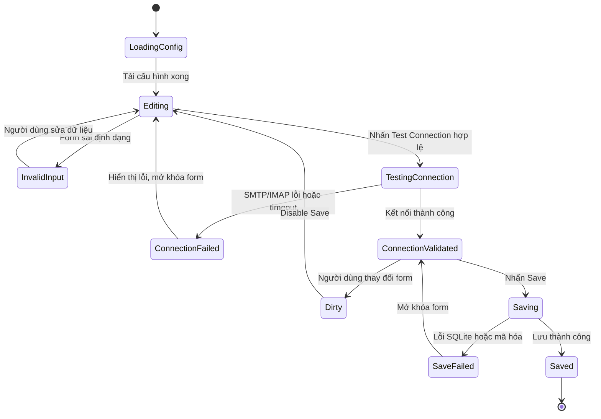
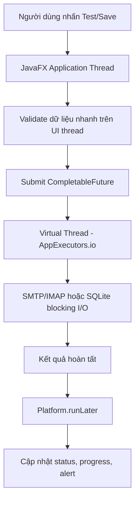
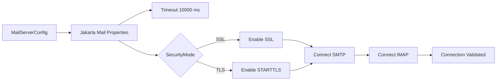
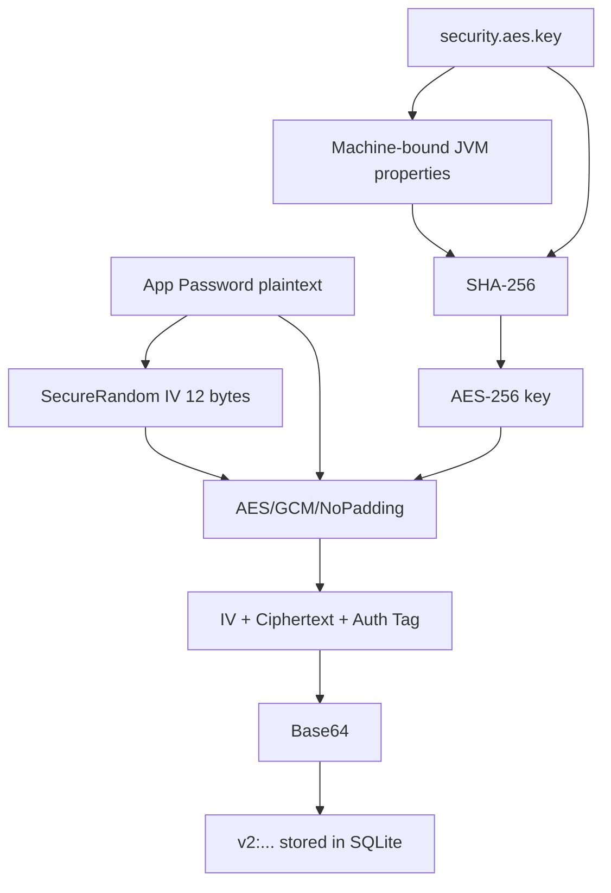
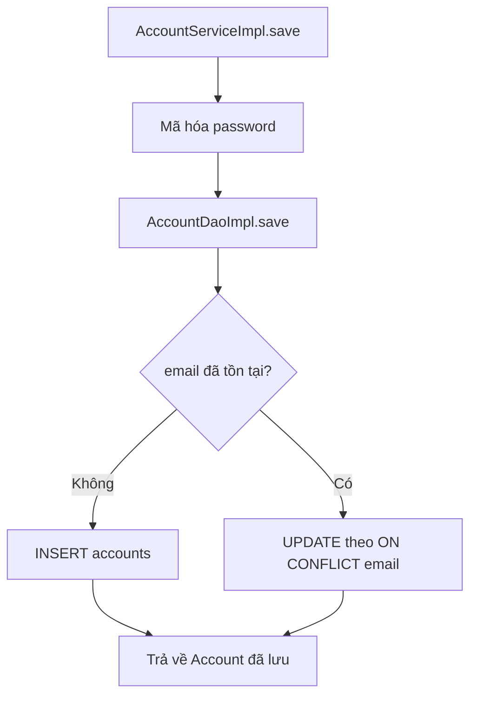
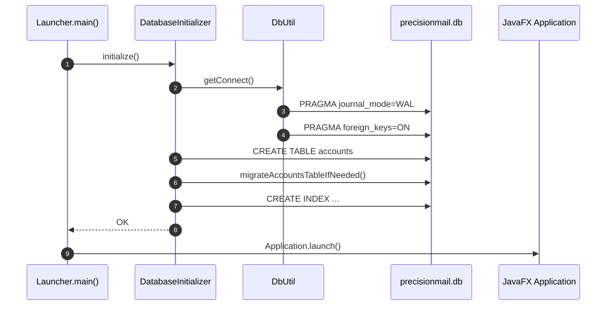
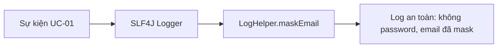

# TÀI LIỆU HIỆN THỰC MÃ NGUỒN UC-01

## 1. Thông tin tài liệu

| Thuộc tính | Giá trị |
| --- | --- |
| Mã tài liệu | UC01-IMPL |
| Use Case | UC-01 - Cấu hình kết nối Mail Server |
| Chuẩn áp dụng | IEEE Std 29148-2018, IEEE Std 1016-2009 |
| Phạm vi | Trình bày hiện thực mã nguồn cho chức năng nhập, kiểm tra, mã hóa và lưu cấu hình tài khoản mail |
| Nguồn tham chiếu | `docs/implementation_guide.md`, `docs/UC_01.md`, mã nguồn trong `src/main/java` |

## 2. Tổng quan hiện thực

UC-01 được hiện thực theo kiến trúc phân tầng của ứng dụng JavaFX. Giao diện cấu hình tài khoản được điều khiển bởi `AddAccountDialogController`; lớp này tiếp nhận dữ liệu người dùng, kiểm tra hợp lệ đầu vào, gọi tầng dịch vụ để kiểm tra kết nối SMTP/IMAP và lưu cấu hình. Tác vụ mạng và ghi cơ sở dữ liệu được đưa xuống luồng nền thông qua `CompletableFuture` kết hợp `AppExecutors.io()`, trong đó executor dùng Virtual Thread của JDK 21.

Mật khẩu ứng dụng không được lưu trực tiếp. Trước khi ghi xuống SQLite, `AccountServiceImpl` gọi `CryptoUtil.encrypt()` để mã hóa bằng AES/GCM. Khi tải cấu hình cũ, dịch vụ đọc dữ liệu từ `AccountDaoImpl`, giải mã mật khẩu và trả về đối tượng `Account` cho controller để hiển thị trong `PasswordField`.



## 3. Ánh xạ kiến trúc sang mã nguồn

### 3.1 Cấu trúc gói liên quan UC-01

```mermaid
flowchart TD
    Root[nlu.fit.soft.gr5.precisionMail]
    Root --> Controller[controller.dialog]
    Root --> Service[service / service.impl]
    Root --> Dao[dao / dao.impl]
    Root --> Model[model]
    Root --> Util[util]
    Root --> Infra[infrastructure]
    Root --> Resource[resources/view/dialog]

    Controller --> AddCtrl[AddAccountDialogController.java]
    Service --> AccSvc[AccountServiceImpl.java]
    Service --> MailSvc[EmailServiceImpl.java]
    Dao --> AccDao[AccountDaoImpl.java]
    Model --> Account[Account.java]
    Model --> Config[MailServerConfig.java]
    Model --> Security[SecurityMode.java]
    Util --> Crypto[CryptoUtil.java]
    Util --> MailUtil[EmailUtil.java]
    Util --> DbUtil[DbUtil.java]
    Infra --> Exec[AppExecutors.java]
    Infra --> Init[DatabaseInitializer.java]
    Resource --> FXML[add-account-dialog.fxml]
```



### 3.2 Bảng ánh xạ thành phần thiết kế - mã nguồn

| Thành phần trong UC-01 | Vai trò thiết kế | Tệp hiện thực | Trách nhiệm chính |
| --- | --- | --- | --- |
| ConfigView | Giao diện nhập cấu hình | `src/main/resources/nlu/fit/soft/gr5/precisionMail/view/dialog/add-account-dialog.fxml` | Khai báo form Email, App Password, SMTP/IMAP host, port, security mode |
| ConfigController | Điều phối sự kiện giao diện | `src/main/java/nlu/fit/soft/gr5/precisionMail/controller/dialog/AddAccountDialogController.java` | Load cấu hình cũ, validate form, test connection, save config, xử lý lỗi UI |
| EmailService | Tầng nghiệp vụ kiểm tra kết nối | `src/main/java/nlu/fit/soft/gr5/precisionMail/service/impl/EmailServiceImpl.java` | Gọi `EmailUtil.validateConnection(account)` và ghi log kết quả |
| Mail Utility | Adapter Jakarta Mail | `src/main/java/nlu/fit/soft/gr5/precisionMail/util/EmailUtil.java` | Tạo cấu hình SMTP/IMAP, đặt timeout, bắt tay xác thực với mail server |
| AccountService | Tầng nghiệp vụ tài khoản | `src/main/java/nlu/fit/soft/gr5/precisionMail/service/impl/AccountServiceImpl.java` | Mã hóa trước khi lưu, giải mã khi đọc |
| CryptoService | Bảo mật dữ liệu nhạy cảm | `src/main/java/nlu/fit/soft/gr5/precisionMail/util/CryptoUtil.java` | Mã hóa/giải mã AES/GCM, hỗ trợ giải mã legacy AES/ECB |
| LocalDB | Lưu trữ cục bộ | `src/main/java/nlu/fit/soft/gr5/precisionMail/dao/impl/AccountDaoImpl.java` | Upsert bản ghi account theo email |
| Bootstrapping | Khởi tạo DB | `src/main/java/nlu/fit/soft/gr5/precisionMail/infrastructure/db/DatabaseInitializer.java` | Tạo bảng `accounts`, migrate schema cũ, tạo index |
| Async Executor | Tác vụ nền | `src/main/java/nlu/fit/soft/gr5/precisionMail/infrastructure/async/AppExecutors.java` | Cấp phát Virtual Thread cho I/O blocking |

## 4. Luồng hiện thực UC-01

### 4.1 Luồng chính



### 4.2 Luồng trạng thái giao diện



## 5. Hiện thực các giải pháp kỹ thuật cốt lõi

### 5.1 Xử lý bất đồng bộ, không khóa JavaFX Application Thread

Theo yêu cầu NFR-01-01, thao tác kiểm tra kết nối và lưu cấu hình không chạy trực tiếp trên JavaFX Application Thread. Controller sử dụng `CompletableFuture` để chuyển tác vụ I/O sang executor nền; sau khi hoàn tất, kết quả được đưa về UI bằng `Platform.runLater()`.

```java
CompletableFuture
        .runAsync(() -> {
            try {
                emailService.validateConnection(account);
            } catch (MessagingException ex) {
                throw new CompletionException(ex);
            }
        }, AppExecutors.io())
        .whenComplete((unused, throwable) ->
                Platform.runLater(() -> handleTestCompleted(account, throwable)));
```

Executor nền được hiện thực bằng Virtual Thread:

```java
private static final ExecutorService IO_EXECUTOR =
        Executors.newVirtualThreadPerTaskExecutor();
```



Lợi ích kỹ thuật là giao diện không bị treo khi Jakarta Mail thực hiện kết nối socket hoặc khi SQLite ghi dữ liệu. Trong lúc xử lý, `setTesting(true)` vô hiệu hóa các trường nhập liệu, nút Test/Cancel/Save và hiển thị `ProgressIndicator`, tránh người dùng kích hoạt trùng lặp cùng một thao tác.

### 5.2 Kiểm tra kết nối Mail Server

`EmailUtil.validateConnection()` thiết lập thuộc tính SMTP và IMAP dựa trên `MailServerConfig`. Thời gian chờ được giới hạn ở 10 giây cho connection/read/write timeout. Với SSL, hệ thống bật `mail.smtp.ssl.enable` và `mail.imap.ssl.enable`; với TLS, hệ thống bật STARTTLS.



Các lỗi được phân loại ở controller:

| Nhóm lỗi | Ngoại lệ hoặc điều kiện | Cách phản hồi |
| --- | --- | --- |
| Sai dữ liệu nhập | Email sai regex, password rỗng, host rỗng, port ngoài `[1, 65535]` | Đánh dấu trường lỗi bằng border đỏ và tooltip |
| Sai xác thực | `AuthenticationFailedException` | Hiển thị thông báo xác thực thất bại |
| Mạng/timeout | `ConnectException`, `SocketTimeoutException` | Hiển thị thông báo kiểm tra mạng, host và port |
| Lỗi khác | `MessagingException`, `RuntimeException` khác | Hiển thị thông báo kiểm tra cấu hình mail server |

### 5.3 Mã hóa App Password trước khi lưu

Mã nguồn hiện thực bảo mật mật khẩu ứng dụng tại `CryptoUtil`. Phiên bản hiện tại dùng `AES/GCM/NoPadding`, IV ngẫu nhiên 12 byte, tag xác thực 128 bit và prefix `v2:` cho ciphertext mới. Khóa AES được dẫn xuất bằng SHA-256 từ `security.aes.key` kết hợp với material máy cục bộ khả dụng qua JVM: `user.name`, `user.home`, `os.name`, `os.arch`, `os.version`.



Ghi chú truy vết: `implementation_guide.md` gợi ý PBKDF2 kết hợp CPU ID/Motherboard UUID. Mã nguồn thực tế chưa đọc định danh phần cứng bằng OS command và chưa dùng PBKDF2; do đó tài liệu hiện thực ghi đúng cơ chế đang có là SHA-256 + JVM machine material. Cách trình bày này bảo đảm tính nhất quán giữa báo cáo và mã nguồn.

### 5.4 Lưu cấu hình bằng upsert trong SQLite

`AccountDaoImpl.save()` dùng câu lệnh `INSERT ... ON CONFLICT(email) DO UPDATE`. Nhờ ràng buộc `email text not null unique`, mỗi địa chỉ email chỉ có một cấu hình. Nếu người dùng nhập lại cùng email, hệ thống cập nhật mật khẩu mã hóa và thông số SMTP/IMAP thay vì tạo bản ghi trùng.



## 6. Hiện thực cơ sở dữ liệu và khởi tạo hệ thống

Khi ứng dụng khởi động, `Launcher.main()` gọi `DatabaseInitializer.initialize()` trước khi mở JavaFX UI. Trình khởi tạo tạo bảng `accounts`, `sent_emails`, `scheduled_emails`, thực hiện migration nếu schema cũ thiếu cột, sau đó tạo index phục vụ truy vấn lịch sử và hàng đợi.



Bảng `accounts` phục vụ trực tiếp UC-01:

```sql
create table if not exists accounts
(
    id integer primary key autoincrement,
    email text not null unique,
    encrypt_app_password text not null,
    smtp_host text not null default 'smtp.gmail.com',
    smtp_port integer not null default 587,
    imap_host text not null default 'imap.gmail.com',
    imap_port integer not null default 993,
    security_mode text not null default 'TLS',
    created_at text not null,
    updated_at text not null
);
```

Vị trí cơ sở dữ liệu hiện tại là `jdbc:sqlite:precisionmail.db`, tức tệp SQLite nằm tại thư mục chạy ứng dụng. `DbUtil` bật WAL mode để giảm xung đột đọc/ghi và bật `foreign_keys=ON` để bảo toàn ràng buộc tham chiếu.

## 7. Ràng buộc bảo mật và ghi log

UC-01 không ghi mật khẩu thô ra log. Các sự kiện như yêu cầu kiểm tra kết nối, kiểm tra thành công/thất bại và lưu cấu hình đều dùng `LogHelper.maskEmail()` để che địa chỉ email.



Các điểm bảo mật chính:

| Yêu cầu | Hiện thực |
| --- | --- |
| Không lưu plaintext password | `AccountServiceImpl.save()` mã hóa trước khi gọi DAO |
| Không hiển thị password rõ trên UI | `PasswordField` trong dialog cấu hình |
| Không log password | Log chỉ chứa email đã mask và metadata kỹ thuật |
| Chống sửa bản mã | AES/GCM có authentication tag 128 bit |
| Tương thích dữ liệu cũ | `CryptoUtil.decrypt()` hỗ trợ ciphertext legacy không có prefix `v2:` |

## 8. Truy vết yêu cầu - hiện thực

| Mã yêu cầu UC-01 | Nội dung | Thành phần hiện thực | Trạng thái |
| --- | --- | --- | --- |
| S1.2 | Tải cấu hình cũ nếu có | `AddAccountDialogController.loadExistingConfiguration()`, `AccountServiceImpl.findPrimaryConfiguration()` | Đã hiện thực |
| S1.3 | Nhập SMTP/IMAP, email, app password, security mode | `add-account-dialog.fxml`, `MailServerConfig`, `SecurityMode` | Đã hiện thực |
| S1.4-S1.8 | Kiểm tra kết nối | `handleTestConnection()`, `EmailServiceImpl.validateConnection()`, `EmailUtil.validateConnection()` | Đã hiện thực |
| S1.10 | Mã hóa app password | `AccountServiceImpl.save()`, `CryptoUtil.encrypt()` | Đã hiện thực |
| S1.11 | Lưu cấu hình xuống DB | `AccountDaoImpl.save()` với upsert theo email | Đã hiện thực |
| EF-01-01 | Validate dữ liệu nhập | `validateForm()`, `EmailUtil.isValidEmail()`, `isValidPort()` | Đã hiện thực |
| EF-01-02 | Xử lý lỗi xác thực | `handleTestCompleted()` kiểm tra `AuthenticationFailedException` | Đã hiện thực |
| EF-01-03 | Xử lý timeout/mạng | Timeout Jakarta Mail 10000 ms, kiểm tra `ConnectException`, `SocketTimeoutException` | Đã hiện thực |
| EF-01-04 | Xử lý lỗi DB | `AccountDaoImpl.save()` bắt `SQLException`, controller hiển thị Save Error | Đã hiện thực |
| NFR-01-01 | Không khóa UI | `CompletableFuture` + `AppExecutors.io()` Virtual Thread | Đã hiện thực |
| BR-01-02 | Gợi ý port theo SSL/TLS | `applySuggestedPorts()` | Đã hiện thực |
| BR-01-04 | Log an toàn | `LogHelper.maskEmail()` trong controller/service/DAO | Đã hiện thực |

## 9. Rào cản kỹ thuật và giải pháp

| Rào cản | Ảnh hưởng | Giải pháp hiện thực |
| --- | --- | --- |
| Jakarta Mail là blocking I/O | Có thể làm treo JavaFX UI nếu chạy trên Application Thread | Đưa tác vụ test connection vào Virtual Thread thông qua `CompletableFuture.runAsync()` |
| Người dùng bấm Save khi chưa test connection | Có thể lưu cấu hình sai hoặc chưa xác thực | Biến `connectionValidated` và `saveButton.setDisable(true)` bắt buộc Test Connection thành công trước khi lưu |
| Cấu hình cũ thiếu trường SMTP/IMAP | Ứng dụng có thể lỗi khi nâng cấp schema | `DatabaseInitializer.migrateAccountsTableIfNeeded()` tự migrate và bổ sung mặc định |
| Trùng cấu hình theo email | Sinh nhiều account giống nhau, khó chọn tài khoản gửi | SQLite `unique` trên `email` và upsert bằng `ON CONFLICT(email) DO UPDATE` |
| Lộ dữ liệu nhạy cảm qua log | Vi phạm yêu cầu bảo mật UR-13 | Chỉ ghi email đã mask, không ghi App Password hoặc ciphertext |

## 10. Kết luận hiện thực

Phần hiện thực UC-01 đã chuyển hóa đặc tả "Cấu hình kết nối Mail Server" thành các thành phần mã nguồn chạy được theo kiến trúc phân tầng. Giao diện JavaFX chịu trách nhiệm nhập liệu và phản hồi trạng thái; tầng service xử lý nghiệp vụ, mã hóa và kiểm tra kết nối; tầng DAO lưu trữ cấu hình vào SQLite; hạ tầng executor bảo đảm thao tác mạng và I/O không khóa giao diện.

Mức độ đáp ứng yêu cầu chính:

| Nhóm yêu cầu | Đánh giá |
| --- | --- |
| Chức năng nhập và lưu cấu hình | Hoàn thành |
| Kiểm tra SMTP/IMAP trước khi lưu | Hoàn thành |
| Mã hóa App Password | Hoàn thành bằng AES/GCM |
| Không khóa giao diện | Hoàn thành bằng Virtual Thread |
| Tự khởi tạo và migrate DB | Hoàn thành |
| Bảo mật log | Hoàn thành ở mức không ghi password, email được mask |

