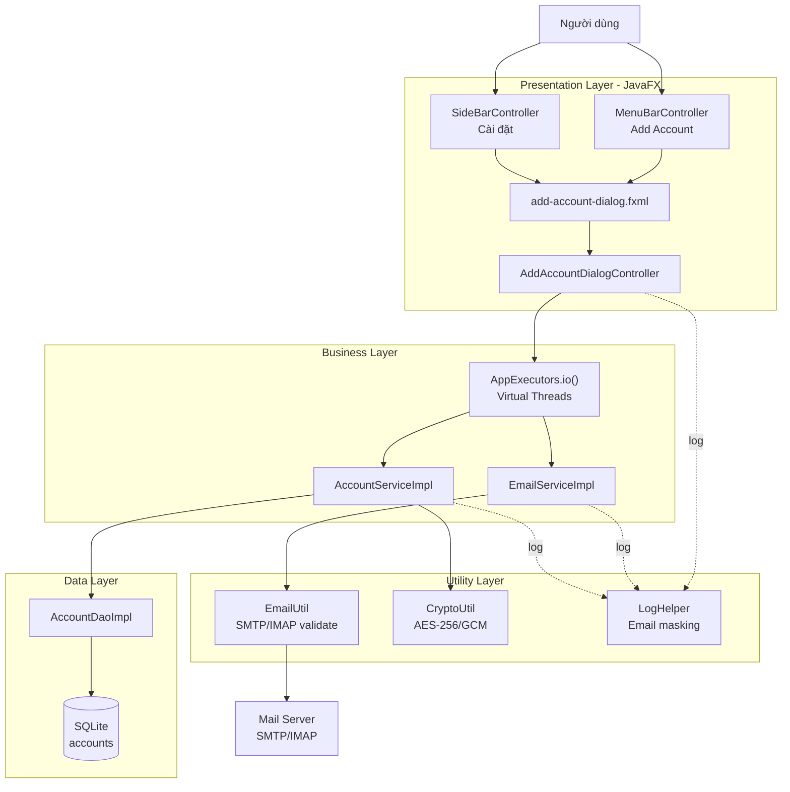
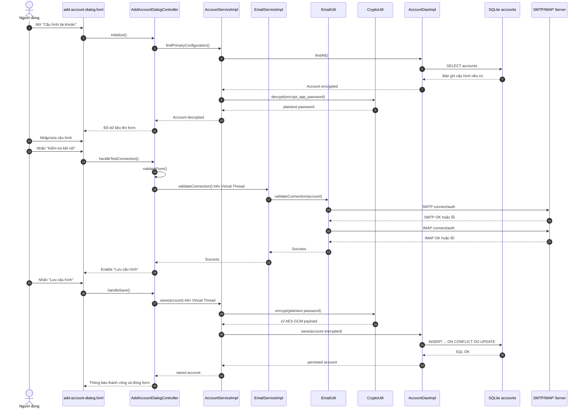
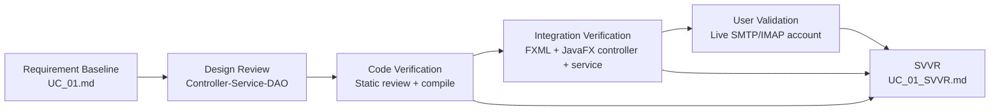
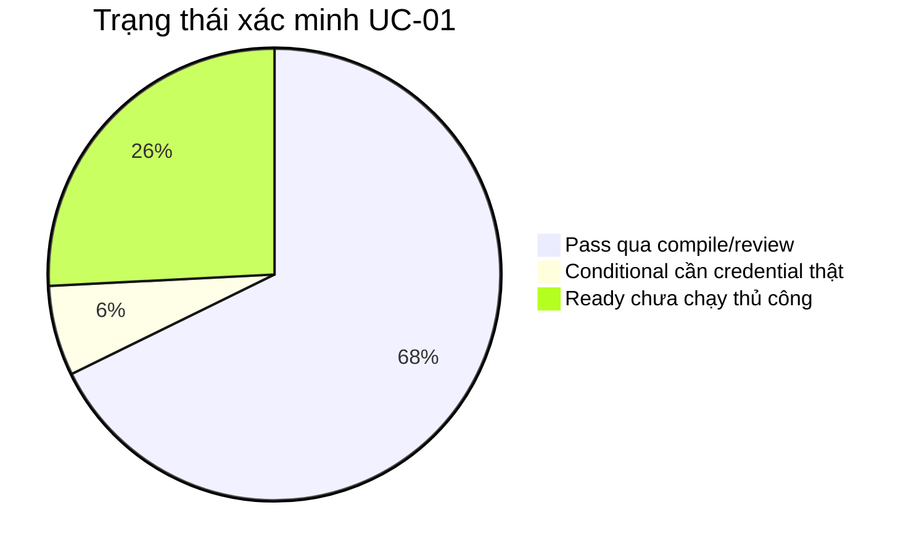
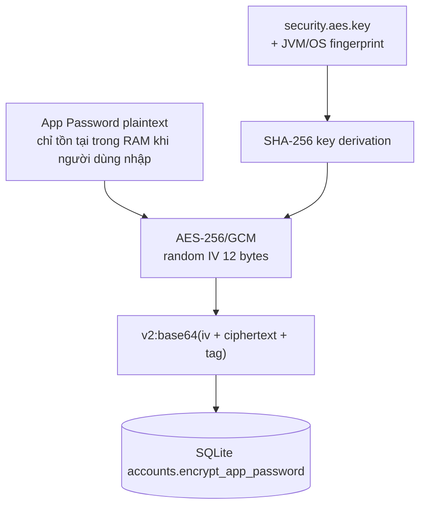

# BÁO CÁO HIỆN THỰC VÀ XÁC MINH PHẦN MỀM

## SOFTWARE VERIFICATION AND VALIDATION REPORT - SVVR

**Mã tài liệu:** SVVR-UC01-01  
**Use Case:** UC-01 - Cấu hình kết nối Mail Server  
**Hệ thống:** PrecisionMail - Desktop Email System  
**Tiêu chuẩn áp dụng:** IEEE Std 1012 / IEEE Std 29148 / IEEE Std 829  
**Trạng thái:** Đã xác minh biên dịch, chờ kiểm thử kết nối mail thực tế  
**Ngày lập:** 2026-05-17  

---

## 1. Mục Đích Và Phạm Vi

### 1.1 Mục Đích

Báo cáo này trình bày phần hiện thực và hoạt động xác minh cho UC-01 theo tài liệu đặc tả `docs/UC_01.md`. Nội dung tập trung vào việc chứng minh rằng hệ thống đã triển khai đúng luồng cấu hình Mail Server, kiểm tra kết nối SMTP/IMAP, mã hóa App Password, lưu cấu hình vào SQLite và ghi log an toàn.

### 1.2 Phạm Vi Xác Minh

Phạm vi bao gồm:

1. Giao diện cấu hình tài khoản Mail Server trên JavaFX.
2. Luồng tải cấu hình cũ từ cơ sở dữ liệu cục bộ.
3. Kiểm tra dữ liệu đầu vào tại client.
4. Kiểm tra kết nối SMTP/IMAP bất đồng bộ bằng Virtual Threads.
5. Lưu cấu hình vào SQLite với mật khẩu đã mã hóa.
6. Bảo mật log và masking email.
7. Cập nhật tài liệu UC-01 để đồng bộ với triển khai thực tế.

Ngoài phạm vi:

1. Kiểm thử xác thực với tài khoản Gmail/Outlook thật, do cần App Password hợp lệ.
2. Kiểm thử hiệu năng UI bằng công cụ đo FPS chuyên dụng.
3. Kiểm thử bảo mật chuyên sâu như penetration test hoặc forensic attack trên database.

---

## 2. Tài Liệu Và Thành Phần Tham Chiếu

| Nhóm | Tài liệu / Mã nguồn | Vai trò |
|---|---|---|
| Đặc tả | `docs/UC_01.md` | Baseline yêu cầu, flow, exception flow và sequence |
| Báo cáo | `docs/UC_01_SVVR.md` | Báo cáo hiện thực và xác minh UC-01 |
| UI | `src/main/resources/nlu/fit/soft/gr5/precisionMail/view/dialog/add-account-dialog.fxml` | Form cấu hình Mail Server |
| Controller | `src/main/java/nlu/fit/soft/gr5/precisionMail/controller/dialog/AddAccountDialogController.java` | Điều phối UI, validate, test connection, save |
| Điều hướng | `MenuBarController.java`, `SideBarController.java`, `sidebar.fxml` | Mở dialog cấu hình từ menu và sidebar |
| Service | `AccountService.java`, `AccountServiceImpl.java` | Lưu/tải cấu hình tài khoản |
| Service | `EmailService.java`, `EmailServiceImpl.java` | Kiểm tra kết nối SMTP/IMAP |
| Utility | `EmailUtil.java` | Tạo Jakarta Mail session, timeout, test SMTP/IMAP |
| Utility | `CryptoUtil.java` | Mã hóa/giải mã App Password bằng AES-256/GCM |
| Utility | `LogHelper.java` | Masking email trong log |
| Model | `Account.java`, `MailServerConfig.java`, `SecurityMode.java` | Mô hình dữ liệu cấu hình |
| Data | `DatabaseInitializer.java`, `AccountDaoImpl.java` | Bảng `accounts`, upsert cấu hình vào SQLite |

---

## 3. Tổng Quan Hiện Thực

### 3.1 Kiến Trúc Hiện Thực UC-01



### 3.2 Các Hạng Mục Đã Hiện Thực

| Mã hạng mục | Nội dung hiện thực | Kết quả |
|---|---|---|
| IMPL-01 | Mở form cấu hình từ menu `Add Account` và sidebar `Cài đặt` | Hoàn tất |
| IMPL-02 | Form có Sender Email, App Password, SMTP Host/Port, IMAP Host/Port, Security Mode | Hoàn tất |
| IMPL-03 | Tải cấu hình đầu tiên từ bảng `accounts` và giải mã mật khẩu | Hoàn tất |
| IMPL-04 | Validate email, host rỗng, port từ 1 đến 65535 | Hoàn tất |
| IMPL-05 | Tự động gợi ý port khi chọn SSL/TLS | Hoàn tất |
| IMPL-06 | Kiểm tra kết nối SMTP và IMAP bằng Jakarta Mail | Hoàn tất |
| IMPL-07 | Chạy kiểm tra kết nối và lưu DB ngoài JavaFX Application Thread | Hoàn tất |
| IMPL-08 | Chỉ cho phép lưu sau khi kiểm tra kết nối thành công | Hoàn tất |
| IMPL-09 | Lưu cấu hình bằng upsert vào SQLite | Hoàn tất |
| IMPL-10 | Mã hóa App Password bằng AES-256/GCM, có hỗ trợ đọc bản mã legacy | Hoàn tất |
| IMPL-11 | Masking email trong log theo dạng tối đa 3 ký tự đầu local-part | Hoàn tất |
| IMPL-12 | Cập nhật `docs/UC_01.md` theo đúng triển khai thực tế | Hoàn tất |

---

## 4. Luồng Hiện Thực Theo Sequence UC-01



---

## 5. Ma Trận Truy Vết Yêu Cầu - Hiện Thực - Xác Minh

| Yêu cầu UC-01 | Mô tả rút gọn | Thành phần hiện thực | Phương pháp xác minh | Trạng thái |
|---|---|---|---|---|
| S1.1 | Người dùng mở chức năng cấu hình | `MenuBarController`, `SideBarController` | Review code, compile | Pass |
| S1.2 | Tải cấu hình cũ, giải mã mật khẩu | `AccountServiceImpl.findPrimaryConfiguration`, `CryptoUtil.decrypt` | Review code, compile | Pass |
| S1.3 | Nhập SMTP/IMAP/security/email/password | `add-account-dialog.fxml` | Review FXML, compile | Pass |
| S1.4 | Nhấn kiểm tra kết nối | `handleTestConnection` | Review code, compile | Pass |
| S1.5 | Khóa form, hiển thị progress, chạy nền | `setTesting`, `CompletableFuture`, `AppExecutors.io()` | Review code, compile | Pass |
| S1.6 | Thiết lập socket SSL/TLS | `EmailUtil.validateConnection` | Review code, compile | Pass |
| S1.7 | Mail Server xác thực | Jakarta Mail `Transport` và `Store` | Chưa chạy live credential | Conditional |
| S1.8 | UI báo thành công, enable save | `handleTestCompleted` | Review code, compile | Pass |
| S1.9 | Người dùng lưu cấu hình | `handleSave` | Review code, compile | Pass |
| S1.10 | Mã hóa App Password | `CryptoUtil.encrypt` | Review code, compile | Pass |
| S1.11 | Lưu DB transaction-safe | `AccountDaoImpl.save` | Review code, compile | Pass |
| S1.12 | Popup thành công, đóng form, log INFO | `handleSaveCompleted`, logging SLF4J | Review code, compile | Pass |
| AF-01-01 | Hủy khi có thay đổi chưa lưu | `requestClose`, `handleCloseRequest` | Review code, compile | Pass |
| EF-01-01 | Input invalid | `validateForm`, tooltip, red border | Review code, compile | Pass |
| EF-01-02 | Authentication failed | `AuthenticationFailedException` handling | Review code, compile | Pass |
| EF-01-03 | Timeout / connection failure | Jakarta Mail timeout, exception mapping | Review code, compile | Pass |
| EF-01-04 | DB write error | `handleSaveCompleted`, DAO exception | Review code, compile | Pass |
| BR-01-01 | Không lưu password plaintext | `CryptoUtil`, `AccountServiceImpl.save` | Review code, compile | Pass |
| BR-01-02 | Gợi ý port | `applySuggestedPorts` | Review code, compile | Pass |
| BR-01-03 | PasswordField | FXML `PasswordField` | Review FXML, compile | Pass |
| BR-01-04 | Không log password, mask email | `LogHelper.maskEmail`, log statements | Review code, compile | Pass |
| NFR-01-01 | Không chặn JavaFX thread | `AppExecutors.io()` | Review code, compile | Pass |
| NFR-01-02 | Timeout 10 giây | Jakarta Mail timeout properties | Review code, compile | Pass |
| NFR-01-03 | Cleanup tài nguyên mạng | try-with-resources `Transport`, `Store` | Review code, compile | Pass |

---

## 6. Chiến Lược Xác Minh Và Thẩm Định

### 6.1 Mức Độ V&V Theo IEEE



### 6.2 Phương Pháp Đã Áp Dụng

| Phương pháp | Mục tiêu | Kết quả |
|---|---|---|
| Requirement review | Đối chiếu UC_01 với code hiện thực | Đã cập nhật tài liệu khi khác triển khai |
| Code review | Kiểm tra luồng controller, service, DAO, utility | Không phát hiện lỗi compile |
| FXML binding verification | Xác minh `fx:id` và handler khớp controller | Compile thành công |
| Build verification | Biên dịch Maven toàn dự án | Pass |
| Security review cơ bản | Kiểm tra password không lưu/log plaintext | Pass ở mức code review |
| Live validation | Test SMTP/IMAP với credential thật | Not Run |

---

## 7. Kết Quả Xác Minh

### 7.1 Build Verification

Lệnh đã chạy:

```bash
bash mvnw -q -DskipTests compile
```

Kết quả:

| Mã kiểm thử | Nội dung | Kết quả |
|---|---|---|
| VER-BUILD-01 | Biên dịch Java source | Pass |
| VER-BUILD-02 | Kiểm tra module dependency | Pass |
| VER-BUILD-03 | Kiểm tra FXML/controller binding ở mức compile/package resource | Pass |

Ghi chú: Maven hiển thị cảnh báo JDK về native access và API deprecated từ thư viện phụ thuộc. Đây không phải lỗi build của UC-01.

### 7.2 Test Case Thiết Kế Cho UC-01

| Test Case ID | Mục tiêu | Dữ liệu kiểm thử | Kết quả mong đợi | Trạng thái |
|---|---|---|---|---|
| TC-UC01-001 | Mở form từ menu | Click `File > Account > Add Account` | Dialog cấu hình mở | Ready |
| TC-UC01-002 | Mở form từ sidebar | Click `Cài đặt` | Dialog cấu hình mở | Ready |
| TC-UC01-003 | Validate email sai | `abc` | Field email đỏ, save disabled | Ready |
| TC-UC01-004 | Validate port sai | `smtpPort=99999` | Field port đỏ, save disabled | Ready |
| TC-UC01-005 | Validate host rỗng | `smtpHost=""` | Field host đỏ, không test connection | Ready |
| TC-UC01-006 | Gợi ý port SSL | Chọn `SSL` | SMTP 465, IMAP 993 | Ready |
| TC-UC01-007 | Gợi ý port TLS | Chọn `TLS` | SMTP 587, IMAP giữ mặc định nếu rỗng | Ready |
| TC-UC01-008 | Test connection thành công | Email/App Password hợp lệ | Hiện success, enable save | Need Credential |
| TC-UC01-009 | Sai App Password | Credential sai | Báo xác thực thất bại | Need Credential |
| TC-UC01-010 | Sai host/timeout | Host không tồn tại | Báo không thể kết nối | Ready |
| TC-UC01-011 | Lưu sau test thành công | Credential hợp lệ | DB có record, password mã hóa | Need Credential |
| TC-UC01-012 | Hủy khi có thay đổi | Sửa form rồi đóng | Confirm discard changes | Ready |

### 7.3 Kết Quả Theo Trạng Thái



---

## 8. Xác Minh Bảo Mật

### 8.1 Mã Hóa App Password



Kết luận xác minh:

1. Mật khẩu được mã hóa trước khi gọi DAO lưu DB.
2. Bản mã mới có prefix `v2:` để phân biệt AES-GCM.
3. Legacy AES/ECB chỉ dùng để đọc dữ liệu cũ, không dùng để ghi mới.
4. Khóa AES có độ dài 256 bit sau khi dẫn xuất SHA-256.

### 8.2 Bảo Mật Log

| Rủi ro | Kiểm soát đã hiện thực |
|---|---|
| Log lộ App Password | Không có log statement ghi password; Alert cũng không chứa password |
| Log lộ email đầy đủ | `LogHelper.maskEmail` giữ tối đa 3 ký tự đầu local-part |
| Log lộ lỗi hệ thống | Stacktrace được ghi cho chẩn đoán, nhưng thông điệp nghiệp vụ không chứa secret |

Ví dụ masking hợp lệ:

```text
sender@gmail.com -> sen***@gmail.com
ab@gmail.com -> ab***@gmail.com
```

---

## 9. Xác Minh Phi Chức Năng

| NFR | Cơ chế hiện thực | Kết quả xác minh |
|---|---|---|
| UI không bị block | Network/DB chạy bằng `CompletableFuture` trên `AppExecutors.io()` | Pass qua code review |
| Timeout kết nối | `mail.smtp.connectiontimeout`, `mail.smtp.timeout`, `mail.smtp.writetimeout`, IMAP tương ứng đều 10000 ms | Pass qua code review |
| Cleanup tài nguyên | `Transport` và `Store` được đóng bằng try-with-resources | Pass qua code review |
| Tính tương thích dữ liệu cũ | `CryptoUtil.decrypt` fallback đọc legacy ciphertext | Pass qua code review |
| Tính nhất quán DB | `INSERT ... ON CONFLICT(email) DO UPDATE` | Pass qua code review |

---

## 10. Sai Khác So Với Tài Liệu Và Hành Động Khắc Phục

| Sai khác phát hiện | Hành động |
|---|---|
| Tài liệu ban đầu ghi SQLite/H2, triển khai dùng SQLite | Đã cập nhật `docs/UC_01.md` thành SQLite |
| Tài liệu ban đầu mô tả hardware-bound bằng CPU ID/Motherboard UUID | Đã cập nhật thành fingerprint cục bộ khả dụng qua JVM/OS |
| Tài liệu ban đầu ghi AES-256 chung, code cũ dùng AES/ECB | Đã nâng code lên AES-256/GCM và cập nhật tài liệu |
| NFR-01-02 thiếu giá trị thời gian cụ thể | Đã cập nhật timeout 10 giây và phản hồi UI < 300 ms |
| Sequence dùng tên `ConfigController` chung | Đã cập nhật thành `AddAccountDialogController` |

---

## 11. Rủi Ro Còn Lại Và Khuyến Nghị

| Mã rủi ro | Mô tả | Mức độ | Khuyến nghị |
|---|---|---|---|
| R-UC01-01 | Chưa xác minh live với Gmail/Outlook thật | Trung bình | Chạy TC-UC01-008/009/011 với App Password hợp lệ |
| R-UC01-02 | Fingerprint JVM/OS không mạnh bằng CPU ID/Motherboard UUID | Trung bình | Nếu yêu cầu bảo mật cao hơn, tích hợp OS keystore hoặc native hardware ID |
| R-UC01-03 | Chưa có unit test tự động cho `CryptoUtil` và `LogHelper` | Trung bình | Bổ sung JUnit test cho encrypt/decrypt, legacy decrypt, masking |
| R-UC01-04 | Chưa có UI automation test cho dialog | Thấp | Bổ sung TestFX hoặc kiểm thử thủ công có biên bản |

---

## 12. Kết Luận V&V

UC-01 đã được hiện thực đầy đủ ở mức code và tích hợp theo kiến trúc JavaFX - Service - DAO hiện có của PrecisionMail. Các yêu cầu chính trong `docs/UC_01.md` đã có thành phần triển khai tương ứng, gồm validate dữ liệu, test kết nối SMTP/IMAP bất đồng bộ, mã hóa AES-256/GCM trước khi lưu SQLite, masking log và xử lý các luồng ngoại lệ chính.

Kết quả xác minh hiện tại:

1. **Build verification:** Pass.
2. **Code/FXML review:** Pass.
3. **Security review cơ bản:** Pass.
4. **Live validation với Mail Server thật:** Chưa chạy do thiếu credential/App Password hợp lệ.

Trạng thái đề xuất: **Conditionally Accepted** cho UC-01 ở môi trường phát triển; chuyển sang **Accepted** sau khi hoàn tất kiểm thử live SMTP/IMAP và bổ sung test tự động cho `CryptoUtil`, `LogHelper`.

