# TÀI LIỆU HIỆN THỰC MÃ NGUỒN UC-02

## 1. Thông tin tài liệu

| Thuộc tính | Giá trị |
| --- | --- |
| Mã tài liệu | UC02-IMPL |
| Use Case | UC-02 - Soạn thảo và Gửi Email |
| Chuẩn áp dụng | IEEE Std 29148-2018, IEEE Std 1016-2009 |
| Phạm vi | Trình bày hiện thực mã nguồn cho chức năng soạn email, kiểm tra dữ liệu, đính kèm tệp, gửi SMTP bất đồng bộ và lưu lịch sử |
| Nguồn tham chiếu | `docs/implementation_guide.md`, `docs/UC_02.md`, `docs/UC_02_SVVR.md`, mã nguồn trong `src/main/java` |

## 2. Tổng quan hiện thực

UC-02 được hiện thực theo kiến trúc phân tầng JavaFX. `compose-mail.fxml` định nghĩa giao diện soạn thư, `ComposeController` điều phối thao tác người dùng, `EmailServiceImpl` thực hiện gửi email bất đồng bộ, `EmailUtil` chuyển dữ liệu nghiệp vụ thành `MimeMessage` của Jakarta Mail và `EmailDaoImpl` lưu kết quả gửi vào SQLite.

Luồng gửi email được thiết kế theo nguyên tắc không chặn JavaFX Application Thread. Controller chỉ thực hiện kiểm tra nhanh trên UI thread, sau đó bàn giao tác vụ gửi SMTP cho `EmailServiceImpl.sendAsync()`. Tầng service chạy `CompletableFuture.supplyAsync(..., AppExecutors.io())`, trong đó `AppExecutors.io()` là Virtual Thread executor của JDK 21.

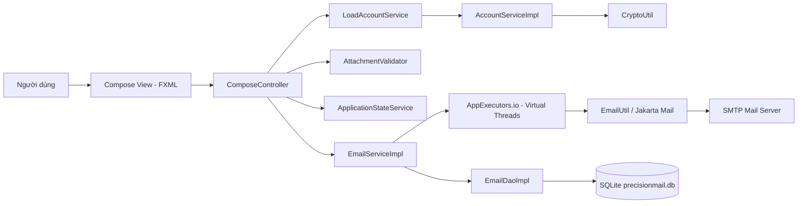

## 3. Ánh xạ kiến trúc sang mã nguồn

### 3.1 Cấu trúc gói liên quan UC-02

```mermaid
flowchart TD
    Root[nlu.fit.soft.gr5.precisionMail]
    Root --> Controller[controller.fxml]
    Root --> Service[service / service.impl]
    Root --> Dao[dao / dao.impl]
    Root --> Model[model]
    Root --> Util[util]
    Root --> Infra[infrastructure]
    Root --> Resources[resources/view/include/center]

    Controller --> ComposeCtrl[ComposeController.java]
    Service --> EmailSvc[EmailServiceImpl.java]
    Service --> LoadAcc[LoadAccountService.java]
    Service --> AppState[ApplicationStateService.java]
    Dao --> EmailDao[EmailDaoImpl.java]
    Model --> Email[Email.java]
    Model --> Account[Account.java]
    Model --> Status[EmailStatus.java]
    Util --> EmailUtil[EmailUtil.java]
    Util --> Attachment[AttachmentValidator.java]
    Util --> LogHelper[LogHelper.java]
    Infra --> Executors[AppExecutors.java]
    Infra --> DbInit[DatabaseInitializer.java]
    Resources --> FXML[compose-mail.fxml]
```

### 3.2 Bảng ánh xạ thành phần thiết kế - mã nguồn

| Thành phần UC-02 | Vai trò thiết kế | Tệp hiện thực | Trách nhiệm chính |
| --- | --- | --- | --- |
| ComposeView | Giao diện soạn thư | `src/main/resources/nlu/fit/soft/gr5/precisionMail/view/include/center/compose-mail.fxml` | Khai báo From, To, Cc, Bcc, Subject, `HTMLEditor`, attachment list, Send button |
| ComposeController | Điều phối UI | `src/main/java/nlu/fit/soft/gr5/precisionMail/controller/fxml/ComposeController.java` | Build `Email`, validate người nhận, validate attachment, khóa/mở UI, xử lý kết quả gửi |
| Account Loader | Nạp tài khoản gửi | `src/main/java/nlu/fit/soft/gr5/precisionMail/service/LoadAccountService.java` | Tải danh sách account nền bằng JavaFX `Service` |
| Account Service | Giải mã tài khoản | `src/main/java/nlu/fit/soft/gr5/precisionMail/service/impl/AccountServiceImpl.java` | Đọc account từ DB và giải mã App Password |
| Attachment Validator | Kiểm tra tệp đính kèm | `src/main/java/nlu/fit/soft/gr5/precisionMail/util/AttachmentValidator.java` | Giới hạn 10 tệp, 25 MB, chặn phần mở rộng nguy hiểm |
| Email Service | Tầng nghiệp vụ gửi email | `src/main/java/nlu/fit/soft/gr5/precisionMail/service/impl/EmailServiceImpl.java` | Gửi bất đồng bộ, cập nhật trạng thái `SENT`/`FAILED`, lưu lịch sử |
| Email Utility | Adapter SMTP/MIME | `src/main/java/nlu/fit/soft/gr5/precisionMail/util/EmailUtil.java` | Tạo SMTP session, `MimeMessage`, HTML body, attachment, gọi `Transport.send()` |
| Email DAO | Lưu lịch sử | `src/main/java/nlu/fit/soft/gr5/precisionMail/dao/impl/EmailDaoImpl.java` | Ghi bản ghi vào bảng `sent_emails` |
| App State | Theo dõi gửi nền | `src/main/java/nlu/fit/soft/gr5/precisionMail/service/ApplicationStateService.java` | Đếm số tác vụ gửi đang chạy, hỗ trợ chặn đóng app |
| Async Executor | Hạ tầng bất đồng bộ | `src/main/java/nlu/fit/soft/gr5/precisionMail/infrastructure/async/AppExecutors.java` | Cung cấp Virtual Thread executor |

## 4. Luồng hiện thực UC-02

### 4.1 Luồng chính

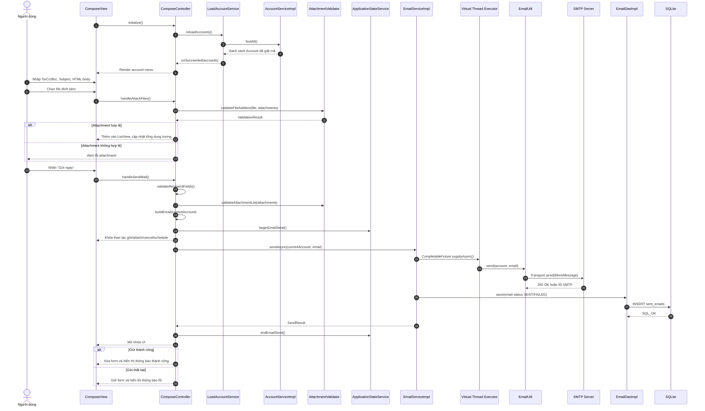

### 4.2 Mô hình trạng thái UI

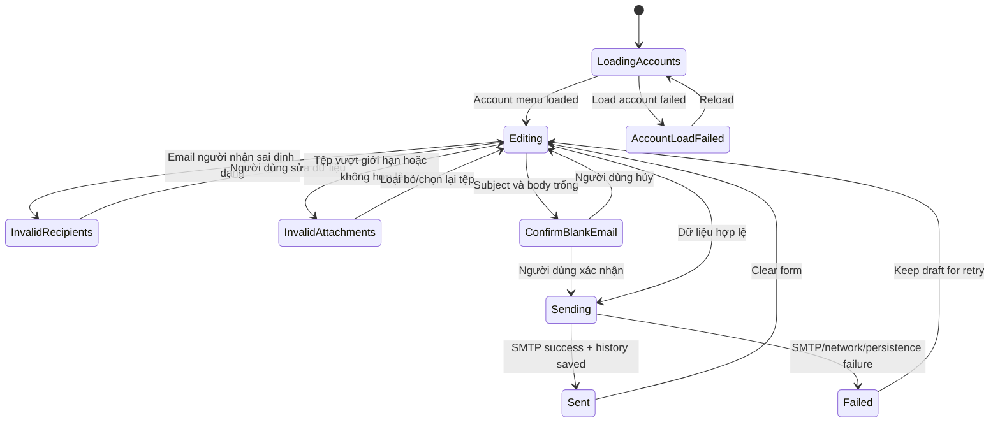

## 5. Hiện thực các giải pháp kỹ thuật cốt lõi

### 5.1 Xử lý gửi mail bất đồng bộ

`ComposeController.handleSendMail()` chỉ kiểm tra dữ liệu, khóa trạng thái UI và gọi `emailService.sendAsync()`. Kết quả được marshal về JavaFX Application Thread bằng `Platform.runLater()`.

```java
setSendLocked(true);
ApplicationStateService.beginEmailSend();
emailService.sendAsync(currentAccount, email)
        .whenComplete((result, throwable) ->
                Platform.runLater(() -> handleSendCompleted(result, throwable)));
```

Tầng service thực hiện SMTP blocking I/O trong Virtual Thread executor:

```java
return CompletableFuture.supplyAsync(() -> {
    try {
        EmailUtil.send(account, email);
        email.status = EmailStatus.SENT;
        email.sentAt = java.time.LocalDateTime.now();
        save(email);
        return new SendResult(email, true, null);
    } catch (MessagingException | IOException | RuntimeException e) {
        email.status = EmailStatus.FAILED;
        email.errorMessage = e.getMessage();
        save(email);
        return new SendResult(email, false, e);
    }
}, AppExecutors.io());
```

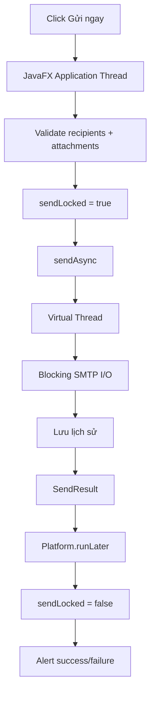

### 5.2 Nạp tài khoản gửi và giải mã App Password

Khi màn hình soạn thư khởi tạo, `ComposeController` gọi `reloadAccounts()`. `LoadAccountService` chạy nền và gọi `AccountServiceImpl.findAll()`. Tầng account service đọc dữ liệu đã mã hóa trong bảng `accounts`, giải mã bằng `CryptoUtil.decrypt()` rồi trả về danh sách tài khoản có thể gửi.

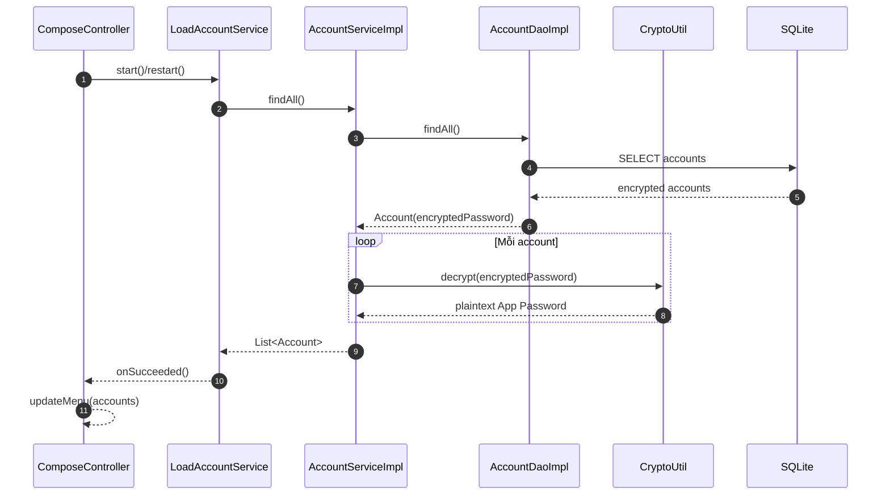

### 5.3 Kiểm tra người nhận

Người nhận được nhập trong các trường To, Cc, Bcc. `EmailUtil.emailFeature()` tách danh sách bằng dấu phẩy hoặc chấm phẩy, loại bỏ khoảng trắng và giữ thứ tự bằng `LinkedHashSet`. `validateRecipientFields()` tìm địa chỉ sai đầu tiên, đánh dấu trường lỗi bằng CSS border đỏ và gắn tooltip.

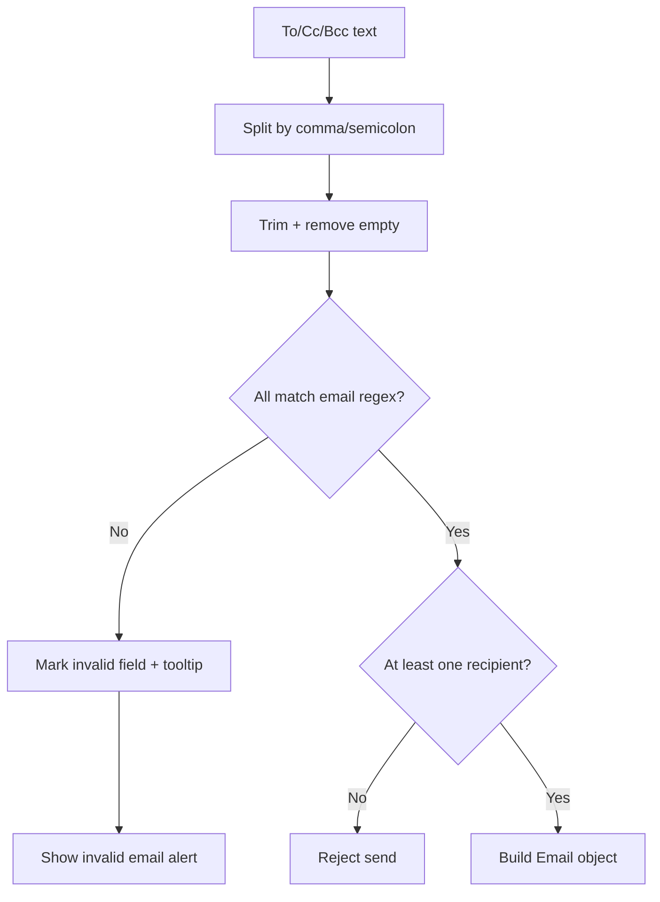

Ngoài kiểm tra trong `handleSendMail()`, nút Send cũng được bind disable theo trạng thái dữ liệu:

| Điều kiện | Hành vi |
| --- | --- |
| Không có email hợp lệ nào trong To/Cc/Bcc | Disable nút Send |
| Có ít nhất một địa chỉ sai định dạng | Disable nút Send |
| Đang gửi hoặc đang thao tác lịch | Disable nút Send |
| Dữ liệu người nhận hợp lệ | Cho phép gửi |

### 5.4 Kiểm tra attachment phía client

`AttachmentValidator` hiện thực các quy tắc trước khi SMTP session được mở. Mục tiêu là từ chối sớm dữ liệu không hợp lệ, giảm rủi ro gửi thất bại sau khi đã kết nối mail server.

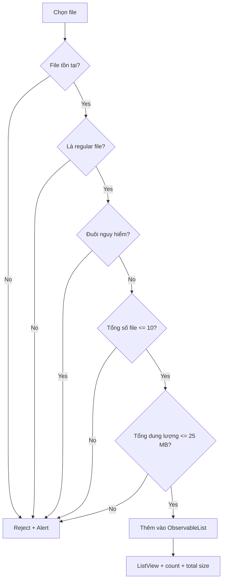

Các ràng buộc đang có:

| Ràng buộc | Giá trị hiện thực |
| --- | --- |
| Số lượng tệp tối đa | 10 |
| Tổng dung lượng tối đa | `25 * 1024 * 1024` bytes |
| Định dạng bị chặn | `.exe`, `.bat`, `.cmd`, `.vbs`, `.com`, `.pif`, `.scr`, `.vbe`, `.js`, `.jse`, `.ws`, `.wsh` |
| Kiểm tra lại trước khi gửi | `validateAttachmentList(attachments)` |

### 5.5 Tạo MIME message và gửi SMTP

`EmailUtil.send()` chuyển đối tượng `Email` thành `MimeMessage`. Nội dung được gửi dạng HTML UTF-8; attachment được thêm vào `MimeMultipart`; tên file được encode bằng `MimeUtility.encodeText()` để hỗ trợ tên file tiếng Việt.

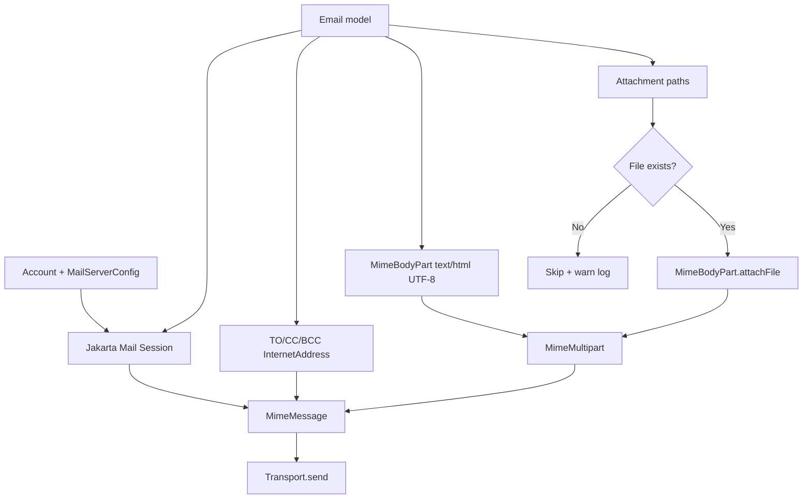

Cấu hình SMTP dùng thông tin từ tài khoản đã được cấu hình ở UC-01:

| Thuộc tính | Hiện thực |
| --- | --- |
| Host/Port | `MailServerConfig.smtpHost`, `MailServerConfig.smtpPort` |
| Authentication | `mail.smtp.auth = true` |
| Timeout | connection/read/write timeout = 10000 ms |
| SSL | `mail.smtp.ssl.enable = true` khi `SecurityMode.SSL` |
| TLS | `mail.smtp.starttls.enable = true` khi `SecurityMode.TLS` |

### 5.6 Lưu lịch sử gửi thành công và thất bại

Sau khi SMTP hoàn tất, `EmailServiceImpl` cập nhật trạng thái email:

| Kết quả | Trạng thái | Dữ liệu lưu |
| --- | --- | --- |
| Gửi thành công | `EmailStatus.SENT` | Người gửi, To/Cc/Bcc, subject, body, attachment paths, `sent_at` |
| Gửi thất bại | `EmailStatus.FAILED` | Cùng metadata email, `error_message`, trạng thái failed |

`EmailDaoImpl.save()` ghi vào bảng `sent_emails` bằng `PreparedStatement`. Các danh sách người nhận và attachment paths được serialize bằng delimiter newline.

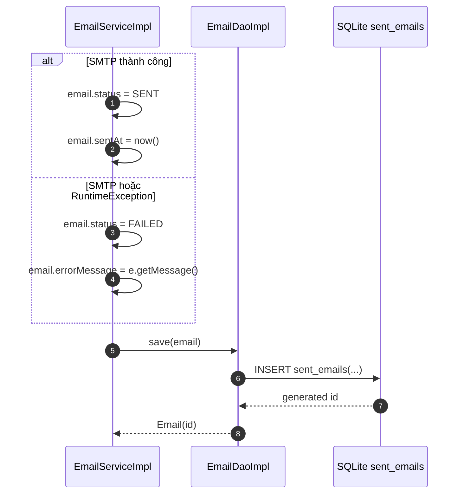

## 6. Hiện thực cơ sở dữ liệu và bootstrapping

`Launcher.main()` gọi `DatabaseInitializer.initialize()` trước khi mở ứng dụng. Bảng `sent_emails` phục vụ trực tiếp UC-02 được tạo nếu chưa tồn tại.

```sql
create table if not exists sent_emails
(
    id integer primary key autoincrement,
    sender_email text not null,
    to_recipients text not null default '',
    cc_recipients text not null default '',
    bcc_recipients text not null default '',
    subject text,
    body text,
    attachment_paths text,
    status text not null,
    error_message text,
    sent_at text,
    created_at text not null,
    updated_at text not null
);
```

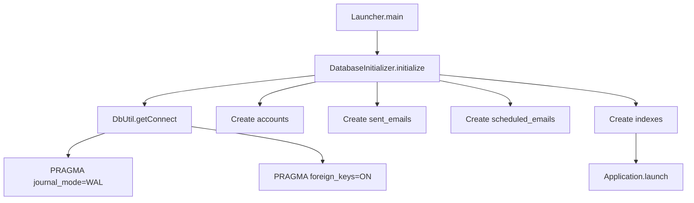

Các index hỗ trợ truy vấn lịch sử sau UC-02:

| Index | Mục đích |
| --- | --- |
| `idx_sent_emails_sent_at` | Sắp xếp/lọc theo thời gian gửi |
| `idx_sent_emails_status` | Lọc trạng thái gửi thành công/thất bại |
| `idx_sent_emails_sender` | Lọc theo tài khoản gửi |
| `idx_sent_emails_to_recipients` | Tìm kiếm theo người nhận chính |

## 7. Xử lý ngoại lệ và phản hồi người dùng

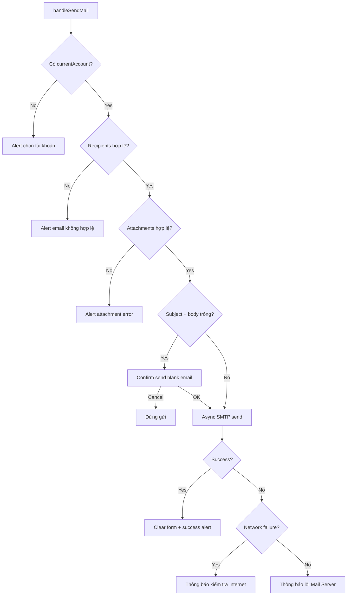

`handleSendCompleted()` luôn gọi `ApplicationStateService.endEmailSend()` và `setSendLocked(false)` để tránh UI bị khóa vĩnh viễn sau khi tác vụ nền kết thúc.

## 8. Bảo mật log và dữ liệu nhạy cảm

UC-02 tuân thủ nguyên tắc log metadata, không log nội dung thư. Các log gửi mail dùng `LogHelper.maskEmail()`, `LogHelper.recipientCount(email)` và `LogHelper.attachmentCount(email)` thay vì ghi đầy đủ người nhận, body hoặc đường dẫn attachment.

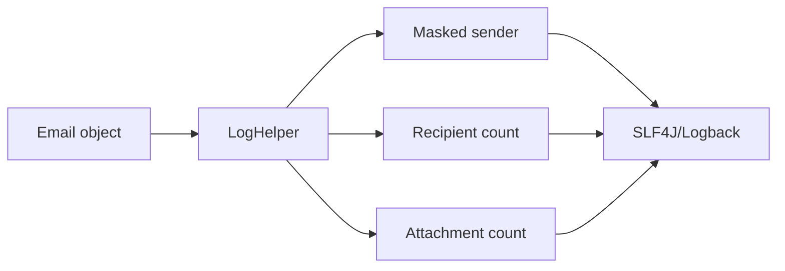

Các điểm bảo mật chính:

| Rủi ro | Biện pháp hiện thực |
| --- | --- |
| Lộ App Password | Account được giải mã trong service để gửi, không ghi password ra log |
| Lộ nội dung body | Log không ghi `email.content` |
| Lộ danh sách người nhận đầy đủ | Log chỉ ghi số lượng người nhận |
| Lộ file path attachment qua log | Log chỉ ghi số lượng attachment |
| File nguy hiểm | `AttachmentValidator` chặn một số định dạng thực thi phổ biến |

## 9. Truy vết yêu cầu - hiện thực

| Mã yêu cầu UC-02 | Nội dung | Thành phần hiện thực | Trạng thái |
| --- | --- | --- | --- |
| S2.1-S2.2 | Hiển thị màn hình soạn thư | `compose-mail.fxml`, `ComposeController.initialize()` | Đã hiện thực |
| S2.3 | Nhập To/Cc/Bcc | `toField`, `ccField`, `bccField`, `toggleCc()`, `toggleBcc()` | Đã hiện thực |
| S2.4 | Soạn nội dung HTML | `HTMLEditor contentEditor`, `EmailUtil.send()` gửi `text/html; charset=UTF-8` | Đã hiện thực |
| S2.5-S2.7 | Chọn và hiển thị attachment | `handleAttachFiles()`, `attachmentListView`, `attachmentSizeLabel` | Đã hiện thực |
| S2.8-S2.9 | Gửi ngay và khóa UI | `handleSendMail()`, `sendLocked`, property bindings | Đã hiện thực |
| S2.10 | Dùng tài khoản đang chọn | `LoadAccountService`, `updateMenu()`, `currentAccount` | Đã hiện thực |
| S2.11-S2.12 | Gửi SMTP SSL/TLS | `EmailServiceImpl.sendAsync()`, `EmailUtil.send()` | Đã hiện thực |
| S2.13 | Lưu lịch sử gửi | `EmailDaoImpl.save()`, bảng `sent_emails` | Đã hiện thực |
| S2.14 | Cập nhật UI sau gửi | `handleSendCompleted()`, `clearComposeForm()` | Đã hiện thực |
| AF-02-01 | Hủy soạn thảo | `handleCancelCompose()`, `confirmDiscardDraft()` | Đã hiện thực |
| EF-02-01 | Email người nhận sai định dạng | `validateRecipientFields()`, `firstInvalidEmail()` | Đã hiện thực |
| EF-02-02 | Attachment vượt giới hạn | `AttachmentValidator.validateFileAddition()`, `validateAttachmentList()` | Đã hiện thực |
| EF-02-03 | Lỗi mạng | `isNetworkFailure()`, `userMessageForSendFailure()` | Đã hiện thực |
| EF-02-04 | Lỗi SMTP/server | `EmailServiceImpl` bắt `MessagingException`, controller hiển thị chi tiết | Đã hiện thực |
| BR-02-01 | Tổng attachment <= 25 MB | `MAX_TOTAL_SIZE = 25 * 1024 * 1024` | Đã hiện thực |
| BR-02-02 | Ít nhất một người nhận, xác nhận email trống | Send button binding, `hasAnyRecipient()`, `confirmBlankEmail()` | Đã hiện thực |
| BR-02-03 | Log không lộ dữ liệu riêng tư | `LogHelper.maskEmail()`, recipient/attachment count | Đã hiện thực |
| NFR-02-01 | Không khóa UI | `CompletableFuture` + Virtual Thread executor + `Platform.runLater()` | Đã hiện thực |
| NFR-02-02 | Lưu trạng thái thành công/thất bại | `EmailServiceImpl` lưu `SENT`/`FAILED` | Đã hiện thực một phần; chưa có transaction bao quanh SMTP + DB vì SMTP là hệ ngoài |
| NFR-02-03 | Không nạp attachment thủ công vào RAM | Jakarta Mail `MimeBodyPart.attachFile(file)` | Đã hiện thực ở mức sử dụng API thư viện |

## 10. Rào cản kỹ thuật và giải pháp

| Rào cản | Ảnh hưởng | Giải pháp hiện thực |
| --- | --- | --- |
| SMTP là blocking I/O | Có thể làm treo JavaFX UI | Đưa gửi mail vào `CompletableFuture` chạy trên Virtual Thread executor |
| Người dùng gửi trùng khi tác vụ chưa xong | Có thể tạo nhiều email ngoài ý muốn | `sendLocked` và property binding khóa Send/Attach/Cancel/Schedule |
| Người dùng đóng ứng dụng khi đang gửi | Có thể mất trạng thái gửi hoặc lịch sử | `ApplicationStateService` đếm tác vụ gửi, `Launcher` chặn close khi còn active send |
| Attachment vượt giới hạn SMTP | Gửi thất bại sau khi đã kết nối server | Validate số lượng, dung lượng và định dạng trước khi gọi `sendAsync()` |
| Lỗi SMTP hoặc lỗi mạng | Người dùng cần biết nguyên nhân, lịch sử vẫn phải ghi nhận | Service lưu `FAILED` và `errorMessage`; controller phân biệt lỗi mạng với lỗi server |
| Log chứa dữ liệu cá nhân | Vi phạm BR-02-03 | Log chỉ ghi email người gửi đã mask, số lượng người nhận, số lượng attachment |

## 11. Kết luận hiện thực

Phần hiện thực UC-02 đã chuyển đặc tả "Soạn thảo và Gửi Email" thành luồng chạy được gồm giao diện soạn thư JavaFX, kiểm tra người nhận, kiểm tra attachment, gửi SMTP bất đồng bộ và lưu lịch sử gửi. Thiết kế phân tầng giúp controller tập trung vào UI state, service xử lý nghiệp vụ gửi, utility phụ trách Jakarta Mail/MIME, DAO phụ trách lưu trữ SQLite.

Mức độ đáp ứng yêu cầu chính:

| Nhóm yêu cầu | Đánh giá |
| --- | --- |
| Soạn email To/Cc/Bcc/Subject/HTML body | Hoàn thành |
| Đính kèm tệp và kiểm tra giới hạn | Hoàn thành |
| Gửi SMTP SSL/TLS | Hoàn thành |
| Không khóa giao diện | Hoàn thành bằng `CompletableFuture` + Virtual Thread |
| Lưu lịch sử gửi thành công/thất bại | Hoàn thành |
| Phân loại lỗi mạng/lỗi server | Hoàn thành ở tầng UI message |
| Bảo mật log | Hoàn thành ở mức metadata-only |

