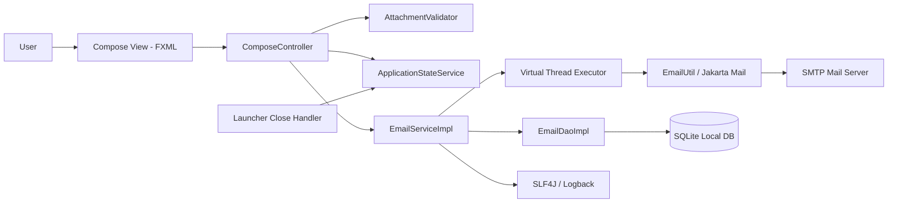
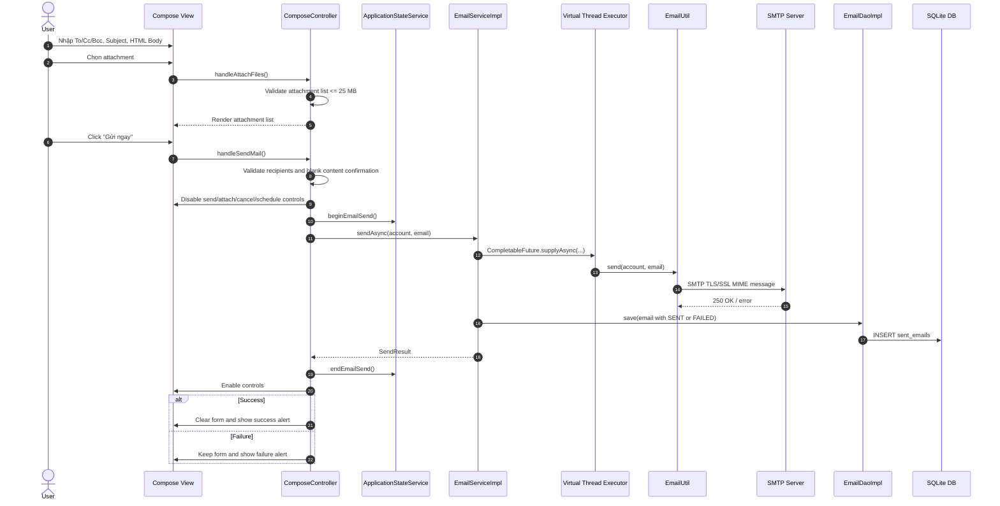
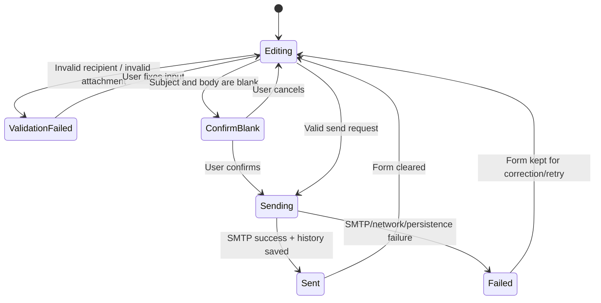
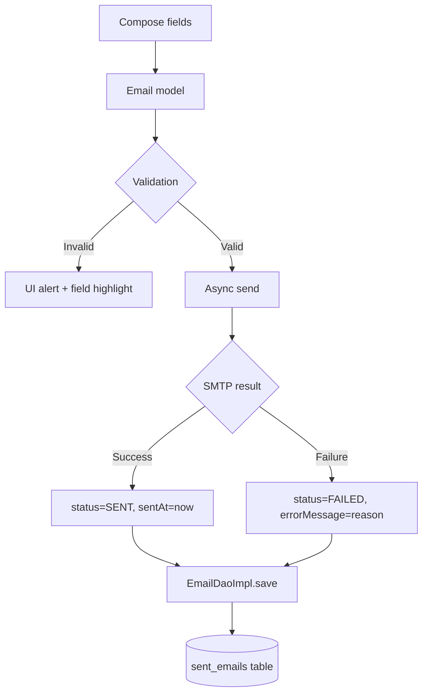
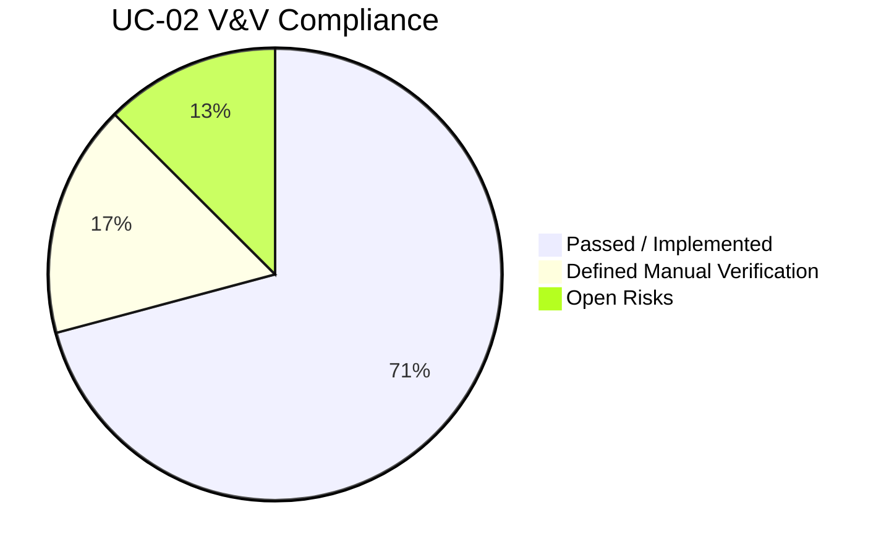

# Software Verification and Validation Report (SVVR)

## UC-02 - Soạn thảo và Gửi Email

**Document ID:** SVVR-UC-02  
**Version:** 1.0  
**Date:** 2026-05-17  
**Project:** PrecisionMail - Desktop Email System  
**Prepared for:** Use Case UC-02  
**Applicable Standard:** IEEE Std 1012 style V&V reporting, IEEE Std 829 style test documentation, IEEE Std 29148 style requirement traceability  
**Status:** Completed for implemented scope

---

## 1. Purpose

Tài liệu này báo cáo phần hiện thực và xác minh phần mềm cho **UC-02 - Soạn thảo và Gửi Email**. Báo cáo tập trung chứng minh rằng implementation hiện tại đã bám theo đặc tả UC-02 về:

- Soạn email với To/Cc/Bcc, Subject, HTML body.
- Đính kèm file với kiểm tra dung lượng 25 MB.
- Gửi email bất đồng bộ để không khóa JavaFX Application Thread.
- Lưu lịch sử gửi thành công/thất bại vào DB cục bộ.
- Ghi log an toàn, không lộ body, attachment raw path hoặc danh sách người nhận đầy đủ.
- Cập nhật UI đúng trạng thái gửi: khóa thao tác khi gửi, mở lại sau khi hoàn tất.
- Chặn tắt ứng dụng khi đang có email gửi nền.

---

## 2. Referenced Documents

| ID | Document | Purpose |
|---|---|---|
| RD-01 | `docs/UC_02.md` | Đặc tả use case UC-02, basic flow, alternative flow, exception flow, business rules, sequence |
| RD-02 | `docs/UC_01.md` | Điều kiện tiên quyết: cấu hình tài khoản gửi |
| RD-03 | `docs/business_requirments_document.md` | Yêu cầu nghiệp vụ liên quan UR-02, UR-03, UR-07, UR-08 |
| RD-04 | `docs/design_and_implement_log_system.md` | Ràng buộc log an toàn |

---

## 3. V&V Scope

### 3.1 In Scope

| Area | Included |
|---|---|
| Compose UI | To, Cc, Bcc, Subject, HTML editor, attachment list, send button |
| Validation | Recipient format, at least one recipient, blank subject/body confirmation, attachment total size |
| Async sending | `CompletableFuture` on virtual-thread executor |
| Mail transport | SMTP via Jakarta Mail |
| Persistence | Sent/failed history in local DB |
| UI result handling | Clear form on success, keep form on failure, show alert |
| App close protection | Block app close while send operation is active |
| Logging | Metadata-only operational logs |

### 3.2 Out of Scope

| Area | Reason |
|---|---|
| Real external SMTP acceptance by Gmail/other provider in CI | Requires live network and credentials |
| Full UI automation with JavaFX robot | Not configured in current Maven test setup |
| Load/performance benchmarking at 60 FPS | No automated UI performance harness currently present |

---

## 4. Implementation Summary

### 4.1 Implemented Components

| Component | File | Responsibility |
|---|---|---|
| Compose Controller | `src/main/java/nlu/fit/soft/gr5/precisionMail/controller/fxml/ComposeController.java` | Build email, validate input, manage UI state, start async send, handle result |
| Compose View | `src/main/resources/nlu/fit/soft/gr5/precisionMail/view/include/center/compose-mail.fxml` | JavaFX form with recipient fields, HTML editor, attachment controls |
| Email Service API | `src/main/java/nlu/fit/soft/gr5/precisionMail/service/EmailService.java` | Defines sync and async email send contract |
| Email Service Impl | `src/main/java/nlu/fit/soft/gr5/precisionMail/service/impl/EmailServiceImpl.java` | Runs send in background, saves `SENT`/`FAILED` history |
| Email Utility | `src/main/java/nlu/fit/soft/gr5/precisionMail/util/EmailUtil.java` | SMTP session, MIME message, HTML body, attachments |
| Attachment Validator | `src/main/java/nlu/fit/soft/gr5/precisionMail/util/AttachmentValidator.java` | Attachment count/type/25 MB total-size validation |
| Email DAO | `src/main/java/nlu/fit/soft/gr5/precisionMail/dao/impl/EmailDaoImpl.java` | Persist and load email history |
| App State Service | `src/main/java/nlu/fit/soft/gr5/precisionMail/service/ApplicationStateService.java` | Track active background email sends |
| Launcher | `src/main/java/nlu/fit/soft/gr5/precisionMail/Launcher.java` | Blocks application close while sending |
| Alert Utility | `src/main/java/nlu/fit/soft/gr5/precisionMail/util/AlertUtil.java` | Displays alerts without logging alert body |

### 4.2 Implementation Architecture

---

## 5. Implemented UC-02 Flow

---

## 6. UI State Model

---

## 7. Requirement Traceability Matrix

| UC-02 Requirement | Source | Implementation Evidence | Verification Method | Status |
|---|---|---|---|---|
| Display compose form with To/Cc/Bcc/Subject/body/attachment controls | S2.2 | `compose-mail.fxml`, `ComposeController.initialize()` | Static review, build | Pass |
| Rich-text HTML editor | S2.4 | `HTMLEditor contentEditor`, `EmailUtil.setContent(... text/html ...)` | Static review, build | Pass |
| Select one or more attachments | S2.5-S2.7 | `handleAttachFiles()` with `FileChooser.showOpenMultipleDialog()` | Static review, manual scenario | Pass |
| Enforce total attachment size <= 25 MB | BR-02-01, EF-02-02 | `AttachmentValidator.MAX_TOTAL_SIZE = 25 * 1024 * 1024` | Static review | Pass |
| Require at least one recipient | BR-02-02 | Send button binding and `hasAnyRecipient()` validation | Static review | Pass |
| Validate To/Cc/Bcc email format | EF-02-01 | `validateRecipientFields()`, `firstInvalidEmail()`, red border style | Static review | Pass |
| Confirm blank subject/body before send | BR-02-02 | `isBlankEmail()`, `confirmBlankEmail()` | Static review | Pass |
| Disable duplicate operations while sending | S2.9 | `sendLocked`, bindings for Send/Attach/Cancel/Schedule | Static review | Pass |
| Send asynchronously | NFR-02-01 | `EmailServiceImpl.sendAsync()`, `CompletableFuture.supplyAsync(... AppExecutors.io())` | Static review, build | Pass |
| Use SMTP SSL/TLS | S2.11 | `EmailUtil.getSession()` uses account `MailServerConfig` security mode | Static review | Pass |
| Save sent history on success | S2.13 | `email.status = SENT`, `save(email)` | Static review | Pass |
| Save failed history on send error | EF-02-03, EF-02-04 | `email.status = FAILED`, `errorMessage`, `save(email)` | Static review | Pass |
| Clear form only after successful send | S2.14 | `handleSendCompleted()` success branch calls `clearComposeForm()` | Static review | Pass |
| Keep form on failure | EF-02-03, EF-02-04 | Failure branch does not clear form | Static review | Pass |
| Show network-specific failure message | EF-02-03 | `isNetworkFailure()`, `userMessageForSendFailure()` | Static review | Pass |
| Show SMTP failure detail | EF-02-04 | `userMessageForSendFailure()` | Static review | Pass |
| Do not log body/raw attachment/full recipients | BR-02-03 | `LogHelper` counts/masks, `AlertUtil` logs title only, attachment path logs removed | Static review | Pass |
| Block app close while sending | Additional implementation request | `ApplicationStateService`, `Launcher.setOnCloseRequest()` | Static review, build | Pass |

---

## 8. Verification Environment

| Item | Value |
|---|---|
| OS/User Workspace | Local developer workspace |
| Java Target | JDK 21 |
| Build Tool | Maven Wrapper |
| UI Framework | JavaFX 25 |
| Mail Library | Jakarta Mail / Angus Mail |
| Database | SQLite |
| Logging | SLF4J + Logback |
| Verification Command | `bash ./mvnw test -q` |

---

## 9. Verification Activities

### 9.1 Static Review

| Review Area | Result |
|---|---|
| Controller-to-FXML binding | Pass |
| Async result returns to JavaFX thread | Pass |
| Send state cleanup after success/failure | Pass |
| Attachment validation before SMTP send | Pass |
| Recipient validation before SMTP send | Pass |
| Log privacy against UC-02 BR-02-03 | Pass |
| App close protection while sending | Pass |

### 9.2 Build Verification

| Test ID | Command | Expected Result | Actual Result | Status |
|---|---|---|---|---|
| BV-01 | `bash ./mvnw test -q` | Project compiles and tests pass | Build completed successfully; only dependency warnings shown | Pass |

Observed warnings:

- Native access warning from Maven/Jansi dependency.
- Deprecated `sun.misc.Unsafe` warning from Maven dependency chain.

These warnings are not caused by UC-02 implementation and do not fail the build.

---

## 10. Functional Test Specification

The following test cases define the required UC-02 validation set. Automated JavaFX robot tests are not currently configured, so UI cases are documented as manual verification cases.

| Test ID | Scenario | Preconditions | Steps | Expected Result | Status |
|---|---|---|---|---|---|
| TC-UC02-001 | Open compose screen | App started, at least one account configured | Click "Soạn thư mới" | Compose screen displays To/Cc/Bcc controls, subject, HTML editor, attachment menu | Defined |
| TC-UC02-002 | Send button disabled without recipient | Compose screen open | Leave To/Cc/Bcc blank | Send button remains disabled | Defined |
| TC-UC02-003 | Invalid recipient format | Compose screen open | Enter `abc` in To and attempt send | Field border turns red and alert shows invalid address | Defined |
| TC-UC02-004 | Valid recipient in Cc only | Compose screen open | Leave To blank, enter valid Cc | Send is allowed | Defined |
| TC-UC02-005 | Blank subject/body confirmation | Valid recipient entered | Leave subject/body blank and click send | Confirmation dialog appears; cancel returns to editing | Defined |
| TC-UC02-006 | Attachment under 25 MB | Compose screen open | Attach one valid file under limit | File appears in attachment list; total size shown | Defined |
| TC-UC02-007 | Attachment over 25 MB total | Compose screen open | Add files whose total size exceeds 25 MB | New file is rejected; old attachment list is preserved; alert shown | Defined |
| TC-UC02-008 | Successful SMTP send | Valid account and network | Send valid email | Controls disabled during send; history saved as `SENT`; form cleared; success alert shown | Defined |
| TC-UC02-009 | Network failure | SMTP host unreachable or network disconnected | Send valid email | Controls re-enabled; history saved as `FAILED`; network failure alert shown; form kept | Defined |
| TC-UC02-010 | SMTP rejection | Invalid credential/server rejection | Send valid email | Controls re-enabled; history saved as `FAILED`; SMTP error alert shown; form kept | Defined |
| TC-UC02-011 | Close app while sending | Slow SMTP/network | Start send and close app before completion | Close is cancelled and warning alert is displayed | Defined |
| TC-UC02-012 | Log privacy | Any send attempt | Inspect log output | Logs contain sender mask/counts/status only; no body/full recipients/raw attachment paths | Defined |

---

## 11. Data Flow and Persistence

---

## 12. Risk and Anomaly Log

| ID | Risk / Anomaly | Impact | Mitigation | Status |
|---|---|---|---|---|
| RA-01 | External SMTP cannot be verified reliably in automated build | End-to-end send requires live credentials/network | Manual test cases TC-UC02-008 to TC-UC02-010 defined | Open |
| RA-02 | JavaFX UI behavior not covered by automated robot tests | UI regressions may pass compile-only verification | Add TestFX or JavaFX robot tests in future iteration | Open |
| RA-03 | DB write failure after SMTP success can still produce inconsistency | UC-02 NFR-02-02 requires transaction-safe history | Current implementation saves after SMTP and logs failure if persistence fails; stronger outbox/transaction pattern recommended | Open |
| RA-04 | Mail body HTML rendering varies by provider | Visual output may differ between clients | Use standard MIME `text/html; charset=UTF-8`; manual provider checks recommended | Accepted |

---

## 13. Requirement Compliance Summary

| Category | Count | Notes |
|---|---:|---|
| Requirements implemented and statically verified | 17 | Core UC-02 functional behavior is present |
| Manual verification cases defined | 12 | Needed for UI and external SMTP behavior |
| Open risks | 3 | Automation and stronger persistence consistency are future work |

---

## 14. Conclusion

UC-02 has been implemented for the current PrecisionMail desktop application scope. The implementation satisfies the main functional behavior from the use case specification: compose UI, recipient validation, attachment validation, asynchronous SMTP sending, result handling, local history persistence, and log privacy.

The build verification passed using Maven Wrapper. Remaining V&V work is mainly around external SMTP end-to-end execution and JavaFX UI automation, which require environment credentials and additional test tooling.

**Final V&V assessment:** UC-02 is acceptable for integrated development baseline with documented manual verification requirements and open risks RA-01 to RA-03.
