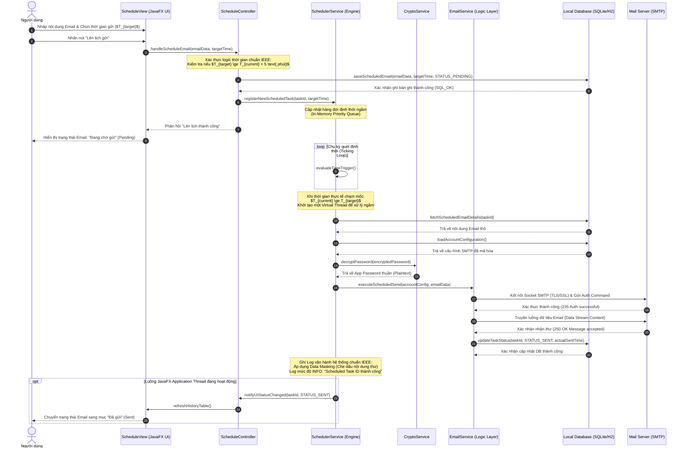

# **TÀI LIỆU ĐẶC TẢ CHI TIẾT USE CASE**

## **HỆ THỐNG GỬI MAIL TỰ ĐỘNG TRÊN DESKTOP (DESKTOP EMAIL SYSTEM)**

**Mã tài liệu:** UC-SPEC-03

**Tiêu chuẩn áp dụng:** IEEE Std 830-1998 / IEEE Std 29148-2018

**Trạng thái:** Hoàn thiện

### **1. Thông tin chung (General Information)**

* **Use Case ID (Mã định danh Use case):** UC-03 (Ánh xạ trực tiếp từ yêu cầu nghiệp vụ UR-04, UR-05, UR-06 trong BRD)
* **Use Case Name (Tên Use case):** Lên lịch gửi Email
* **Description (Mô tả chức năng):** Cung cấp giao diện cho phép người dùng thiết lập ngày, giờ cụ thể trong tương lai để hệ thống tự động thực hiện gửi email. Hệ thống quản lý hàng đợi dưới nền, tự động kích hoạt tiến trình gửi khi đến thời điểm đã định và cập nhật trạng thái lịch sử tương ứng.
* **Actor(s) (Các tác nhân tham gia):** Người dùng (User), Hệ thống định thời ngầm (Scheduler Daemon - Tác nhân hệ thống), Mail Server (SMTP Server)
* **Priority (Mức độ ưu tiên):** Cao (High)
* **Trigger (Điều kiện kích hoạt):** Người dùng đang trong giao diện soạn thảo thư (UC-02) và nhấn chọn chức năng "Lên lịch gửi" (Schedule Send) thay vì chọn "Gửi ngay".

### **2. Điều kiện Tiền - Hậu (Pre & Post-Conditions)**

* **Pre-Condition(s) (Điều kiện tiên quyết):**

    1.  Người dùng đã cấu hình tài khoản gửi thành công trong hệ thống (Hoàn tất **UC-01**).
    2.  Người dùng đã hoàn thành việc nhập nội dung email (Người nhận, Tiêu đề, Nội dung, Tệp đính kèm nếu có) tại giao diện soạn thư (**UC-02**).
    3.  Thời gian lập lịch được chọn phải lớn hơn thời gian hiện tại của hệ thống máy trạm ít nhất là 1 phút.

* **Post-Condition(s) (Trạng thái hệ thống sau khi thành công):**

    1.  Bản ghi thông tin Email được ghi nhận thành công vào Database cục bộ với trạng thái ban đầu là "Chờ gửi" (Pending) cùng mốc thời gian gửi dự kiến ($T_{\text{target}}$).
    2.  Tác vụ gửi được đăng ký thành công vào bộ định thời quản lý hàng đợi cục bộ của ứng dụng.
    3.  Khi đạt đến mốc thời gian $T_{\text{target}}$ (với điều kiện ứng dụng vẫn đang chạy trên máy trạm), email được tự động gửi đi mà không cần thao tác thủ công của người dùng, trạng thái bản ghi chuyển sang "Thành công" hoặc "Thất bại" tùy thuộc vào phản hồi từ Mail Server.

### **3. Luồng sự kiện (Flow of Events)**

#### **3.1 Basic Flow (Luồng Use case chính)**

1.  **S3.1:** Người dùng soạn thảo hoàn tất email và nhấn nút **"Lên lịch gửi"**.
2.  **S3.2:** Hệ thống hiển thị hộp thoại chọn thời gian (DateTimePicker Dialog).
3.  **S3.3:** Người dùng chọn Ngày và Giờ (Giờ:Phút) mong muốn gửi thư trong tương lai, sau đó nhấn **"Xác nhận lên lịch"**.
4.  **S3.4:** Hệ thống thực hiện kiểm tra ràng buộc thời gian chọn ($T_{\text{target}}$) so với thời gian hiện tại ($T_{\text{current}}$).
5.  **S3.5:** Thời gian hợp lệ, hệ thống tự động đóng hộp thoại chọn giờ và khóa tạm thời nút bấm trên form soạn thảo chính.
6.  **S3.6:** Hệ thống lưu trữ thông tin email đã soạn cùng thông tin lịch trình ($T_{\text{target}}$) vào DB cục bộ dưới trạng thái "Chờ gửi" (Pending).
7.  **S3.7:** Hệ thống cập nhật hàng đợi tác vụ trên bộ nhớ đệm (In-memory Task Queue) và hiển thị thông báo "Đã lên lịch gửi email thành công\!". Biểu mẫu soạn thảo đóng lại.
8.  **S3.8:** Bộ định thời ngầm (Scheduler Daemon) chạy trên một luồng riêng liên tục quét và đối chiếu thời gian hệ thống.
9.  **S3.9:** Khi đạt điều kiện mốc thời gian thực thi: 
$$
    T_{\text{current}} \ge T_{\text{target}}
$$
Bộ định thời ngầm sẽ tự động kích hoạt một tiến trình ngầm sử dụng Virtual Threads của JDK 21.
10. **S3.10:** Tiến trình ngầm truy vấn DB lấy thông tin tài khoản cấu hình Mail Server, giải mã mật khẩu bằng Crypto Service, tạo kết nối Socket SMTP an toàn và thực hiện truyền tải email tới Mail Server.
11. **S3.11:** Mail Server phản hồi tín hiệu xác nhận truyền tải thư thành công.
12. **S3.12:** Hệ thống cập nhật trạng thái bản ghi trong DB cục bộ thành "Thành công" (Success), ghi log hệ thống dạng INFO và cập nhật lại giao diện danh sách lịch sử gửi nếu người dùng đang mở xem.

#### **3.2 Alternative Flow (Luồng thay thế)**

* **AF-03-01: Chỉnh sửa hoặc Hủy bỏ lịch gửi trước giờ G:**
    * Người dùng truy cập vào màn hình "Quản lý hàng đợi" (hoặc danh mục Chờ gửi).
    * Người dùng chọn một bản ghi email đang ở trạng thái "Chờ gửi".
      * Hệ thống cung cấp hai lựa chọn:
          1.  *Hủy lịch gửi:* Hệ thống xóa tác vụ định thời khỏi hàng đợi chạy ngầm, cập nhật trạng thái bản ghi trong DB thành "Đã hủy" (Cancelled).
          2.  *Thay đổi thời gian:* Hệ thống hiển thị lại hộp thoại DateTimePicker. Người dùng chọn mốc thời gian mới ($T_{\text{new}}$). Hệ thống thực hiện cập nhật lại mốc thời gian trong DB và tái cấu hình tác vụ định thời ngầm.
      * *Lưu ý ràng buộc:* Thao tác chỉnh sửa hoặc hủy lịch gửi chỉ được chấp nhận nếu thời điểm thực hiện cách thời gian gửi dự kiến tối thiểu là 1 phút:
      
        $$
          T_{\text{target}} - T_{\text{current}} \ge 60 \text{ giây}
        $$

#### **3.3 Exception Flow (Luồng ngoại lệ)**

* **EF-03-01: Thời gian chọn nằm trong quá khứ hoặc quá sát hiện tại (Xảy ra tại bước S3.4):**

    * Nếu người dùng chọn mốc thời gian gửi:
  $$
      T_{\text{target}} < T_{\text{current}} + 60 \text{ giây}
$$
    * Hệ thống từ chối xác nhận, viền đỏ hộp chọn thời gian, hiển thị tooltip cảnh báo: *"Mốc thời gian gửi phải cách thời gian hiện tại ít nhất 1 phút. Vui lòng chọn lại."* và giữ nguyên màn hình để người dùng thiết lập lại.

* **EF-03-02: Ứng dụng bị tắt/mất nguồn tại thời điểm kích hoạt gửi (Xảy ra tại bước S3.8 - S3.9):**

    * Khi đến mốc thời gian $T_{\text{target}}$ , ứng dụng không hoạt động trên máy trạm (người dùng đã tắt app hoặc máy trạm bị sập nguồn).
    * Tại lần khởi động ứng dụng tiếp theo, tiến trình khởi chạy (Bootstrap process) của JavaFX sẽ quét toàn bộ DB cục bộ tìm kiếm các bản ghi có trạng thái "Chờ gửi" nhưng:
  $$
      T_{\text{target}} < T_{\text{current}}
$$
    * Hệ thống sẽ tự động chuyển trạng thái của các bản ghi này thành "Trễ hạn" (Missed) hoặc tự động gửi bù ngay lập tức (Tùy thuộc vào cấu hình cài đặt ưu tiên của người dùng). Đồng thời ghi nhận log sự kiện ở cấp độ WARN để người dùng theo dõi.

* **EF-03-03: Mất mạng Internet tại thời điểm kích hoạt tự động gửi (Xảy ra tại bước S3.10):**

    * Tiến trình gửi tự động ngầm kích hoạt nhưng máy trạm bị ngắt kết nối Internet đột ngột.
    * Hệ thống bắt được ngoại lệ ConnectException / UnknownHostException.
    * Thay vì đánh dấu thất bại ngay lập tức, hệ thống áp dụng chính sách thử lại tự động (Retry Policy): Thực hiện gửi lại tối đa lần, mỗi lần cách nhau $5$ phút ($300 \text{ giây}$).
    * Nếu sau lần thử lại vẫn thất bại, hệ thống dừng tiến trình gửi, cập nhật trạng thái bản ghi trong DB cục bộ thành "Thất bại - Lỗi kết nối mạng" kèm chi tiết thời gian lỗi và ghi nhận log WARNING.

### **4. Quy tắc Nghiệp vụ (Business Rules)**

* **BR-03-01 (Thời gian trễ tối thiểu):** Mốc thời gian lên lịch gửi bắt buộc phải cách thời gian hiện hành tối thiểu $60 \text{ giây}$ để đảm bảo hệ thống có đủ thời gian thiết lập luồng và ghi nhận I/O ổn định xuống database.
* **BR-03-02 (Ràng buộc đồng bộ hàng đợi):** Toàn bộ hàng đợi gửi thư ngầm trên bộ nhớ RAM (In-memory queue) bắt buộc phải được ánh xạ đồng bộ trực tiếp $1:1$ với trạng thái bản ghi trong cơ sở dữ liệu cục bộ SQLite/H2. Nghiêm cấm việc lưu trữ hàng đợi độc lập trên RAM để tránh mất mát dữ liệu lịch trình khi ứng dụng bị tắt đột ngột.
* **BR-03-03 (Tự giải phóng luồng - JVM Daemon Thread):** Toàn bộ luồng định thời ngầm (Scheduler Service) phải được cấu hình chạy dưới dạng các luồng Daemon (Thread.setDaemon(true)) của JVM 21. Điều này đảm bảo khi người dùng thực hiện tắt giao diện chính của JavaFX, toàn bộ các tiến trình ngầm sẽ được đóng một cách an toàn và giải phóng tài nguyên bộ nhớ sạch sẽ, không tạo ra các luồng chạy ẩn "mồ côi" (orphan threads) gây hao pin máy trạm.

### **5. Yêu cầu phi chức năng (Non-Functional Requirements)**

* **NFR-03-01 (Độ chính xác thời gian kích hoạt):** Bộ định thời ngầm phải liên tục kiểm tra hàng đợi với chu kỳ quét tối thiểu (Polling interval) đảm bảo độ sai lệch thời gian kích hoạt gửi so với mốc thời gian yêu cầu không vượt quá giới hạn:
$$
  \Delta t \le 1 \text{ giây}
$$
* **NFR-03-02 (Hiệu năng xử lý song song):** Tận dụng công nghệ luồng ảo Virtual Threads của JDK 21, hệ thống phải cho phép lên lịch và thực thi đồng thời lên đến $100$ tác vụ gửi mail song song tại cùng một thời điểm kích hoạt mà không làm tăng đột biến CPU (\> 15%) và đảm bảo bộ nhớ đệm RAM tiêu thụ của ứng dụng duy trì ổn định dưới mức .
* **NFR-03-03 (Bảo toàn dữ liệu):** Trong trường hợp hệ thống gặp sự cố tắt nguồn đột ngột (Crash), cơ sở dữ liệu SQLite/H2 cục bộ phải đảm bảo tính toàn vẹn thông qua cơ chế ghi nhật ký giao dịch trước (Write-Ahead Logging - WAL), đảm bảo không bị hỏng tệp tin DB (Database corruption).

### **6. Sequence Diagram**
