# TÀI LIỆU HIỆN THỰC MÃ NGUỒN UC-03

## 1. Thông tin tài liệu

| Thuộc tính | Giá trị |
| --- | --- |
| Mã tài liệu | UC03-IMPL |
| Use Case | UC-03 - Lên lịch gửi Email |
| Chuẩn áp dụng | IEEE Std 29148-2018, IEEE Std 1016-2009 |
| Phạm vi | Trình bày hiện thực mã nguồn cho chức năng tạo lịch gửi, đăng ký tác vụ định thời, tự động gửi, retry khi lỗi mạng, bootstrap hàng đợi và chỉnh sửa/hủy lịch |
| Nguồn tham chiếu | `docs/implementation_guide.md`, `docs/UC_03.md`, mã nguồn trong `src/main/java` |

## 2. Tổng quan hiện thực

UC-03 được hiện thực trên nền chức năng soạn thư của UC-02. Người dùng nhập nội dung email trong `ComposeController`, chọn ngày/giờ bằng `DatePicker`, `hourBox`, `minuteBox`, sau đó nhấn `Schedule send`. Controller kiểm tra tài khoản gửi, người nhận, tệp đính kèm và mốc thời gian tối thiểu 60 giây trong tương lai trước khi tạo `ScheduledEmail`.

Tầng nghiệp vụ chính là `ScheduledEmailServiceImpl`. Dịch vụ này lưu lịch vào SQLite thông qua `ScheduledEmailDaoImpl`, sau đó đăng ký tác vụ vào `ScheduledExecutorService` daemon từ `AppExecutors.scheduler()`. Khi đến giờ, scheduler kích hoạt một Virtual Thread từ `AppExecutors.io()` để gửi email bằng `EmailUtil.send()`, cập nhật trạng thái bảng `scheduled_emails`, đồng thời ghi bản ghi lịch sử vào `sent_emails` nếu gửi thành công.

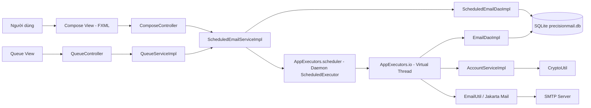

## 3. Ánh xạ kiến trúc sang mã nguồn

### 3.1 Cấu trúc gói liên quan UC-03

```mermaid
flowchart TD
    Root[nlu.fit.soft.gr5.precisionMail]
    Root --> Controller[controller.fxml]
    Root --> Service[service / service.impl]
    Root --> Dao[dao / dao.impl]
    Root --> Model[model]
    Root --> Util[util]
    Root --> Infra[infrastructure]
    Root --> Resources[resources/view/include/center]

    Controller --> ComposeCtrl[ComposeController.java]
    Controller --> QueueCtrl[QueueController.java]
    Service --> ScheduledSvc[ScheduledEmailServiceImpl.java]
    Service --> QueueSvc[QueueServiceImpl.java]
    Service --> AccountSvc[AccountServiceImpl.java]
    Dao --> ScheduledDao[ScheduledEmailDaoImpl.java]
    Dao --> EmailDao[EmailDaoImpl.java]
    Model --> ScheduledEmail[ScheduledEmail.java]
    Model --> Email[Email.java]
    Model --> Status[EmailStatus.java]
    Util --> EmailUtil[EmailUtil.java]
    Util --> AttachmentValidator[AttachmentValidator.java]
    Util --> LogHelper[LogHelper.java]
    Infra --> AppExecutors[AppExecutors.java]
    Infra --> DatabaseInitializer[DatabaseInitializer.java]
    Resources --> ComposeFxml[compose-mail.fxml]
    Resources --> QueueFxml[queue-mail.fxml]
```

### 3.2 Bảng ánh xạ thành phần thiết kế - mã nguồn

| Thành phần UC-03 | Vai trò thiết kế | Tệp hiện thực | Trách nhiệm chính |
| --- | --- | --- | --- |
| ScheduleView | Giao diện chọn lịch gửi | `compose-mail.fxml` | Cung cấp `DatePicker`, `hourBox`, `minuteBox`, nút `Schedule send` |
| ScheduleController | Điều phối thao tác lập lịch | `ComposeController.java` | Validate nội dung, kiểm tra mốc thời gian, tạo `ScheduledEmail`, gọi service |
| SchedulerService | Engine lập lịch | `ScheduledEmailServiceImpl.java` | Lưu lịch, đăng ký task, bootstrap lịch cũ, gửi tự động, retry, hủy/sửa lịch |
| QueueView | Giao diện quản lý hàng đợi | `queue-mail.fxml` | Hiển thị các email đang chờ gửi |
| QueueController | Điều phối hủy/sửa lịch | `QueueController.java` | Refresh queue, xem chi tiết, chỉnh sửa nội dung/thời gian, hủy lịch |
| QueueService | Facade quản lý hàng đợi | `QueueServiceImpl.java` | Chuyển thao tác UI sang `ScheduledEmailServiceImpl` |
| ScheduledEmailDao | Lưu trữ lịch | `ScheduledEmailDaoImpl.java` | Ghi/đọc/cập nhật bảng `scheduled_emails` |
| EmailDao | Lưu lịch sử gửi | `EmailDaoImpl.java` | Ghi bản ghi đã gửi vào `sent_emails` |
| AccountService | Nạp tài khoản gửi | `AccountServiceImpl.java` | Tìm account theo sender email và giải mã App Password |
| Async/Scheduler Infrastructure | Hạ tầng luồng | `AppExecutors.java` | Scheduler daemon và Virtual Thread executor |
| Mail Utility | Adapter SMTP | `EmailUtil.java` | Tạo MIME message và gửi SMTP |

## 4. Luồng hiện thực UC-03

### 4.1 Luồng tạo lịch từ màn hình soạn thư

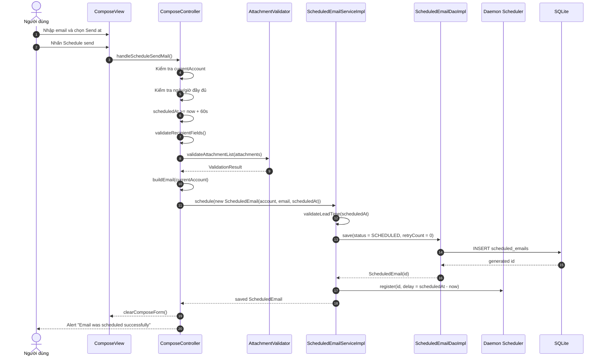

### 4.2 Luồng tự động gửi khi đến giờ

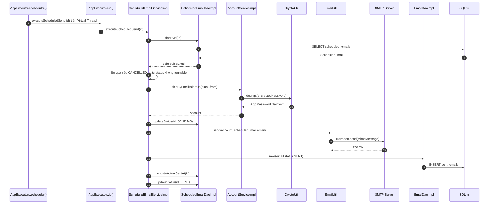

### 4.3 Mô hình trạng thái lịch gửi

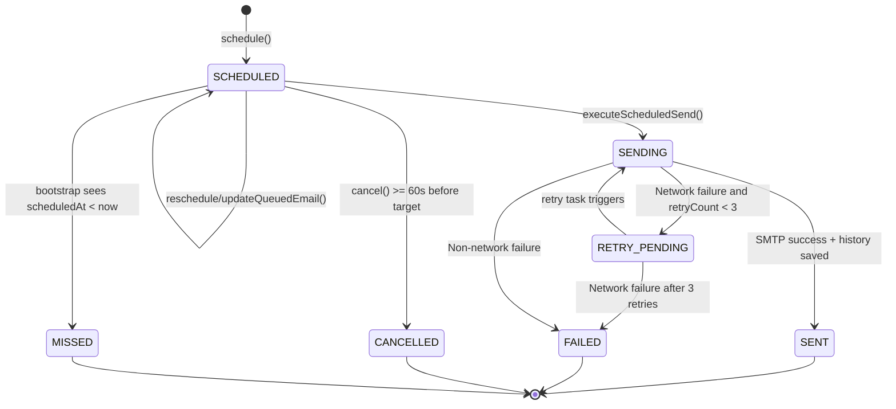

## 5. Hiện thực các giải pháp kỹ thuật cốt lõi

### 5.1 Scheduler daemon và Virtual Thread

`AppExecutors` cung cấp hai hạ tầng riêng: `ScheduledExecutorService` daemon để chờ đến mốc thời gian và Virtual Thread executor để thực thi I/O gửi mail.

```java
private static final ScheduledExecutorService SCHEDULER =
        Executors.newScheduledThreadPool(2, r -> {
            Thread thread = new Thread(r, "precisionmail-scheduler");
            thread.setDaemon(true);
            return thread;
        });
```

Khi đăng ký lịch, service dùng `schedule(...)` theo delay tính từ `scheduledAt`, sau đó chuyển việc gửi thật sang Virtual Thread:

```java
ScheduledFuture<?> future = AppExecutors.scheduler().schedule(
        () -> AppExecutors.io().execute(() -> executeScheduledSend(scheduledEmail.id)),
        delayMillis,
        TimeUnit.MILLISECONDS
);
```

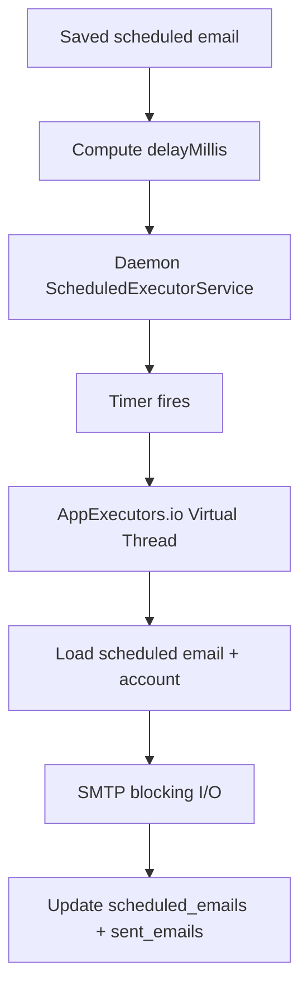

Ghi chú truy vết: `UC_03.md` nêu mục tiêu polling với sai lệch không quá 1 giây. Mã nguồn thực tế không polling mỗi giây mà đăng ký trực tiếp từng task bằng `ScheduledExecutorService.schedule(delayMillis)`, vì vậy độ chính xác phụ thuộc scheduler của JVM và tải hệ thống tại thời điểm kích hoạt.

### 5.2 Ràng buộc thời gian tối thiểu 60 giây

Ràng buộc được kiểm tra ở cả controller và service. Controller chặn sớm để phản hồi nhanh trên UI; service kiểm tra lại để bảo vệ invariant nghiệp vụ khi lời gọi đến từ Queue hoặc nguồn khác.

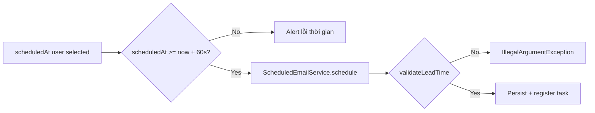

Các điểm kiểm tra:

| Vị trí | Hàm | Mục đích |
| --- | --- | --- |
| Compose UI | `handleScheduleSendMail()` | Chặn lịch mới quá gần hiện tại |
| Scheduler Service | `validateLeadTime()` | Bảo vệ khi tạo/reschedule/update task |
| Queue UI | `ensureCanModify()` | Không cho hủy/sửa khi còn dưới 60 giây |
| Scheduler Service | `validateCanModify()` | Bảo vệ hủy/sửa ở tầng nghiệp vụ |

### 5.3 Đồng bộ hàng đợi RAM với SQLite

Mỗi lịch gửi có một bản ghi trong bảng `scheduled_emails`. Sau khi lưu DB thành công và có `id`, service mới đăng ký `ScheduledFuture` vào `activeTasks`. Map `activeTasks` chỉ là cache runtime để hủy/thay thế task; nguồn dữ liệu bền vững vẫn là SQLite.

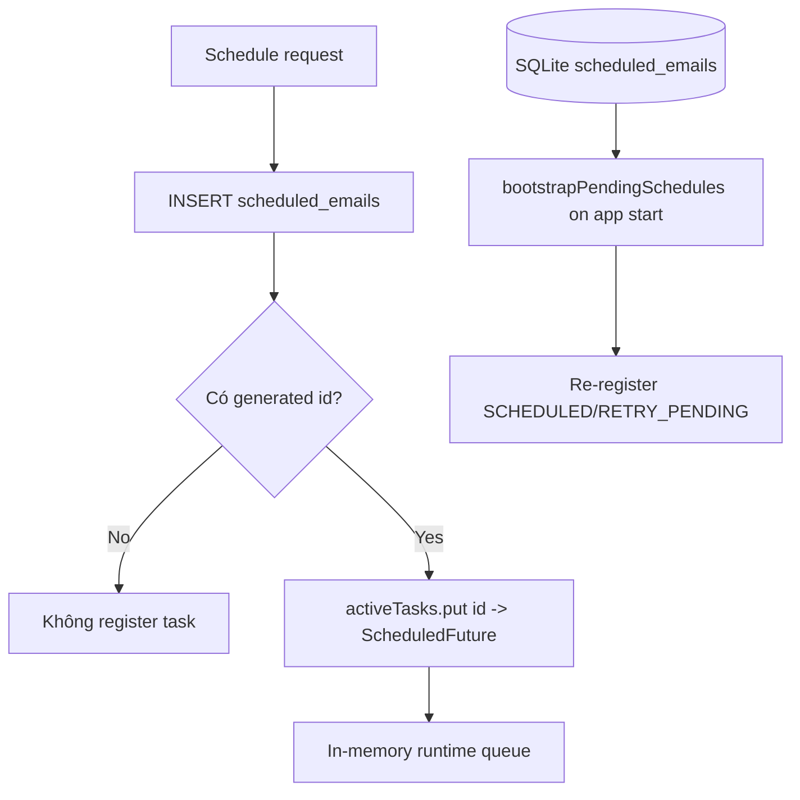

Nếu người dùng hủy hoặc sửa lịch, service luôn cập nhật DB và hủy `ScheduledFuture` cũ:

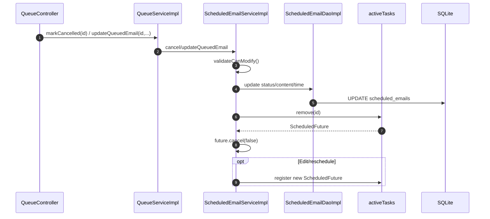

### 5.4 Bootstrap khi ứng dụng khởi động

`Launcher.main()` gọi `ScheduledEmailServiceImpl.getInstance().bootstrapPendingSchedules()` sau khi khởi tạo DB. Service truy vấn các bản ghi `SCHEDULED` và `RETRY_PENDING`. Nếu `scheduledAt` đã qua khi app không chạy, bản ghi được cập nhật thành `MISSED`; nếu vẫn còn tương lai, task được đăng ký lại.

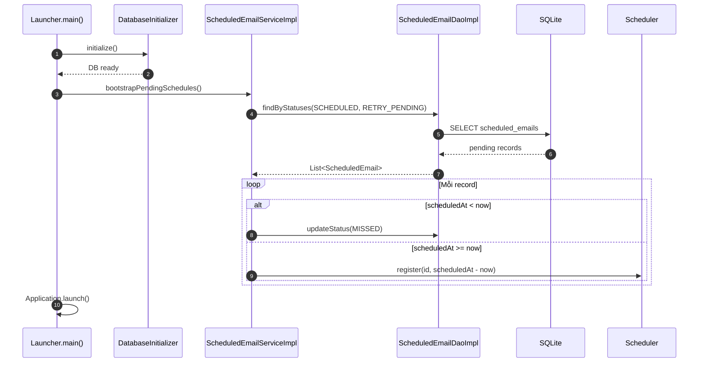

### 5.5 Retry policy khi lỗi mạng

Khi gửi tự động thất bại, `handleSendFailure()` phân biệt lỗi mạng bằng class name: `UnknownHostException`, `ConnectException`, `SocketTimeoutException`. Nếu là lỗi mạng và `retryCount < 3`, service cập nhật trạng thái `RETRY_PENDING`, tăng `retryCount`, đặt `scheduled_at = now + 300 seconds`, rồi đăng ký lại task.

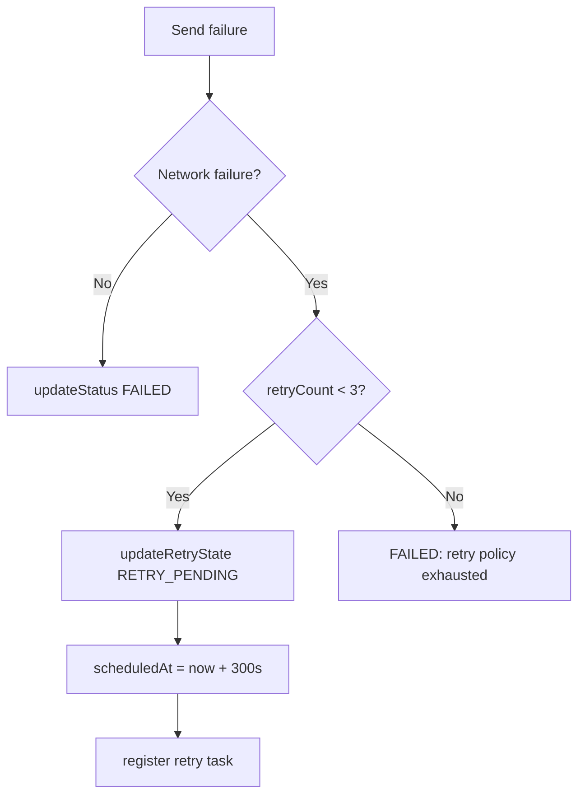

Chính sách hiện thực:

| Thuộc tính | Giá trị |
| --- | --- |
| Số lần retry tối đa | 3 |
| Khoảng cách giữa các lần retry | 300 giây |
| Trạng thái chờ retry | `RETRY_PENDING` |
| Trạng thái cuối khi hết retry | `FAILED` |
| Thông điệp lỗi mạng cuối | `Network connection error after retry policy was exhausted: ...` |

### 5.6 Gửi SMTP và lưu lịch sử

Tại thời điểm thực thi, service không dùng lại object account lưu trong `scheduled_emails` vì mật khẩu không nằm trong bảng queue. Service tìm account theo `email.from` thông qua `AccountServiceImpl.findByEmailAddress()`, giải mã App Password, rồi gửi email bằng `EmailUtil.send()`.

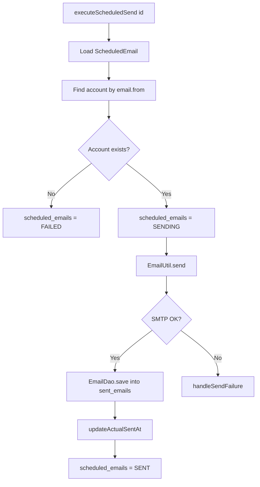

## 6. Hiện thực cơ sở dữ liệu và bootstrapping

UC-03 sử dụng bảng `scheduled_emails`, được tạo trong `DatabaseInitializer.initialize()`.

```sql
create table if not exists scheduled_emails
(
    id integer primary key autoincrement,
    account_id integer,
    sender_email text not null,
    to_recipients text not null default '',
    cc_recipients text not null default '',
    bcc_recipients text not null default '',
    subject text,
    body text,
    attachment_paths text,
    scheduled_at text not null,
    status text not null,
    error_message text,
    retry_count integer not null default 0,
    actual_sent_at text,
    created_at text not null,
    updated_at text not null,
    foreign key(account_id) references accounts(id)
);
```

Các index hỗ trợ UC-03:

| Index | Mục đích |
| --- | --- |
| `idx_scheduled_emails_status` | Tìm nhanh bản ghi `SCHEDULED`/`RETRY_PENDING` khi bootstrap hoặc hiển thị queue |
| `idx_scheduled_emails_scheduled_at` | Sắp xếp và lọc theo thời gian gửi dự kiến |

`DbUtil` bật WAL và foreign key mỗi lần mở connection:

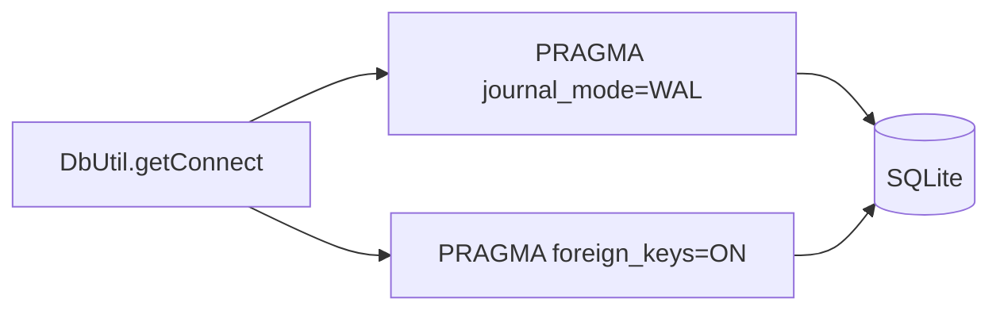

## 7. Quản lý hàng đợi: xem, hủy, chỉnh sửa

Màn hình queue là phần hiện thực cho AF-03-01. `QueueController.refreshQueue()` tải danh sách `SCHEDULED` bằng `QueueServiceImpl.findScheduled()`. Người dùng có thể xem chi tiết, hủy lịch hoặc chỉnh sửa nội dung/thời gian nếu còn tối thiểu 60 giây trước giờ gửi.

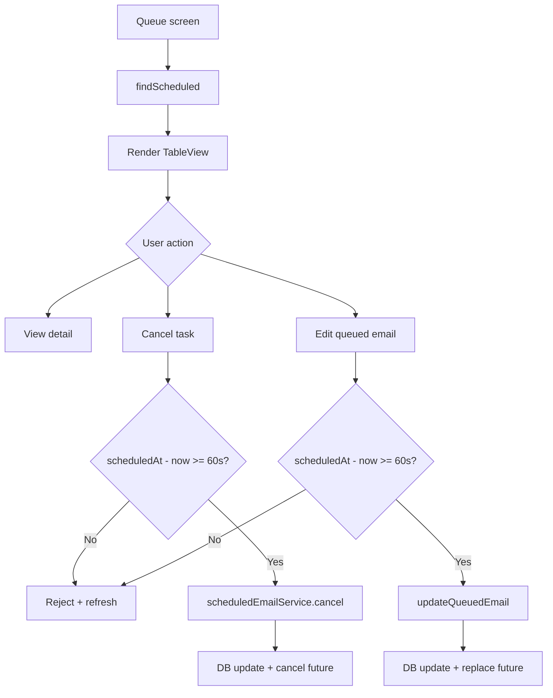

## 8. Bảo mật log và dữ liệu nhạy cảm

UC-03 ghi log vận hành bằng metadata. Email người gửi được mask bằng `LogHelper.maskEmail()`, số lượng người nhận và attachment được ghi bằng count. Service không ghi App Password, nội dung body hoặc đường dẫn attachment chi tiết vào log trong luồng scheduler.

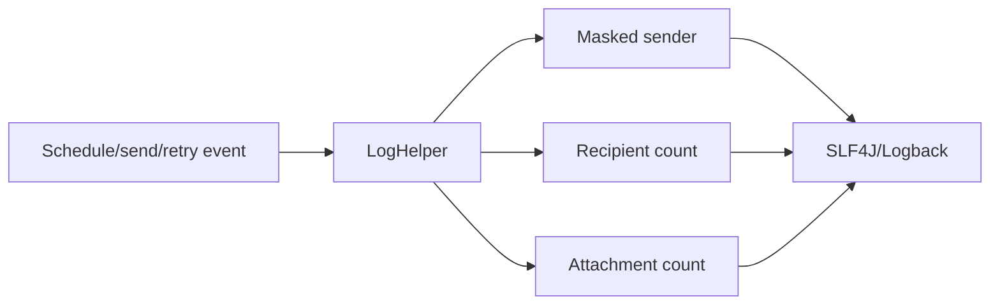

## 9. Truy vết yêu cầu - hiện thực

| Mã yêu cầu UC-03 | Nội dung | Thành phần hiện thực | Trạng thái |
| --- | --- | --- | --- |
| S3.1-S3.3 | Người dùng chọn ngày/giờ và nhấn lên lịch | `compose-mail.fxml`, `ComposeController.handleScheduleSendMail()` | Đã hiện thực |
| S3.4 | Kiểm tra thời gian so với hiện tại | `handleScheduleSendMail()`, `validateLeadTime()` | Đã hiện thực |
| S3.5 | Khóa thao tác khi xử lý | Controller có `scheduleLocked`, nhưng đường `handleScheduleSendMail()` hiện lưu đồng bộ nhanh và chưa gọi `setScheduleLocked(true)` | Hiện thực một phần |
| S3.6 | Lưu email vào DB trạng thái `SCHEDULED` | `ScheduledEmailDaoImpl.save()` | Đã hiện thực |
| S3.7 | Đăng ký tác vụ định thời | `ScheduledEmailServiceImpl.register()` | Đã hiện thực |
| S3.8 | Bootstrap lịch khi app khởi động | `Launcher.main()`, `bootstrapPendingSchedules()` | Đã hiện thực |
| S3.9 | Kích hoạt khi đến giờ | `ScheduledExecutorService.schedule(delayMillis)` | Đã hiện thực |
| S3.10 | Nạp account, giải mã, gửi SMTP | `AccountServiceImpl.findByEmailAddress()`, `EmailUtil.send()` | Đã hiện thực |
| S3.11-S3.12 | Cập nhật `SENT` và lưu lịch sử | `EmailDaoImpl.save()`, `updateActualSentAt()`, `updateStatus(SENT)` | Đã hiện thực |
| AF-03-01 | Hủy/chỉnh sửa lịch trước giờ G | `QueueController`, `QueueServiceImpl`, `ScheduledEmailServiceImpl.cancel/updateQueuedEmail` | Đã hiện thực |
| EF-03-01 | Thời gian quá khứ/quá gần | `MINIMUM_LEAD_TIME_SECONDS = 60` | Đã hiện thực |
| EF-03-02 | App tắt tại giờ gửi | `bootstrapPendingSchedules()` đánh dấu `MISSED` | Đã hiện thực |
| EF-03-03 | Mất mạng và retry | `handleSendFailure()`, `RETRY_PENDING`, retry 3 lần mỗi 300 giây | Đã hiện thực |
| BR-03-01 | Lead time tối thiểu 60 giây | Controller + service validation | Đã hiện thực |
| BR-03-02 | Queue RAM ánh xạ DB | DB là nguồn bền vững, `activeTasks` ánh xạ theo `scheduledEmail.id` | Đã hiện thực |
| BR-03-03 | Scheduler daemon | `Thread.setDaemon(true)` trong `AppExecutors.scheduler()` | Đã hiện thực |
| NFR-03-01 | Sai lệch kích hoạt <= 1 giây | Dùng scheduled executor theo delay, chưa có kiểm thử đo sai lệch thời gian | Chưa xác minh tự động |
| NFR-03-02 | Xử lý song song nhiều tác vụ | Dùng Virtual Thread cho gửi mail; chưa có benchmark 100 tác vụ | Hiện thực nền tảng, chưa benchmark |
| NFR-03-03 | Bảo toàn DB | SQLite WAL được bật trong `DbUtil` | Đã hiện thực |

## 10. Rào cản kỹ thuật và giải pháp

| Rào cản | Ảnh hưởng | Giải pháp hiện thực |
| --- | --- | --- |
| Ứng dụng desktop có thể bị tắt trước giờ gửi | Task RAM biến mất | Lưu lịch trong SQLite và bootstrap lại khi khởi động |
| Lịch đã quá giờ khi app mở lại | Không thể gửi đúng giờ như cam kết | Đánh dấu `MISSED` và ghi log WARN |
| Hủy/sửa lịch quá sát giờ gửi | Có nguy cơ race với task đang chuẩn bị chạy | Chặn thao tác nếu còn dưới 60 giây ở cả UI và service |
| Lỗi mạng tạm thời tại thời điểm gửi | Email có thể thất bại dù chỉ mất mạng ngắn | Retry tối đa 3 lần, mỗi lần cách 300 giây |
| Nhiều lịch kích hoạt gần nhau | Blocking SMTP có thể chiếm luồng | Timer daemon chỉ kích hoạt; gửi thật chạy trên Virtual Thread executor |
| Dữ liệu nhạy cảm trong log | Rủi ro lộ thông tin cá nhân | Log metadata, mask sender, chỉ ghi count người nhận/attachment |

## 11. Kết luận hiện thực

Phần hiện thực UC-03 đã chuyển đặc tả "Lên lịch gửi Email" thành cơ chế chạy được gồm tạo lịch từ màn hình soạn thư, lưu lịch bền vững trong SQLite, đăng ký task daemon, bootstrap lại khi ứng dụng khởi động, gửi SMTP tự động trên Virtual Thread, retry khi lỗi mạng và quản lý hàng đợi qua màn hình Queue.

Mức độ đáp ứng yêu cầu chính:

| Nhóm yêu cầu | Đánh giá |
| --- | --- |
| Lên lịch gửi với thời gian tương lai | Hoàn thành |
| Lưu hàng đợi vào DB | Hoàn thành |
| Scheduler daemon tự kích hoạt | Hoàn thành |
| Gửi SMTP nền bằng Virtual Thread | Hoàn thành |
| Bootstrap lịch sau khi mở app | Hoàn thành |
| Đánh dấu `MISSED` khi app tắt qua giờ gửi | Hoàn thành |
| Retry lỗi mạng | Hoàn thành |
| Hủy/chỉnh sửa hàng đợi trước giờ G | Hoàn thành |
| Benchmark độ chính xác <= 1 giây và 100 tác vụ song song | Chưa có kiểm thử hiệu năng tự động |

