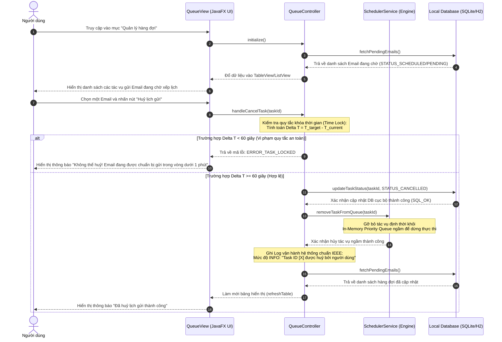

# TÀI LIỆU ĐẶC TẢ CHI TIẾT USE CASE

## HỆ THỐNG GỬI MAIL TỰ ĐỘNG TRÊN DESKTOP (DESKTOP EMAIL SYSTEM)

**Mã tài liệu:** UC-SPEC-04

**Tiêu chuẩn áp dụng:** IEEE Std 830-1998 / IEEE Std 29148-2018

**Trạng thái:** Hoàn thiện

### 1. Thông tin chung (General Information)

*   **Use Case ID (Mã định danh Use case):** UC-04 (Ánh xạ trực tiếp từ yêu cầu nghiệp vụ UR-05 trong BRD)
*   **Use Case Name (Tên Use case):** Quản lý hàng đợi Email
*   **Description (Mô tả chức năng):** Cung cấp giao diện trực quan cho phép người dùng quản lý, giám sát trạng thái của các email đang nằm trong hàng đợi chờ gửi (Pending). Người dùng có quyền truy vấn chi tiết, thay đổi thời gian lập lịch, chỉnh sửa nội dung soạn thảo hoặc thực hiện hủy bỏ tác vụ gửi trước thời điểm thực thi.
*   **Actor(s) (Các tác nhân tham gia):** Người dùng (User)
*   **Priority (Mức độ ưu tiên):** Cao (High)
*   **Trigger (Điều kiện kích hoạt):** Người dùng bấm chọn mục "Hàng đợi chờ gửi" (Queue Management) trên thanh menu điều hướng chính của giao diện JavaFX.

### 2. Điều kiện Tiền - Hậu (Pre & Post-Conditions)

*   **Pre-Condition(s) (Điều kiện tiên quyết):**
    1.  Ứng dụng đã khởi chạy thành công trên máy trạm (Hệ điều hành Windows 10/11 hoặc Linux LTS) dưới môi trường thực thi JVM 21.
    2.  Cơ sở dữ liệu cục bộ (SQLite/H2) đang ở trạng thái hoạt động bình thường để truy vấn dữ liệu hàng đợi.
*   **Post-Condition(s) (Trạng thái hệ thống sau khi thành công):**
    1.  Mọi thay đổi về nội dung, thời gian hoặc trạng thái của tác vụ gửi (Đã hủy - Cancelled, Thay đổi thời gian - Rescheduled) được cập nhật đồng bộ, chính xác xuống Database cục bộ.
    2.  Bộ định thời ngầm (Scheduler Daemon) trên RAM được đồng bộ hóa tức thời (nạp lại cấu hình hoặc loại bỏ tác vụ) để phản ánh đúng trạng thái thực tế trong Database.
    3.  Nhật ký hệ thống (System Log) ghi nhận thông tin thao tác của người dùng ở cấp độ INFO mà không để lộ các dữ liệu cá nhân nhạy cảm.

### 3. Luồng sự kiện (Flow of Events)

#### 3.1 Basic Flow (Luồng Use case chính - Xem hàng đợi & Hủy lịch gửi)

1.  **S4.1:** Người dùng chọn mục "Hàng đợi chờ gửi" trên giao diện điều hướng.
2.  **S4.2:** Hệ thống gửi câu lệnh truy vấn tới Database cục bộ để tìm kiếm tất cả các bản ghi email có trạng thái là "Chờ gửi" (Pending). Trong triển khai, trạng thái lưu trữ nội bộ tương ứng là `SCHEDULED`.
3.  **S4.3:** Hệ thống hiển thị danh sách hàng đợi lên bảng (TableView của JavaFX) được sắp xếp thứ tự ưu tiên theo thời gian dự kiến gửi (`scheduled_at`) tăng dần, kèm theo các nút chức năng: "Xem chi tiết", "Chỉnh sửa", "Hủy gửi".
4.  **S4.4:** Người dùng chọn một email cụ thể từ danh sách và nhấn nút **"Hủy gửi"** (Cancel Task).
5.  **S4.5:** Hệ thống thực hiện kiểm tra ràng buộc thời gian hiện tại ($T_{\text{current}}$) so với thời gian dự kiến gửi ($T_{\text{target}}$) của email được chọn.
6.  **S4.6:** Thời gian thỏa mãn điều kiện an toàn, hệ thống hiển thị hộp thoại cảnh báo xác nhận: *"Bạn có chắc chắn muốn hủy lịch gửi cho email này?"*.
7.  **S4.7:** Người dùng nhấn nút **"Đồng ý"**.
8.  **S4.8:** Hệ thống cập nhật trạng thái của bản ghi email trong DB cục bộ thành "Đã hủy" (Cancelled).
9.  **S4.9:** Hệ thống gửi tín hiệu đến Scheduler Daemon yêu cầu loại bỏ (De-register) tác vụ định thời tương ứng ra khỏi hàng đợi trên bộ nhớ đệm RAM.
10. **S4.10:** Hệ thống làm mới (Refresh) bảng danh sách trên giao diện UI, hiển thị thông báo "Đã hủy lịch gửi email thành công\!" và ghi log sự kiện INFO.

#### 3.2 Alternative Flow (Luồng thay thế)

*   **AF-04-01: Chỉnh sửa nội dung và Thời gian gửi của Email trong hàng đợi:**
    *   Tại bước S4.4, người dùng chọn một email và bấm nút **"Chỉnh sửa"** (Edit Task).
    *   Hệ thống kiểm tra điều kiện an toàn thời gian ($T_{\text{target}} - T_{\text{current}} \ge 60 \text{ giây}$). Nếu đạt, hệ thống hiển thị một biểu mẫu chứa toàn bộ nội dung đã soạn thảo trước đó cùng hộp chọn thời gian (DateTimePicker).
    *   Người dùng tiến hành thay đổi các thông tin (Người nhận, Tiêu đề, Nội dung HTML, danh sách đường dẫn tệp đính kèm hoặc Ngày/Giờ gửi mới $T_{\text{new}}$) và nhấn **"Xác nhận cập nhật"**.
    *   Hệ thống kiểm tra ràng buộc dữ liệu đầu vào (tương tự **EF-01-01** của UC-01 và **EF-02-02** của UC-02) và điều kiện thời gian gửi mới:
    $$
        T_{\text{new}} \ge T_{\text{current}} + 60 \text{ giây}
    $$
    *   Nếu hợp lệ, hệ thống cập nhật bản ghi trong DB cục bộ, đồng thời thông báo cho Scheduler Daemon hủy tác vụ cũ và đăng ký lịch trình mới ứng với $T_{\text{new}}$.
    *   Biểu mẫu đóng lại, hệ thống cập nhật lại danh sách hàng đợi trên UI và thông báo thành công.

#### 3.3 Exception Flow (Luồng ngoại lệ)

*   **EF-04-01: Tác vụ rơi vào "Khung giờ khóa" không cho phép can thiệp (Xảy ra tại bước S4.5):**
    *   Khi người dùng nhấn "Hủy gửi" hoặc "Chỉnh sửa", hệ thống phát hiện khoảng cách thời gian từ hiện tại tới lúc gửi thực tế không đủ an toàn:
    $$
        T_{\text{target}} - T_{\text{current}} < 60 \text{ giây}
    $$
    *   Hệ thống từ chối thực thi thao tác, không hiển thị hộp thoại xác nhận/biểu mẫu sửa, mà hiển thị cảnh báo lỗi trực quan: *"Không thể thay đổi. Email đã đi vào trạng thái chuẩn bị gửi (dưới 60 giây trước giờ G)."*.
    *   Danh sách hàng đợi được tự động nạp lại để cập nhật trạng thái chính xác nhất.
*   **EF-04-02: Lỗi xung đột tiến trình cập nhật Database (Xảy ra tại bước S4.8):**
    *   Khi thực hiện cập nhật trạng thái sang "Đã hủy" hoặc lưu nội dung chỉnh sửa, tệp tin DB SQLite cục bộ bị khóa do tiến trình ngầm khác đang thực hiện ghi dữ liệu.
    *   Hệ thống bắt ngoại lệ SQLException, thực hiện Rollback giao dịch để bảo vệ tính toàn vẹn.
    *   Hiển thị thông báo: *"Hệ thống bận. Không thể cập nhật trạng thái hàng đợi, vui lòng thử lại sau ít giây."* và ghi nhận log WARNING.

### 4. Quy tắc Nghiệp vụ (Business Rules)

*   **BR-04-01 (Thời gian khóa tối thiểu):** Để đảm bảo tiến trình gửi thư ngầm hoạt động ổn định và không xảy ra xung đột tranh chấp tài nguyên mạng Socket khi chuẩn bị gửi, mọi thao tác chỉnh sửa hoặc hủy bỏ bắt buộc phải thực hiện cách thời điểm gửi thực tế ($T_{\text{target}}$) tối thiểu $60 \text{ giây}$. Công thức ràng buộc:
$$
    \Delta T_{\text{safe}} = T_{\text{target}} - T_{\text{current}} \ge 60 \text{ giây}
$$
*   **BR-04-02 (Ràng buộc nhất quán bộ nhớ đệm và DB):** Bộ lập lịch ngầm chạy trên bộ nhớ RAM và Cơ sở dữ liệu SQLite/H2 cục bộ phải luôn đồng bộ . Khi một tác vụ bị hủy hoặc dời lịch trên UI, hệ thống bắt buộc phải giải phóng đối tượng hoặc cập nhật lại Trigger trong Scheduler Engine ngay lập tức để tránh hiện tượng gửi lặp (Double Send) hoặc lỗi rò rỉ bộ nhớ (Memory leak).
*   **BR-04-03 (Bảo mật thông tin Log vận hành):** Tuân thủ nghiêm ngặt quy định UR-13. Nhật ký thao tác hàng đợi chỉ ghi nhận siêu dữ liệu tổng quát dưới dạng:  
    `User modified/cancelled task ID \[X\]. Previous target: \[YYYY-MM-DD HH:mm:ss\]. Status: SUCCESS`
     
    Tuyệt đối không lưu lại lịch sử nội dung thư cũ/mới hay tệp tin đính kèm vào file log.

### 5. Yêu cầu phi chức năng (Non-Functional Requirements)

*   **NFR-04-01 (Hiệu năng phản hồi UI mượt mà):** Thời gian phản hồi render danh sách hàng đợi (TableView) khi người dùng mở tab hoặc thực hiện lọc, tìm kiếm theo từ khóa phải nhỏ hơn $0.2 \text{ giây}$, duy trì tần số quét giao diện đồ họa ổn định 60 FPS.
*   **NFR-04-02 (Đồng bộ bất đồng bộ):** Các thao tác cập nhật DB cục bộ và thông báo đồng bộ Scheduler Daemon phải được thực thi bất đồng bộ thông qua Virtual Threads của JDK 21 nhằm loại bỏ hoàn toàn khả năng làm đứng ứng dụng (UI Freezing) khi thao tác với lượng hàng đợi lớn (\> 1000 bản ghi).
*   **NFR-04-03 (Tính toàn vẹn dữ liệu khi có lỗi xảy ra):** Quy trình cập nhật hàng đợi phải đặt trong cấu trúc Giao dịch (Database Transaction) để đảm bảo nếu quá trình đồng bộ hóa Scheduler trên RAM thất bại thì trạng thái dưới Database cũng sẽ không bị thay đổi (Rollback hoàn toàn).

### 6. Sequence Diagram

