# TÀI LIỆU HIỆN THỰC MÃ NGUỒN UC-04

## 1. Thông tin tài liệu

| Thuộc tính | Giá trị |
| --- | --- |
| Mã tài liệu | UC04-IMPL |
| Use Case | UC-04 - Quản lý hàng đợi Email |
| Chuẩn áp dụng | IEEE Std 29148-2018, IEEE Std 1016-2009 |
| Phạm vi | Trình bày hiện thực mã nguồn cho chức năng xem hàng đợi, xem chi tiết, hủy lịch gửi, chỉnh sửa nội dung và thời gian gửi của email đang chờ |
| Nguồn tham chiếu | `docs/implementation_guide.md`, `docs/UC_04.md`, mã nguồn trong `src/main/java` |

## 2. Tổng quan hiện thực

UC-04 được hiện thực bằng màn hình `queue-mail.fxml` và controller `QueueController`. Khi người dùng mở mục "Hàng đợi chờ gửi", controller tải danh sách email có trạng thái `SCHEDULED` từ SQLite thông qua `QueueServiceImpl` và `ScheduledEmailDaoImpl`, sau đó hiển thị dữ liệu lên `TableView`.

Các thao tác cập nhật hàng đợi như hủy lịch hoặc chỉnh sửa email được thực thi bất đồng bộ bằng `AppExecutors.io()` để không khóa JavaFX Application Thread. Tầng nghiệp vụ `ScheduledEmailServiceImpl` chịu trách nhiệm đồng bộ hai phần: cập nhật bản ghi trong DB và hủy/đăng ký lại `ScheduledFuture` trong bộ nhớ RAM thông qua map `activeTasks`.

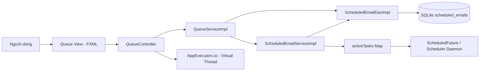

Ghi chú truy vết: trong `docs/OLD/use_case_specifications.md`, UC04 từng được mô tả là "Import danh sách người nhận". Tài liệu này bám theo file hiện hành `docs/UC_04.md`, trong đó UC04 là "Quản lý hàng đợi Email".

## 3. Ánh xạ kiến trúc sang mã nguồn

### 3.1 Cấu trúc gói liên quan UC-04

```mermaid
flowchart TD
    Root[nlu.fit.soft.gr5.precisionMail]
    Root --> Controller[controller.fxml]
    Root --> Service[service / service.impl]
    Root --> Dao[dao / dao.impl]
    Root --> Model[model]
    Root --> Util[util]
    Root --> Infra[infrastructure]
    Root --> Resources[resources/view/include/center]

    Controller --> QueueCtrl[QueueController.java]
    Service --> QueueSvc[QueueServiceImpl.java]
    Service --> ScheduledSvc[ScheduledEmailServiceImpl.java]
    Dao --> ScheduledDao[ScheduledEmailDaoImpl.java]
    Model --> ScheduledEmail[ScheduledEmail.java]
    Model --> Email[Email.java]
    Model --> Status[EmailStatus.java]
    Util --> EmailUtil[EmailUtil.java]
    Util --> LogHelper[LogHelper.java]
    Util --> AlertUtil[AlertUtil.java]
    Infra --> Executors[AppExecutors.java]
    Infra --> DbInit[DatabaseInitializer.java]
    Resources --> QueueFxml[queue-mail.fxml]
```

### 3.2 Bảng ánh xạ thành phần thiết kế - mã nguồn

| Thành phần UC-04 | Vai trò thiết kế | Tệp hiện thực | Trách nhiệm chính |
| --- | --- | --- | --- |
| QueueView | Giao diện hàng đợi | `src/main/resources/nlu/fit/soft/gr5/precisionMail/view/include/center/queue-mail.fxml` | Khai báo `TableView`, các cột ID/sender/recipient/subject/scheduledAt/status và nút thao tác |
| QueueController | Điều phối UI | `src/main/java/nlu/fit/soft/gr5/precisionMail/controller/fxml/QueueController.java` | Load hàng đợi, xem chi tiết, kiểm tra time-lock, hủy task, mở form chỉnh sửa |
| QueueService | Facade nghiệp vụ hàng đợi | `src/main/java/nlu/fit/soft/gr5/precisionMail/service/impl/QueueServiceImpl.java` | Gọi DAO để đọc queue và gọi scheduler service để hủy/sửa |
| SchedulerService | Đồng bộ DB và scheduler RAM | `src/main/java/nlu/fit/soft/gr5/precisionMail/service/impl/ScheduledEmailServiceImpl.java` | Hủy `ScheduledFuture`, cập nhật nội dung/thời gian, đăng ký lại task |
| ScheduledEmailDao | Lưu trữ hàng đợi | `src/main/java/nlu/fit/soft/gr5/precisionMail/dao/impl/ScheduledEmailDaoImpl.java` | Truy vấn/cập nhật bảng `scheduled_emails` |
| Email Parser | Kiểm tra danh sách người nhận | `src/main/java/nlu/fit/soft/gr5/precisionMail/util/EmailUtil.java` | Parse To/Cc/Bcc và validate định dạng email |
| Async Executor | Tác vụ nền | `src/main/java/nlu/fit/soft/gr5/precisionMail/infrastructure/async/AppExecutors.java` | Chạy truy vấn/cập nhật DB ngoài UI thread |
| Log Helper | Log an toàn | `src/main/java/nlu/fit/soft/gr5/precisionMail/util/LogHelper.java` | Mask sender, đếm người nhận/attachment |

## 4. Luồng hiện thực UC-04

### 4.1 Luồng tải và hiển thị hàng đợi

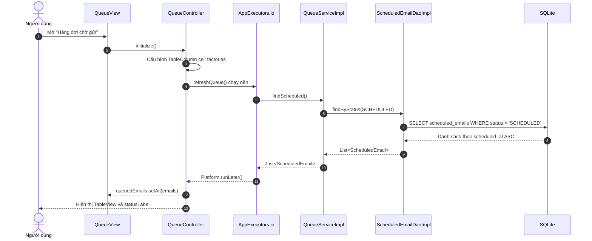

### 4.2 Luồng hủy lịch gửi

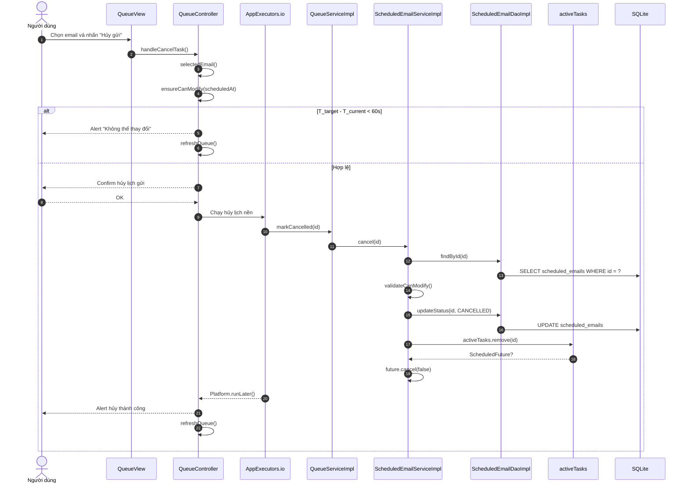

### 4.3 Luồng chỉnh sửa nội dung và thời gian gửi

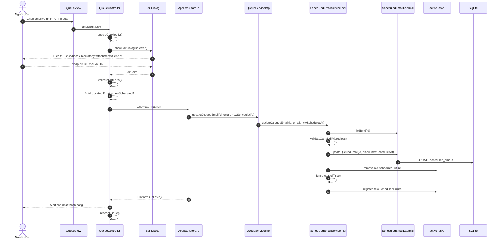

### 4.4 Mô hình trạng thái task trong hàng đợi

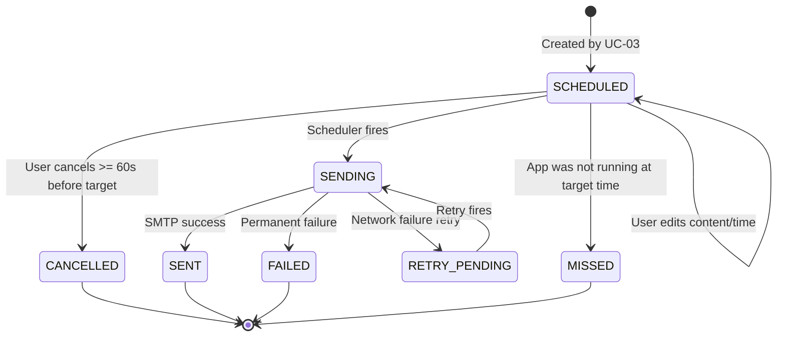

## 5. Hiện thực các giải pháp kỹ thuật cốt lõi

### 5.1 Tải và cập nhật hàng đợi bất đồng bộ

`QueueController.refreshQueue()` không truy vấn DB trên JavaFX Application Thread. Controller gửi tác vụ sang `AppExecutors.io()` và chỉ cập nhật `ObservableList` bằng `Platform.runLater()`.

```java
AppExecutors.io().execute(() -> {
    try {
        List<ScheduledEmail> emails = queueService.findScheduled();
        Platform.runLater(() -> {
            queuedEmails.setAll(emails);
            statusLabel.setText("Đang hiển thị " + emails.size() + " email chờ gửi.");
        });
    } catch (IOException e) {
        Platform.runLater(() -> {
            statusLabel.setText("Không thể tải hàng đợi.");
            AlertUtil.showError("Lỗi tải hàng đợi", "Không thể truy vấn danh sách email chờ gửi.");
        });
    }
});
```

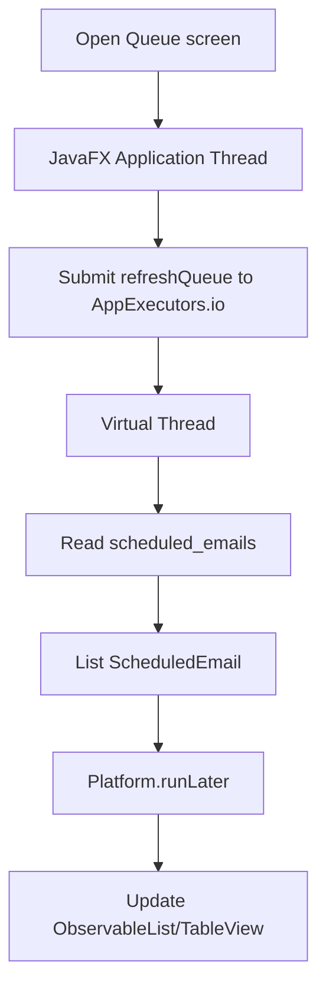

### 5.2 Ràng buộc khóa thời gian 60 giây

UC-04 kiểm tra time-lock ở hai lớp. `QueueController.ensureCanModify()` chặn sớm trên UI; `ScheduledEmailServiceImpl.validateCanModify()` kiểm tra lại ở tầng nghiệp vụ để tránh cập nhật ngoài UI.

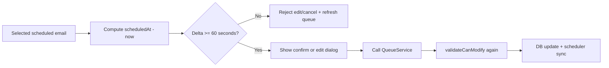

Các điểm hiện thực:

| Lớp | Hàm | Vai trò |
| --- | --- | --- |
| UI | `QueueController.ensureCanModify()` | Không mở confirm/dialog nếu còn dưới 60 giây |
| Service | `ScheduledEmailServiceImpl.validateCanModify()` | Bảo vệ thao tác hủy/sửa từ mọi caller |
| Constant | `MINIMUM_LEAD_TIME_SECONDS = 60` | Đồng nhất ràng buộc an toàn |

### 5.3 Đồng bộ DB với Scheduler Daemon

Khi hủy lịch, service cập nhật trạng thái DB thành `CANCELLED`, sau đó xóa `ScheduledFuture` trong `activeTasks` và gọi `future.cancel(false)`.

Khi chỉnh sửa lịch, service cập nhật nội dung/thời gian trong DB, hủy future cũ và đăng ký lại future mới theo `newScheduledAt`. Nếu đăng ký lại thất bại, service cố gắng rollback logic bằng cách ghi lại nội dung/thời gian cũ và register lại task cũ.

```mermaid
flowchart TD
    Change[Cancel/Edit request] --> Find[findById]
    Find --> Validate[validateCanModify]
    Validate --> DbUpdate[Update scheduled_emails]
    DbUpdate --> Remove[activeTasks.remove(id)]
    Remove --> CancelFuture[future.cancel(false)]
    CancelFuture --> Type{Edit or Cancel?}
    Type -->|Cancel| Done[Status CANCELLED]
    Type -->|Edit| Register[register new ScheduledFuture]
    Register --> Done2[Status SCHEDULED with new target]
```

### 5.4 Chỉnh sửa nội dung email trong hàng đợi

Form chỉnh sửa được tạo bằng JavaFX `Dialog`. Dữ liệu cũ được đổ vào các trường To, Cc, Bcc, Subject, Body, Attachments và Send at. Khi người dùng xác nhận, controller validate người nhận và thời gian gửi mới rồi tạo `Email` mới.

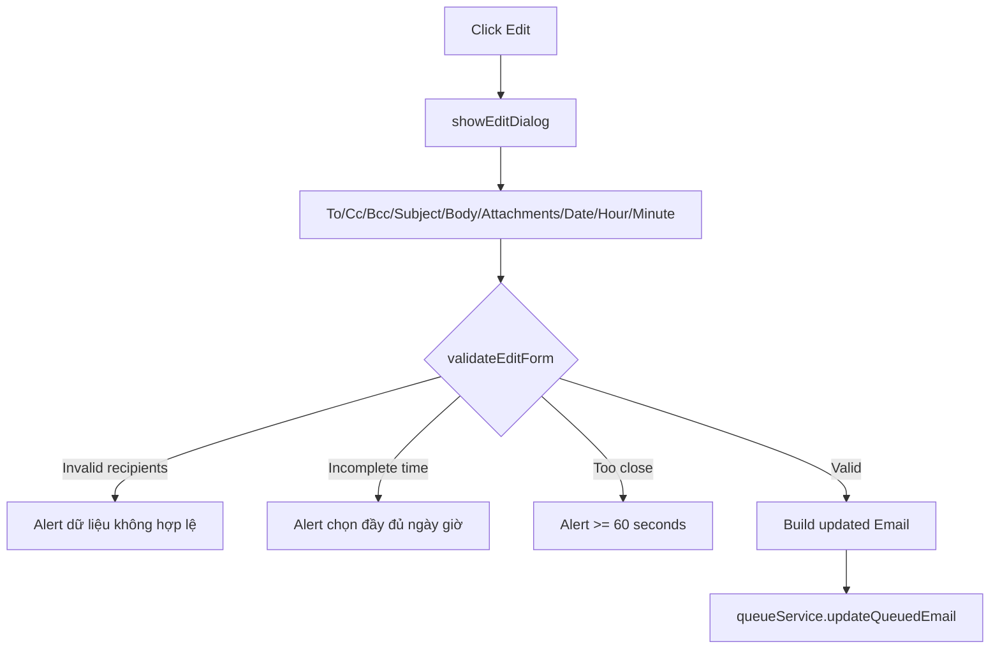

Giới hạn hiện tại: form chỉnh sửa attachment là `TextArea` chứa danh sách đường dẫn, chưa dùng lại `FileChooser` và chưa kiểm tra tổng dung lượng 25 MB như luồng soạn thư UC-02. Đây là điểm cần ghi nhận nếu mở rộng kiểm thử.

### 5.5 Truy vấn hàng đợi từ SQLite

`QueueServiceImpl.findScheduled()` gọi trực tiếp `ScheduledEmailDaoImpl.findByStatus(EmailStatus.SCHEDULED)`. DAO sắp xếp kết quả theo `scheduled_at asc`, đúng yêu cầu hiển thị các email gần đến giờ gửi trước.

```mermaid
flowchart LR
    QueueService[QueueServiceImpl.findScheduled] --> DAO[ScheduledEmailDaoImpl.findByStatus]
    DAO --> SQL["SELECT ... FROM scheduled_emails WHERE status = ? ORDER BY scheduled_at ASC"]
    SQL --> Map[mapScheduledEmail(ResultSet)]
    Map --> UI[List ScheduledEmail]
```

## 6. Hiện thực cơ sở dữ liệu

UC-04 sử dụng bảng `scheduled_emails`, được tạo trong `DatabaseInitializer`. Bảng này là nguồn dữ liệu bền vững cho hàng đợi và cũng là điểm đồng bộ với scheduler runtime.

```sql
create table if not exists scheduled_emails
(
    id integer primary key autoincrement,
    account_id integer,
    sender_email text not null,
    to_recipients text not null default '',
    cc_recipients text not null default '',
    bcc_recipients text not null default '',
    subject text,
    body text,
    attachment_paths text,
    scheduled_at text not null,
    status text not null,
    error_message text,
    retry_count integer not null default 0,
    actual_sent_at text,
    created_at text not null,
    updated_at text not null,
    foreign key(account_id) references accounts(id)
);
```

Các thao tác chính trên DB:

| Nghiệp vụ | DAO method | SQL effect |
| --- | --- | --- |
| Load hàng đợi | `findByStatus(SCHEDULED)` | `SELECT ... WHERE status = ? ORDER BY scheduled_at ASC` |
| Hủy lịch | `updateStatus(id, CANCELLED, null)` | Cập nhật `status`, `error_message`, `updated_at` |
| Đổi thời gian | `updateScheduledAt(id, newScheduledAt)` | Cập nhật `scheduled_at`, reset error/retry |
| Sửa nội dung queue | `updateQueuedEmail(id, email, scheduledAt)` | Cập nhật recipients, subject, body, attachments, time |

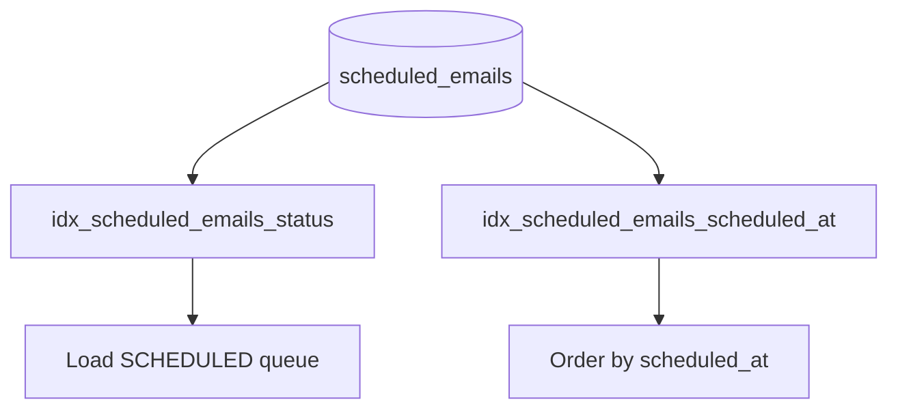

## 7. Xử lý ngoại lệ và phản hồi người dùng

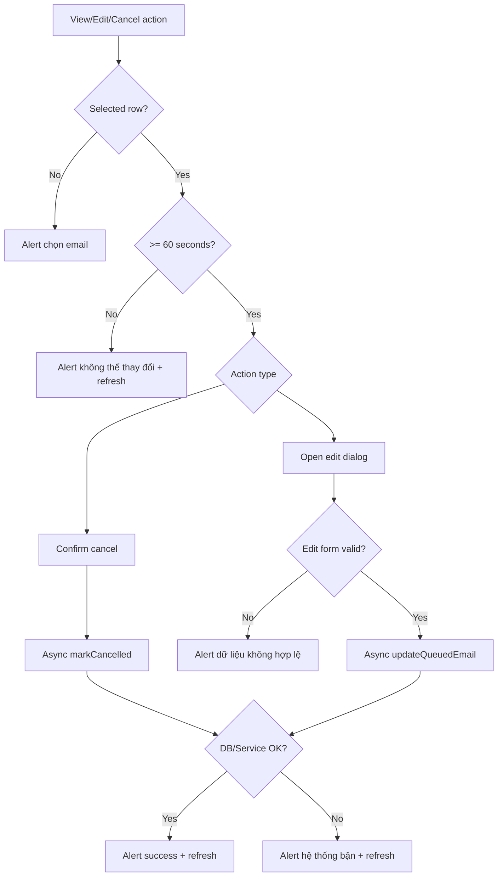

Các lỗi chính được xử lý:

| Ngoại lệ/điều kiện | Phản hồi UI | Log |
| --- | --- | --- |
| Chưa chọn email | Alert "Vui lòng chọn một email trong hàng đợi." | Không cần log lỗi |
| Dưới 60 giây trước giờ gửi | Alert "Không thể thay đổi..." và refresh queue | Không ghi dữ liệu nhạy cảm |
| Form edit thiếu người nhận hợp lệ | Alert "Vui lòng nhập ít nhất một địa chỉ email hợp lệ." | Không ghi body/recipient đầy đủ |
| Lỗi DB/service khi hủy/sửa | Alert "Hệ thống bận..." và refresh queue | WARN với `taskId` |

## 8. Bảo mật log và dữ liệu nhạy cảm

UC-04 chỉ log metadata vận hành. `QueueController` hiển thị chi tiết cho người dùng nhưng log hủy/sửa không ghi body hoặc attachment path. Cột sender trên bảng dùng `LogHelper.maskEmail()` để giảm lộ thông tin khi hiển thị trong UI.

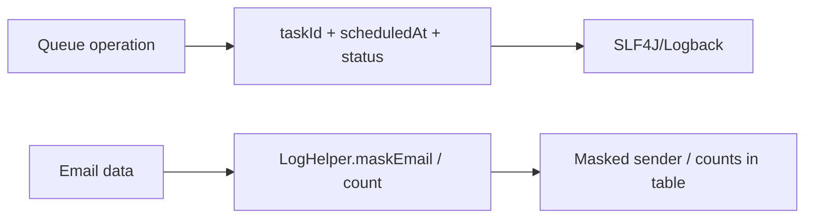

Các nguyên tắc bảo mật:

| Rủi ro | Biện pháp hiện thực |
| --- | --- |
| Log nội dung thư | Không log `body` trong thao tác queue |
| Log đường dẫn attachment | Chỉ hiển thị/log số lượng attachment ở phần detail |
| Lộ email người gửi | Dùng `LogHelper.maskEmail()` ở table/detail/log liên quan |
| Cập nhật sai do thao tác sát giờ gửi | Chặn sửa/hủy dưới 60 giây |

## 9. Truy vết yêu cầu - hiện thực

| Mã yêu cầu UC-04 | Nội dung | Thành phần hiện thực | Trạng thái |
| --- | --- | --- | --- |
| S4.1 | Người dùng mở mục hàng đợi | `SideBarController.handleQueueBtn()`, `queue-mail.fxml` | Đã hiện thực |
| S4.2 | Truy vấn email trạng thái chờ gửi | `QueueServiceImpl.findScheduled()`, `ScheduledEmailDaoImpl.findByStatus(SCHEDULED)` | Đã hiện thực |
| S4.3 | Hiển thị TableView theo thời gian gửi | `QueueController.initialize()`, SQL `order by scheduled_at asc` | Đã hiện thực |
| S4.4-S4.7 | Chọn email và xác nhận hủy | `handleCancelTask()`, `selectedEmail()`, confirm `Alert` | Đã hiện thực |
| S4.5 / EF-04-01 | Kiểm tra time-lock 60 giây | `ensureCanModify()`, `validateCanModify()` | Đã hiện thực |
| S4.8 | Cập nhật trạng thái `CANCELLED` | `ScheduledEmailServiceImpl.cancel()`, `updateStatus()` | Đã hiện thực |
| S4.9 | Gỡ task khỏi scheduler RAM | `activeTasks.remove(id)`, `future.cancel(false)` | Đã hiện thực |
| S4.10 | Refresh UI và thông báo | `refreshQueue()`, `AlertUtil.showInfo()` | Đã hiện thực |
| AF-04-01 | Chỉnh sửa nội dung/thời gian gửi | `handleEditTask()`, `showEditDialog()`, `updateQueuedEmail()` | Đã hiện thực |
| EF-04-02 | Lỗi DB khi cập nhật | Catch `IOException | RuntimeException`, alert "Hệ thống bận" | Đã hiện thực ở mức bắt lỗi; rollback transaction chưa bao quanh DB + scheduler |
| BR-04-01 | Thời gian khóa tối thiểu 60 giây | `MINIMUM_LEAD_TIME_SECONDS = 60` | Đã hiện thực |
| BR-04-02 | Đồng bộ scheduler RAM và DB | `cancel()`, `updateQueuedEmail()` hủy/đăng ký lại future | Đã hiện thực |
| BR-04-03 | Log metadata, không log nội dung | Log dùng `taskId`, thời gian, status; không log body | Đã hiện thực |
| NFR-04-01 | UI phản hồi mượt | DB I/O chạy nền; chưa có benchmark 0.2 giây | Hiện thực nền tảng, chưa benchmark |
| NFR-04-02 | Cập nhật bất đồng bộ | `AppExecutors.io().execute(...)` | Đã hiện thực |
| NFR-04-03 | Transaction rollback DB + scheduler | DAO dùng từng `PreparedStatement`; chưa có transaction bao trùm cập nhật DB và register scheduler | Chưa hoàn chỉnh theo NFR |

## 10. Rào cản kỹ thuật và giải pháp

| Rào cản | Ảnh hưởng | Giải pháp hiện thực |
| --- | --- | --- |
| Truy vấn/cập nhật SQLite có thể chặn UI | Giao diện bị đơ khi hàng đợi lớn | Chạy `refreshQueue`, cancel, edit trên `AppExecutors.io()` |
| Hủy/sửa task sát giờ gửi | Race condition với scheduler đang kích hoạt | Chặn thao tác nếu còn dưới 60 giây ở UI và service |
| DB và scheduler RAM có thể lệch trạng thái | Gửi nhầm task đã hủy hoặc sai thời gian | Sau DB update, service xóa future cũ và register future mới |
| Lỗi khi register lại task sau chỉnh sửa | DB đã đổi nhưng scheduler chưa đổi | Service cố gắng phục hồi nội dung/thời gian cũ và register lại task cũ |
| Log chứa thông tin nhạy cảm | Lộ nội dung email hoặc file path | Chỉ log `taskId`, thời gian, trạng thái; dùng mask/count |

## 11. Kết luận hiện thực

Phần hiện thực UC-04 đã chuyển đặc tả "Quản lý hàng đợi Email" thành màn hình JavaFX có khả năng tải danh sách email chờ gửi, xem chi tiết, hủy lịch và chỉnh sửa nội dung/thời gian gửi. Thiết kế phân tầng giữ UI controller tập trung vào điều phối giao diện, `QueueServiceImpl` làm facade nghiệp vụ, còn `ScheduledEmailServiceImpl` đảm bảo đồng bộ giữa SQLite và scheduler runtime.

Mức độ đáp ứng yêu cầu chính:

| Nhóm yêu cầu | Đánh giá |
| --- | --- |
| Hiển thị hàng đợi `SCHEDULED` | Hoàn thành |
| Xem chi tiết task | Hoàn thành |
| Hủy lịch gửi | Hoàn thành |
| Chỉnh sửa nội dung/thời gian gửi | Hoàn thành |
| Time-lock 60 giây | Hoàn thành |
| Đồng bộ DB và scheduler RAM | Hoàn thành ở luồng chính |
| Cập nhật bất đồng bộ không khóa UI | Hoàn thành |
| Transaction bao trùm DB + scheduler | Chưa hoàn chỉnh theo NFR-04-03 |

