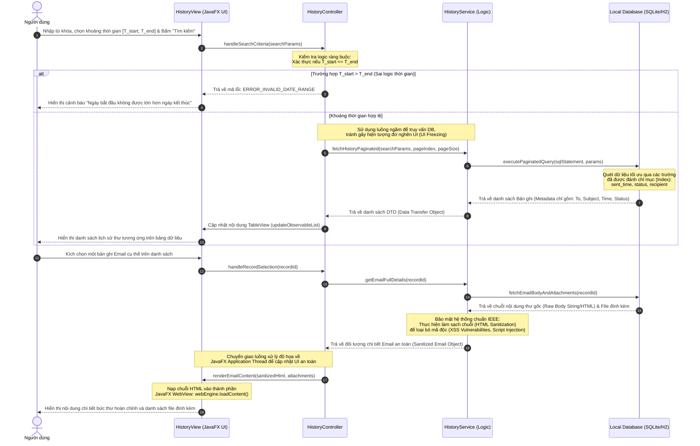

# **TÀI LIỆU ĐẶC TẢ CHI TIẾT USE CASE**

## **HỆ THỐNG GỬI MAIL TỰ ĐỘNG TRÊN DESKTOP (DESKTOP EMAIL SYSTEM)**

**Mã tài liệu:** UC-SPEC-05

**Tiêu chuẩn áp dụng:** IEEE Std 830-1998 / IEEE Std 29148-2018

**Trạng thái:** Hoàn thiện

### **1. Thông tin chung (General Information)**

* **Use Case ID (Mã định danh Use case):** UC-05 (Ánh xạ trực tiếp từ yêu cầu nghiệp vụ UR-07 và UR-08 trong BRD)
* **Use Case Name (Tên Use case):** Tra cứu lịch sử gửi thư
* **Description (Mô tả chức năng):** Cung cấp giao diện trực quan cho phép người dùng xem danh sách, lọc, tìm kiếm nâng cao và truy vấn chi tiết các email đã được xử lý (bao gồm các trạng thái: Gửi thành công, Gửi thất bại, Đã hủy, Trễ hạn) từ cơ sở dữ liệu SQLite/H2 cục bộ. Đồng thời hỗ trợ tính năng xuất báo cáo danh sách ra định dạng tệp tin di động.
* **Actor(s) (Các tác nhân tham gia):** Người dùng (User)
* **Priority (Mức độ ưu tiên):** Trung bình (Medium)
* **Trigger (Điều kiện kích hoạt):** Người dùng bấm chọn mục "Lịch sử gửi thư" (Sent History) trên bảng điều hướng chính của giao diện JavaFX.

### **2. Điều kiện Tiền - Hậu (Pre & Post-Conditions)**

* **Pre-Condition(s) (Điều kiện tiên quyết):**
    1.  Ứng dụng đã khởi chạy thành công trên máy trạm dưới môi trường thực thi JVM 21.
    2.  Cơ sở dữ liệu SQLite/H2 cục bộ hoạt động bình thường và sẵn sàng tiếp nhận các truy vấn đọc (Read-only queries).
* **Post-Condition(s) (Trạng thái hệ thống sau khi thành công):**
    1.  Danh sách lịch sử hiển thị chính xác, phản ánh đầy đủ thông tin từ DB theo bộ lọc người dùng thiết lập.
    2.  Nhật ký hệ thống ghi nhận sự kiện tra cứu ở cấp độ INFO, bảo mật tuyệt đối các từ khóa và nội dung riêng tư của người dùng.

### **3. Luồng sự kiện (Flow of Events)**

#### **3.1 Basic Flow (Luồng Use case chính - Truy vấn & Xem chi tiết thư)**

1.  **S5.1:** Người dùng chọn tab "Lịch sử gửi thư" trên thanh menu chính.
2.  **S5.2:** Hệ thống truy vấn DB cục bộ lấy danh sách lịch sử mặc định, sắp xếp theo thời gian gửi thực tế ($T_{\text{actual}}$) giảm dần để đưa các thư mới nhất lên đầu.
3.  **S5.3:** Hệ thống hiển thị danh sách lên bảng (TableView của JavaFX) kèm theo thanh tìm kiếm nhanh và bộ chọn khoảng thời gian.
4.  **S5.4:** Người dùng nhập từ khóa tìm kiếm (theo Địa chỉ người nhận hoặc Tiêu đề thư) và chọn khoảng thời gian lọc từ ngày $T_{\text{start}}$ đến ngày $T_{\text{end}}$.
5.  **S5.5:** Người dùng nhấn nút **"Tìm kiếm"** (hoặc hệ thống tự động lọc thời gian thực khi người dùng gõ phím).
6.  **S5.6:** Hệ thống khởi tạo một tiến trình ngầm bất đồng bộ gửi câu lệnh SQL động (Dynamic SQL query) có tham số (để tránh lỗi SQL Injection) xuống DB cục bộ.
7.  **S5.7:** Hệ thống cập nhật bảng dữ liệu trên giao diện UI tương ứng với kết quả trả về.
8.  **S5.8:** Người dùng chọn một dòng email bất kỳ trong bảng và nhấn nút **"Xem chi tiết"** (hoặc double-click vào dòng đó).
9.  **S5.9:** Hệ thống hiển thị một hộp thoại popup chứa thông tin chi tiết của email bao gồm: Danh sách người nhận (To, Cc, Bcc), Tiêu đề, Thời gian gửi thực tế, Trạng thái, Danh sách tệp đính kèm cục bộ và Nội dung Rich-text HTML (được kết xuất thông qua thành phần WebView của JavaFX).
10. **S5.10:** Người dùng nhấn "Đóng" để tắt hộp thoại chi tiết.

#### **3.2 Alternative Flow (Luồng thay thế)**

* **AF-05-01: Xuất báo cáo lịch sử ra tệp tin CSV:**
    * Tại giao diện danh sách lịch sử (bước S5.3), người dùng nhấn nút **"Xuất báo cáo"** (Export CSV).
    * Hệ thống hiển thị hộp thoại lưu tệp tin mặc định của Hệ điều hành (JavaFX FileChooser). Người dùng chọn thư mục lưu trữ và đặt tên tệp tin .csv mong muốn.
    * Người dùng nhấn **"Save"**.
    * Hệ thống tạo luồng ngầm thực hiện đọc tập dữ liệu đang hiển thị hiện tại, chuyển đổi định dạng sang chuẩn CSV (mã hóa ký tự UTF-8 có BOM để tránh lỗi hiển thị tiếng Việt trên MS Excel) và ghi xuống ổ đĩa cục bộ.
    * Xuất tệp thành công, hệ thống hiển thị thông báo popup trực quan: *"Xuất dữ liệu lịch sử thành công\!"* kèm đường dẫn mở tệp nhanh.

#### **3.3 Exception Flow (Luồng ngoại lệ)**

* **EF-05-01: Khoảng thời gian lọc không hợp lệ (Xảy ra tại bước S5.4):**
    * Khi người dùng thiết lập mốc thời gian lọc trên giao diện phát hiện lỗi logic:
    $$ 
        T_{\text{start}} > T_{\text{end}}
    $$
    * Hệ thống từ chối thực hiện truy vấn, bôi đỏ viền hộp chọn ngày bị sai, và hiển thị thông báo tooltip cảnh báo: *"Khoảng thời gian không hợp lệ. Ngày bắt đầu không thể lớn hơn ngày kết thúc."*.
* **EF-05-02: Lỗi truy cập cơ sở dữ liệu cục bộ (Xảy ra tại bước S5.2 hoặc S5.6):**
    * Tệp tin cơ sở dữ liệu SQLite bị hỏng (Corrupt Database) hoặc bị phần mềm diệt virus khóa quyền đọc.
    * Hệ thống bắt ngoại lệ SQLException, hiển thị lỗi trực quan trên UI thay thế bảng danh sách: *"Không thể kết nối cơ sở dữ liệu cục bộ. Vui lòng kiểm tra lại quyền truy cập thư mục cài đặt."*.
    * Hệ thống ghi log lỗi nghiêm trọng ở cấp độ ERROR kèm Stacktrace đầy đủ.

### **4. Quy tắc Nghiệp vụ (Business Rules)**

* **BR-05-01 (Quản lý đường dẫn tệp đính kèm gốc):**
    * Để tránh làm phình to dung lượng ổ đĩa của ứng dụng và cơ sở dữ liệu cục bộ, hệ thống tuyệt đối không sao chép hoặc lưu trữ trực tiếp file đính kèm thô vào DB. Hệ thống chỉ lưu trữ chuỗi đường dẫn tuyệt đối (Absolute File Path) dẫn tới file gốc trên máy trạm.
    * Khi người dùng click vào tệp đính kèm trong mục "Xem chi tiết", hệ thống phải kiểm tra xem tệp tin gốc tại máy trạm có còn tồn tại hay không. Nếu không, hiển thị cảnh báo: *"Tệp tin gốc đã bị di dời hoặc xóa bỏ khỏi máy trạm. Không thể mở."*.
* **BR-05-02 (Quy tắc phân trang dữ liệu - Pagination):**
    * Nhằm tối ưu hóa tài nguyên RAM và tốc độ render đồ họa của JavaFX TableView, nếu tổng số lượng bản ghi lịch sử trong DB vượt quá $1000$ dòng, hệ thống bắt buộc phải áp dụng cơ chế phân trang (Pagination) hoặc Lazy Loading. Mỗi trang dữ liệu chỉ hiển thị tối đa:
    $$ N_{\text{page}} = 50 \text{ bản ghi} $$
* **BR-05-03 (Bảo mật truy vấn Log hệ thống):**
    * Tuân thủ UR-13 và BR-04-03. Để bảo đảm tính riêng tư cho khách hàng, nhật ký hệ thống SLF4J/Logback chỉ ghi nhận siêu dữ liệu tổng quát về thao tác tìm kiếm:
     
      `"User queried history. Filter params: [Keyword Length: X, Range: T_start to T_end]. Results returned: [Y] rows. Duration: [Z] ms"`
   
  Tuyệt đối không được ghi lại chi tiết chuỗi từ khóa tìm kiếm nhạy cảm hoặc bất kỳ phần nội dung email nào tìm thấy vào tệp tin log text.

### **5. Yêu cầu phi chức năng (Non-Functional Requirements)**

* **NFR-05-01 (Hiệu năng phản hồi truy vấn):** Với khối lượng cơ sở dữ liệu lịch sử cục bộ dưới $10,000$ bản ghi, thời gian thực hiện câu lệnh SELECT SQL động và hiển thị kết quả lên giao diện phải nhỏ hơn $0.1 \text{ giây}$.
* **NFR-05-02 (Tối ưu hóa luồng I/O):** Toàn bộ các thao tác đọc DB và xử lý ghi tệp CSV (AF-05-01) tuyệt đối không được chạy trên luồng chính JavaFX Application Thread. Mọi hoạt động I/O phải được ủy thác cho Virtual Threads của JDK 21 nhằm duy trì giao diện đồ họa đạt 60 FPS ổn định, không gây trễ nải UI.
* **NFR-05-03 (Tối ưu hóa RAM và giải phóng WebView):**
    * Thành phần WebView của JavaFX dùng để hiển thị HTML Body (bước S5.9) tiêu tốn rất nhiều tài nguyên hệ thống.
    * Ngay khi người dùng đóng hộp thoại popup chi tiết thư, hệ thống bắt buộc phải gọi phương thức hủy tham chiếu, dọn dẹp bộ nhớ đệm WebView và gợi ý Garbage Collector (System.gc()) để tránh hiện tượng rò rỉ bộ nhớ (Memory Leak) làm treo ứng dụng sau nhiều lần sử dụng.\# **TÀI LIỆU ĐẶC TẢ CHI TIẾT USE CASE**

### 6. Sequence Diagram

