# TÀI LIỆU HIỆN THỰC MÃ NGUỒN UC-05

## 1. Thông tin tài liệu

| Thuộc tính | Giá trị |
| --- | --- |
| Mã tài liệu | UC05-IMPL |
| Use Case | UC-05 - Tra cứu lịch sử gửi thư |
| Chuẩn áp dụng | IEEE Std 29148-2018, IEEE Std 1016-2009 |
| Phạm vi | Trình bày hiện thực mã nguồn cho chức năng xem lịch sử gửi thư, tìm kiếm/lọc theo thời gian, phân trang, xem chi tiết, mở tệp đính kèm và xuất CSV |
| Nguồn tham chiếu | `docs/implementation_guide.md`, `docs/UC_05.md`, mã nguồn trong `src/main/java` và `src/main/resources` |

## 2. Tổng quan hiện thực

UC-05 được hiện thực bằng màn hình `history-mail.fxml` và controller `HistoryMailController`. Khi người dùng chọn mục "Lịch sử gửi thư" trên sidebar, `SideBarController` điều hướng tới view lịch sử; controller cấu hình `TableView`, tải trang đầu tiên từ SQLite và hiển thị các bản ghi trong bảng `sent_emails`.

Các thao tác đọc lịch sử, đếm tổng số bản ghi, đọc chi tiết email và xuất CSV đều được đưa xuống `AppExecutors.io()` sử dụng Virtual Thread của JDK 21. JavaFX Application Thread chỉ đảm nhiệm cập nhật `ObservableList`, hiển thị dialog và phản hồi trạng thái qua `Platform.runLater()`.

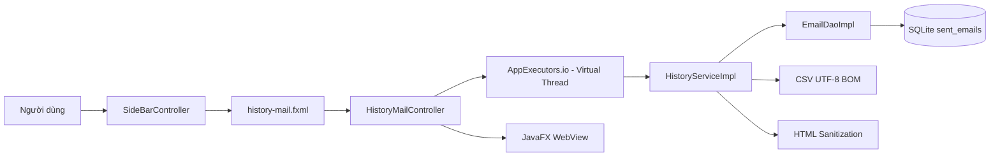

Ghi chú truy vết: tài liệu hiện hành `docs/UC_05.md` định nghĩa UC-05 là "Tra cứu lịch sử gửi thư". Một tài liệu cũ trong `docs/OLD` từng dùng mã UC05 cho chức năng khác; tài liệu hiện thực này bám theo đặc tả hiện hành.

## 3. Ánh xạ kiến trúc sang mã nguồn

### 3.1 Cấu trúc gói liên quan UC-05

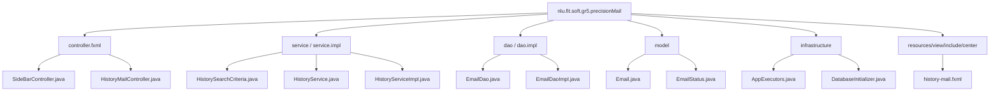

### 3.2 Bảng ánh xạ thành phần thiết kế - mã nguồn

| Thành phần UC-05 | Vai trò thiết kế | Tệp hiện thực | Trách nhiệm chính |
| --- | --- | --- | --- |
| HistoryView | Giao diện lịch sử | `src/main/resources/nlu/fit/soft/gr5/precisionMail/view/include/center/history-mail.fxml` | Khai báo ô tìm kiếm, `DatePicker`, `TableView`, nút xem chi tiết, xuất CSV và phân trang |
| SideBarController | Điều hướng chức năng | `src/main/java/nlu/fit/soft/gr5/precisionMail/controller/fxml/SideBarController.java` | Điều hướng tới `center/history-mail.fxml` khi người dùng chọn mục đã gửi |
| HistoryController | Điều phối UI | `src/main/java/nlu/fit/soft/gr5/precisionMail/controller/fxml/HistoryMailController.java` | Validate khoảng ngày, tải dữ liệu nền, cập nhật bảng, mở dialog chi tiết, xuất CSV |
| HistorySearchCriteria | DTO bộ lọc | `src/main/java/nlu/fit/soft/gr5/precisionMail/service/HistorySearchCriteria.java` | Đóng gói từ khóa, ngày bắt đầu, ngày kết thúc; chuẩn hóa keyword |
| HistoryService | Giao diện nghiệp vụ | `src/main/java/nlu/fit/soft/gr5/precisionMail/service/HistoryService.java` | Định nghĩa các thao tác `search`, `count`, `detail`, `sanitizeHtml`, `exportCsv` |
| HistoryServiceImpl | Nghiệp vụ lịch sử | `src/main/java/nlu/fit/soft/gr5/precisionMail/service/impl/HistoryServiceImpl.java` | Gọi DAO, làm sạch HTML, tạo CSV UTF-8 BOM |
| EmailDao | Truy cập dữ liệu lịch sử | `src/main/java/nlu/fit/soft/gr5/precisionMail/dao/impl/EmailDaoImpl.java` | Truy vấn `sent_emails` bằng `PreparedStatement`, phân trang, đếm, đọc chi tiết |
| DatabaseInitializer | Khởi tạo DB | `src/main/java/nlu/fit/soft/gr5/precisionMail/infrastructure/db/DatabaseInitializer.java` | Tạo bảng `sent_emails` và index phục vụ lọc/sắp xếp |
| AppExecutors | Hạ tầng bất đồng bộ | `src/main/java/nlu/fit/soft/gr5/precisionMail/infrastructure/async/AppExecutors.java` | Cung cấp Virtual Thread executor cho DB I/O và ghi CSV |

## 4. Luồng hiện thực UC-05

### 4.1 Luồng mở màn hình và tải trang lịch sử

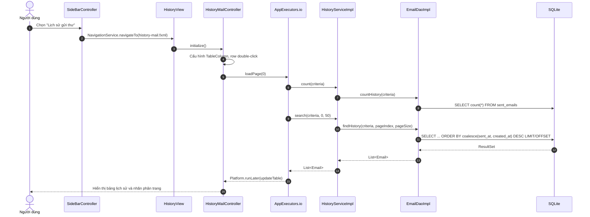

### 4.2 Luồng tìm kiếm, lọc thời gian và phân trang

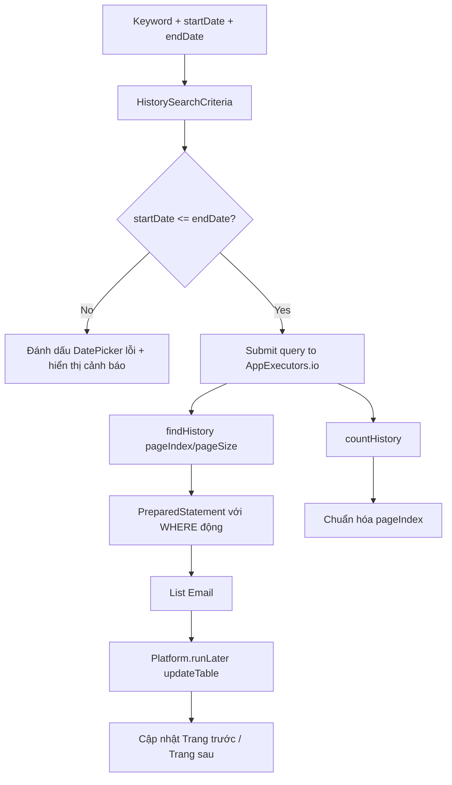

Phân trang dùng hằng số `PAGE_SIZE = 50` trong `HistoryMailController`, phù hợp BR-05-02. Controller tính lại `safePage` theo tổng bản ghi để tránh truy vấn vượt trang khi dữ liệu thay đổi.

### 4.3 Luồng xem chi tiết và render HTML an toàn

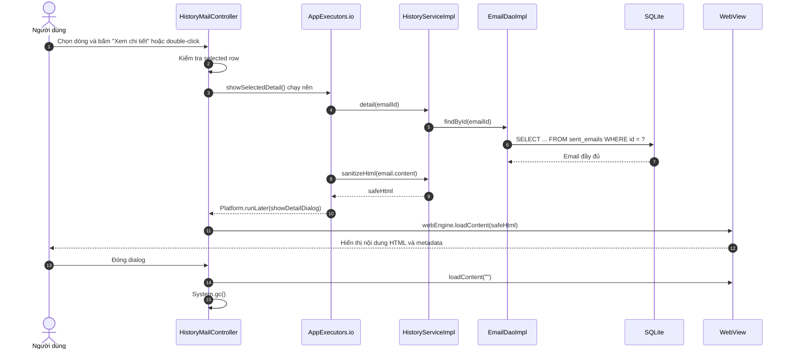

### 4.4 Luồng xuất báo cáo CSV

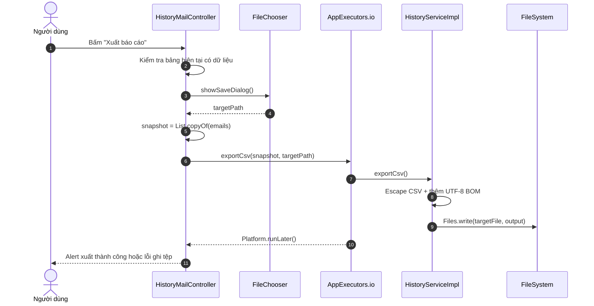

## 5. Hiện thực các giải pháp kỹ thuật cốt lõi

### 5.1 Bất đồng bộ hóa truy vấn DB và ghi CSV

`HistoryMailController.loadPage()` và `handleExportCsv()` không thực thi I/O trực tiếp trên JavaFX Application Thread. Các tác vụ nặng được đưa vào `AppExecutors.io()`, sau đó cập nhật UI qua `Platform.runLater()`.

```java
AppExecutors.io().execute(() -> {
    try {
        int count = historyService.count(criteria);
        List<Email> rows = historyService.search(criteria, safePage, PAGE_SIZE);
        Platform.runLater(() -> updateTable(rows, count, safePage));
    } catch (IOException e) {
        Platform.runLater(() -> statusLabel.setText("Không thể kết nối cơ sở dữ liệu cục bộ."));
    }
});
```

Hạ tầng executor dùng Virtual Thread:

```java
private static final ExecutorService IO_EXECUTOR =
        Executors.newVirtualThreadPerTaskExecutor();
```

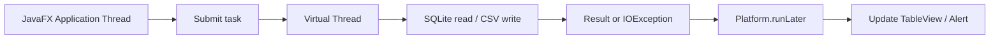

### 5.2 SQL động an toàn bằng PreparedStatement

`EmailDaoImpl.buildHistoryWhere()` chỉ sinh mệnh đề `WHERE`; giá trị người dùng luôn được truyền qua tham số `?` và bind bằng `PreparedStatement`. Cách này đáp ứng yêu cầu tránh SQL Injection trong S5.6.

```mermaid
flowchart TD
    Criteria[HistorySearchCriteria] --> Keyword{Keyword rỗng?}
    Keyword -->|No| LikeClause[lower(recipients/subject) LIKE ?]
    Criteria --> Start{Có startDate?}
    Start -->|Yes| StartClause[date(sent_at) >= date(?)]
    Criteria --> End{Có endDate?}
    End -->|Yes| EndClause[date(sent_at) <= date(?)]
    LikeClause --> Params[params list]
    StartClause --> Params
    EndClause --> Params
    Params --> Bind[bindParams PreparedStatement]
    Bind --> Execute[executeQuery]
```

Truy vấn chính dùng `limit ? offset ?`, sắp xếp theo `coalesce(sent_at, created_at) desc` để bản ghi mới nhất xuất hiện trước.

### 5.3 Làm sạch HTML trước khi đưa vào WebView

`HistoryServiceImpl.sanitizeHtml()` loại bỏ các khối `<script>`, thuộc tính sự kiện dạng `onclick`, `onload`, ... và URL `javascript:` trước khi nạp vào `WebView`. Nếu nội dung không phải HTML hoàn chỉnh, service bao lại trong khung HTML tối giản và escape plain text.

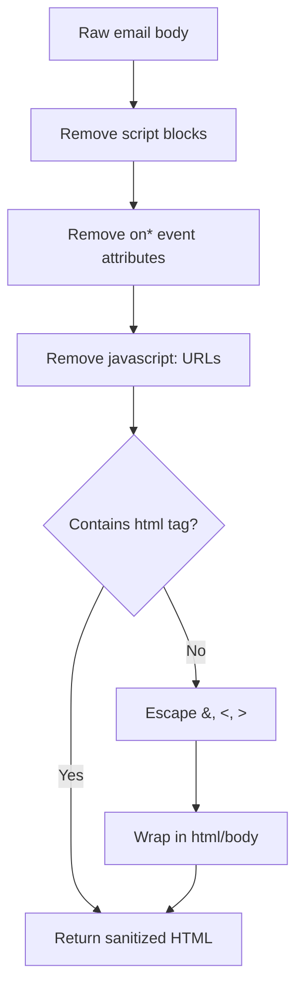

### 5.4 Quản lý WebView và tài nguyên khi đóng dialog

UC-05 dùng `WebView` để hiển thị rich-text HTML. Khi dialog chi tiết đóng, controller nạp nội dung rỗng vào engine và gọi `System.gc()` để giảm rủi ro giữ lại cache/nội dung HTML sau nhiều lần xem chi tiết.

```java
dialog.setOnHidden(event -> {
    webView.getEngine().loadContent("");
    System.gc();
});
```

### 5.5 Xuất CSV tương thích Excel

`HistoryServiceImpl.exportCsv()` tạo header cố định, escape dấu nháy kép theo chuẩn CSV, dùng dấu chấm phẩy để gom danh sách người nhận trong một ô và thêm UTF-8 BOM trước khi ghi file. BOM giúp Excel nhận đúng tiếng Việt khi mở trực tiếp.

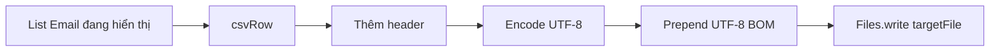

## 6. Hiện thực cơ sở dữ liệu

UC-05 sử dụng bảng `sent_emails`, được tạo khi ứng dụng khởi động bởi `DatabaseInitializer.initialize()`.

```sql
create table if not exists sent_emails
(
    id integer primary key autoincrement,
    sender_email text not null,
    to_recipients text not null default '',
    cc_recipients text not null default '',
    bcc_recipients text not null default '',
    subject text,
    body text,
    attachment_paths text,
    status text not null,
    error_message text,
    sent_at text,
    created_at text not null,
    updated_at text not null
);
```

Các index phục vụ truy vấn lịch sử:

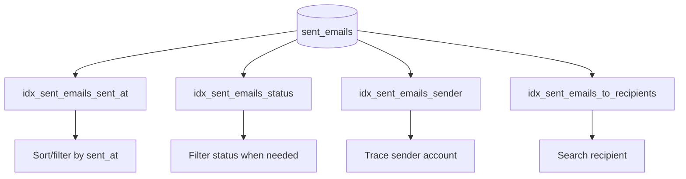

| Nghiệp vụ | DAO method | SQL effect |
| --- | --- | --- |
| Tải lịch sử phân trang | `findHistory(criteria, pageIndex, pageSize)` | `SELECT ... WHERE ... ORDER BY ... LIMIT ? OFFSET ?` |
| Đếm tổng bản ghi | `countHistory(criteria)` | `SELECT count(*) FROM sent_emails WHERE ...` |
| Xem chi tiết | `findById(id)` | `SELECT ... FROM sent_emails WHERE id = ?` |
| Lưu lịch sử từ UC-02/UC-03 | `save(email)` | `INSERT INTO sent_emails(...)` |

## 7. Xử lý ngoại lệ và phản hồi người dùng

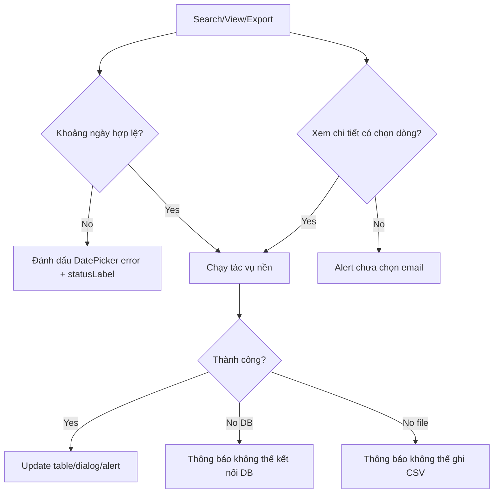

| Ngoại lệ/điều kiện | Phản hồi UI | Log |
| --- | --- | --- |
| `startDate > endDate` | Thêm style `error`, gắn tooltip và cập nhật `statusLabel` | Không ghi log lỗi |
| Lỗi đọc DB khi tìm kiếm | Xóa bảng, hiển thị thông báo không thể kết nối DB | `History query failed.` kèm stacktrace |
| Lỗi đọc DB khi xem chi tiết | Alert "Lỗi đọc chi tiết" | `History detail query failed. id={}` |
| Không có dữ liệu để xuất | Alert "Không có dữ liệu" | Không cần log lỗi |
| Lỗi ghi CSV | Alert kiểm tra quyền ghi thư mục | `History CSV export failed.` |
| Attachment gốc không tồn tại | Alert tệp bị di dời hoặc xóa | Không log đường dẫn ở cấp ERROR |

## 8. Bảo mật log và dữ liệu nhạy cảm

UC-05 tuân thủ BR-05-03 bằng cách chỉ log metadata của truy vấn. Controller ghi độ dài keyword, khoảng ngày, số dòng trả về và thời gian xử lý; không ghi keyword thật, subject tìm kiếm, nội dung email hoặc HTML body.

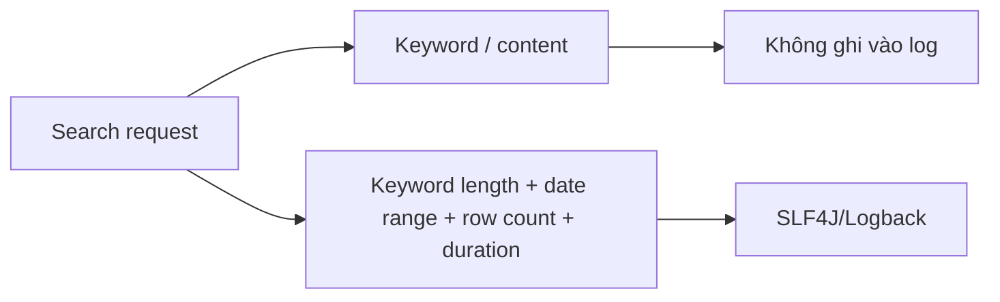

Mẫu log hiện thực:

```text
User queried history. Filter params: [Keyword Length: X, Range: T_start to T_end]. Results returned: [Y] rows. Duration: [Z] ms
```

## 9. Truy vết yêu cầu - hiện thực

| Mã yêu cầu UC-05 | Nội dung | Thành phần hiện thực | Trạng thái |
| --- | --- | --- | --- |
| S5.1 | Người dùng mở mục lịch sử gửi thư | `SideBarController.handleSentMailBtn()`, `history-mail.fxml` | Đã hiện thực |
| S5.2 | Truy vấn lịch sử mặc định, mới nhất trước | `HistoryMailController.initialize()`, `loadPage(0)`, SQL `order by coalesce(sent_at, created_at) desc` | Đã hiện thực |
| S5.3 | Hiển thị bảng, thanh tìm kiếm, bộ lọc thời gian | `history-mail.fxml`, `HistoryMailController.initialize()` | Đã hiện thực |
| S5.4-S5.7 | Tìm kiếm theo keyword và khoảng ngày | `HistorySearchCriteria`, `validateDateRange()`, `findHistory()` | Đã hiện thực |
| S5.8-S5.10 | Xem chi tiết email bằng dialog và WebView | `showSelectedDetail()`, `showDetailDialog()`, `sanitizeHtml()` | Đã hiện thực |
| AF-05-01 | Xuất báo cáo CSV | `handleExportCsv()`, `HistoryServiceImpl.exportCsv()` | Đã hiện thực |
| EF-05-01 | Khoảng thời gian không hợp lệ | `validateDateRange()`, `markDateError()` | Đã hiện thực |
| EF-05-02 | Lỗi truy cập SQLite | Catch `IOException` trong `loadPage()` và `showSelectedDetail()` | Đã hiện thực |
| BR-05-01 | Không lưu file attachment thô, chỉ dùng path | `EmailDaoImpl.save()` lưu `attachment_paths`; `openAttachment()` kiểm tra file tồn tại | Đã hiện thực |
| BR-05-02 | Phân trang 50 bản ghi/trang | `PAGE_SIZE = 50`, `limit ? offset ?` | Đã hiện thực |
| BR-05-03 | Log metadata, không log keyword/nội dung | Log dùng keyword length, date range, row count, duration | Đã hiện thực |
| NFR-05-01 | Truy vấn dưới 0.1 giây với dưới 10,000 bản ghi | Có index và phân trang; chưa có benchmark hiệu năng chính thức | Hiện thực nền tảng, chưa benchmark |
| NFR-05-02 | DB/CSV I/O không chạy trên UI thread | `AppExecutors.io().execute(...)` + `Platform.runLater()` | Đã hiện thực |
| NFR-05-03 | Giải phóng WebView khi đóng popup | `webView.getEngine().loadContent("")`, `System.gc()` | Đã hiện thực ở mức dọn nội dung và gợi ý GC |

## 10. Rào cản kỹ thuật và giải pháp

| Rào cản | Ảnh hưởng | Giải pháp hiện thực |
| --- | --- | --- |
| Truy vấn SQLite hoặc ghi CSV có thể chặn UI | JavaFX bị đơ khi DB lớn hoặc ổ đĩa chậm | Chạy tác vụ bằng `AppExecutors.io()` Virtual Thread |
| SQL động từ dữ liệu người dùng | Nguy cơ SQL Injection nếu nối chuỗi trực tiếp | Chỉ nối cấu trúc `WHERE`, bind giá trị bằng `PreparedStatement` |
| Nội dung HTML từ email có thể chứa script | Rủi ro script/event handler khi render bằng WebView | `sanitizeHtml()` loại bỏ `<script>`, `on*=` và `javascript:` |
| WebView giữ cache sau nhiều lần xem chi tiết | Tăng RAM và có nguy cơ memory leak | Khi đóng dialog, nạp nội dung rỗng và gọi `System.gc()` |
| Excel lỗi tiếng Việt khi mở CSV | Người dùng đọc báo cáo bị sai encoding | Ghi CSV UTF-8 kèm BOM |
| Log chứa thông tin tìm kiếm riêng tư | Lộ keyword hoặc nội dung email trong file log | Chỉ log độ dài keyword và metadata tổng quát |

## 11. Kết luận hiện thực

Phần hiện thực UC-05 đã chuyển đặc tả "Tra cứu lịch sử gửi thư" thành màn hình JavaFX có khả năng tải lịch sử từ SQLite, tìm kiếm theo người nhận/tiêu đề, lọc theo khoảng ngày, phân trang 50 dòng/trang, xem chi tiết nội dung HTML an toàn, kiểm tra/mở tệp đính kèm gốc và xuất báo cáo CSV.

Mức độ đáp ứng yêu cầu chính:

| Nhóm yêu cầu | Đánh giá |
| --- | --- |
| Điều hướng tới màn hình lịch sử | Hoàn thành |
| Hiển thị danh sách lịch sử từ `sent_emails` | Hoàn thành |
| Tìm kiếm/lọc bằng SQL tham số hóa | Hoàn thành |
| Phân trang 50 bản ghi/trang | Hoàn thành |
| Xem chi tiết bằng WebView có sanitization | Hoàn thành |
| Mở attachment theo đường dẫn gốc | Hoàn thành |
| Xuất CSV UTF-8 BOM | Hoàn thành |
| I/O nền không khóa UI | Hoàn thành |
| Log không lộ keyword/nội dung email | Hoàn thành |
| Benchmark NFR-05-01 dưới 0.1 giây | Chưa có số đo chính thức |
