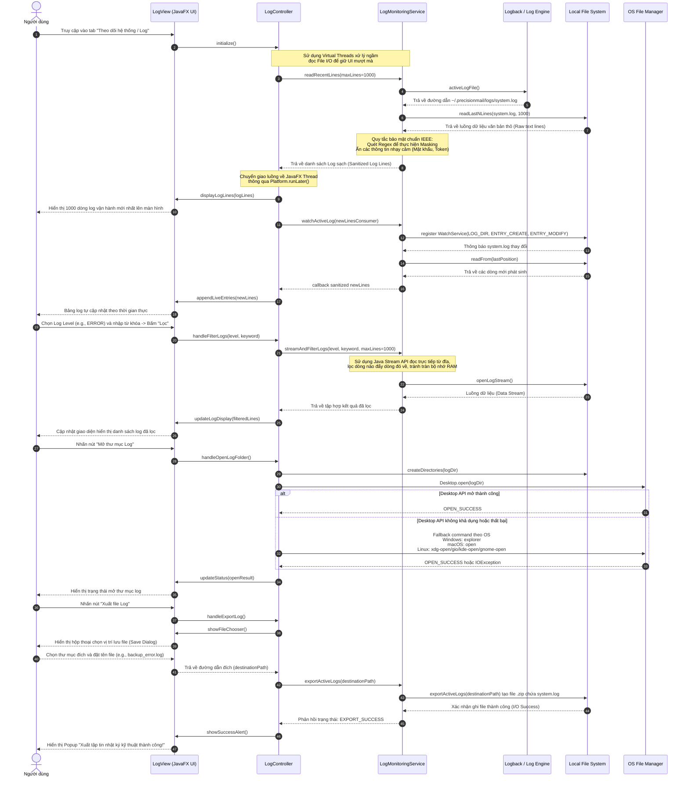

# TÀI LIỆU ĐẶC TẢ CHI TIẾT USE CASE

## HỆ THỐNG GỬI MAIL TỰ ĐỘNG TRÊN DESKTOP (DESKTOP EMAIL SYSTEM)

**Mã tài liệu:** UC-SPEC-06
 
**Tiêu chuẩn áp dụng:** IEEE Std 830-1998 / IEEE Std 29148-2018
 
**Trạng thái:** Hoàn thiện

### 1\. Thông tin chung (General Information)

* **Use Case ID (Mã định danh Use case):** UC-06 (Ánh xạ trực tiếp từ yêu cầu nghiệp vụ UR-09, UR-10, UR-11, UR-12, UR-13 trong BRD)
* **Use Case Name (Tên Use case):** Theo dõi log hệ thống (System Log Monitoring)
* **Description (Mô tả chức năng):** Cung cấp giao diện quản trị trực quan cho phép người dùng trực tiếp theo dõi, lọc, tìm kiếm và truy vấn các sự kiện vận hành của hệ thống (ở các cấp độ INFO, WARN, ERROR) được ghi nhận thời gian thực từ thư mục log cục bộ. Hỗ trợ tính năng mở nhanh thư mục lưu trữ log trên hệ điều hành và xuất báo cáo sự cố khi cần thiết.
* **Actor(s) (Các tác nhân tham gia):** Người dùng (User / Administrator)
* **Priority (Mức độ ưu tiên):** Trung bình (Medium)
* **Trigger (Điều kiện kích hoạt):** Người dùng bấm chọn mục "Log hệ thống" (System Logs) trên thanh menu điều hướng chính của giao diện JavaFX.

### 2\. Điều kiện Tiền - Hậu (Pre & Post-Conditions)

* **Pre-Condition(s) (Điều kiện tiên quyết):**
    1.  Ứng dụng đã khởi chạy thành công trên máy trạm tương thích (Windows 10/11 hoặc Linux LTS) dưới JVM 21.
    2.  Khung ghi nhật ký SLF4J/Logback đã được khởi tạo thành công và đang hoạt động ở chế độ ghi tệp cục bộ (RollingFileAppender).
* **Post-Condition(s) (Trạng thái hệ thống sau khi thành công):**
    1.  Dữ liệu log được tải và kết xuất chính xác lên giao diện người dùng mà không làm rò rỉ bất kỳ thông tin mật khẩu thô nào.
    2.  Các sự kiện log mới phát sinh trong quá trình chạy ngầm (gửi thư, lập lịch) được tự động cập nhật liên tục lên màn hình giám sát.

### 3\. Luồng sự kiện (Flow of Events)

#### 3.1 Basic Flow (Luồng Use case chính - Truy vấn & Xem log thời gian thực)

1.  **S6.1:** Người dùng chọn tab "Log hệ thống" trên thanh điều hướng của giao diện.
2.  **S6.2:** Hệ thống kích hoạt một tiến trình ngầm (Virtual Thread) thực hiện đọc bất đồng bộ $N_{\text{lines}} = 1000$ dòng nhật ký mới nhất từ tệp tin log hiện hành `~/.precisionmail/logs/system.log`.
3.  **S6.3:** Hệ thống phân tích (Parse) từng dòng dữ liệu theo định dạng cấu trúc tiêu chuẩn:
$$ 
\text{[Timestamp] [LogLevel] [Thread] [Class:Line] - Message} 
$$
4.  **S6.4:** Hệ thống hiển thị danh sách log lên bảng UI (TableView hoặc ListView tùy biến của JavaFX) kèm theo màu sắc nhận diện trực quan ứng với từng cấp độ nghiêm trọng (Màu đỏ cho ERROR, màu vàng cho WARN, màu xanh lá/đen cho INFO).
5.  **S6.5:** Hệ thống kích hoạt bộ lắng nghe sự kiện thay đổi file (File Watcher Service) để tự động nạp thêm các dòng log mới phát sinh theo thời gian thực (tương tự lệnh tail -f trên Linux).
6.  **S6.6:** Người dùng nhập từ khóa tìm kiếm (theo tên lớp, nội dung lỗi) hoặc chọn lọc theo Cấp độ log (LogLevel).
7.  **S6.7:** Hệ thống lọc dữ liệu tức thời và cập nhật lại bảng hiển thị.
8.  **S6.8:** Người dùng chọn một dòng log lỗi (ERROR) bất kỳ để xem toàn bộ chi tiết Stacktrace lỗi trong khung hiển thị chi tiết bên dưới.
9.  **S6.9:** Người dùng nhấn nút **"Mở thư mục Log"** (Open Log Folder).
10. **S6.10:** Hệ thống tạo thư mục log nếu chưa tồn tại, sau đó thử gọi thư viện Desktop API của Java (`Desktop.open`) để kích hoạt trình quản lý tệp tin mặc định của hệ điều hành mở trực tiếp thư mục chứa file log gốc.
11. **S6.11:** Nếu Desktop API không khả dụng hoặc không mở được thư mục, hệ thống tự động dùng fallback theo hệ điều hành:
    * Windows: `explorer <logDir>`
    * macOS: `open <logDir>`
    * Linux: lần lượt thử `xdg-open <logDir>`, `gio open <logDir>`, `kde-open <logDir>`, `gnome-open <logDir>`
12. **S6.12:** Hệ thống cập nhật trạng thái trên UI: *"Đã mở thư mục log: \<logDir\>"* khi một cơ chế mở thư mục được kích hoạt thành công.

#### 3.2 Alternative Flow (Luồng thay thế)

* **AF-06-01: Xuất tập tin Log phục vụ hỗ trợ kỹ thuật:**
    * Tại giao diện quản trị log, người dùng nhấn nút **"Xuất file Log"** (Export Log File).
    * Hệ thống mở hộp thoại chọn đường dẫn lưu tệp (FileChooser của JavaFX).
    * Người dùng chọn thư mục đích (Ví dụ: Desktop, USB) và nhấn **"Save"**.
    * Hệ thống thực hiện sao chép tệp log hiện tại kèm theo việc nén lại dưới định dạng tệp tin nén .zip để giảm dung lượng trước khi chuyển giao sang vị trí mới.
    * Xuất tệp thành công, hiển thị thông báo: *"Xuất tập tin nhật ký kỹ thuật thành công\!"*.
* **AF-06-02: Mở thư mục log bằng fallback theo hệ điều hành:**
    * Tại bước S6.10, nếu Java Desktop API không được hỗ trợ bởi runtime/desktop session hiện tại hoặc trả lỗi khi mở thư mục, hệ thống không dừng use case ngay.
    * Hệ thống chuyển sang lệnh mở thư mục theo hệ điều hành tương ứng như đã mô tả ở S6.11.
    * Việc chạy lệnh fallback được thực hiện trên tiến trình ngầm để không khóa JavaFX Application Thread.

#### 3.3 Exception Flow (Luồng ngoại lệ)

* **EF-06-01: Không tìm thấy tệp tin Log hoặc tệp tin bị khóa (Xảy ra tại bước S6.2):**
    * Tiến trình ngầm không thể truy cập tệp tin log cục bộ do bị phần mềm diệt virus bên thứ ba khóa quyền đọc, hoặc tệp tin chưa được khởi tạo.
    * Hệ thống bắt ngoại lệ FileNotFoundException hoặc IOException.
    * Hệ thống dừng luồng đọc, khôi phục UI và hiển thị thông báo lỗi trực quan tại vị trí bảng: *"Không thể truy cập tệp tin nhật ký hệ thống cục bộ. Vui lòng kiểm tra lại quyền ghi tệp trong thư mục cài đặt."*. Ghi nhận log lỗi hệ thống ra console của JVM.
* **EF-06-02: Dung lượng tệp tin log hiển thị quá lớn gây tràn RAM (Xảy ra tại bước S6.2 hoặc S6.7):**
    * Kích thước tệp log hiện hành vượt quá giới hạn an toàn để tải trực tiếp lên giao diện đồ họa cùng một lúc:
    $$ \text{Size}_{\text{log}} > 10 \text{ MB} $$
    * Hệ thống từ chối nạp toàn bộ tệp tin vào RAM của JavaFX UI. Thay vào đó, hệ thống chỉ cắt lấy $1000$ dòng cuối cùng của file để hiển thị và đưa ra cảnh báo tooltip: *"Tệp nhật ký quá lớn. Hệ thống chỉ hiển thị 1000 dòng mới nhất để tối ưu hóa hiệu năng."*.
* **EF-06-03: Không thể mở thư mục log bằng cả Desktop API và fallback OS (Xảy ra tại bước S6.10 hoặc S6.11):**
    * Hệ thống đã tạo hoặc xác nhận thư mục log tồn tại nhưng không thể kích hoạt trình quản lý tệp tin mặc định.
    * Nguyên nhân có thể bao gồm: môi trường Linux không có `xdg-open`/`gio`, Windows Explorer không khả dụng, session đồ họa không tồn tại, hoặc người dùng không có quyền thực thi lệnh mở thư mục.
    * Hệ thống ghi WARN vào log nội bộ và hiển thị thông báo lỗi: *"Không thể mở thư mục chứa log bằng trình quản lý tệp mặc định."*.

### 4\. Quy tắc Nghiệp vụ (Business Rules)

* **BR-06-01 (Mặt nạ bảo mật thông tin nhạy cảm - Data Masking):** Nhằm tuân thủ tuyệt đối tiêu chuẩn bảo vệ dữ liệu cá nhân người dùng (UR-13), trước khi hiển thị bất kỳ dòng log nào lên giao diện, hệ thống bắt buộc phải áp dụng bộ lọc regex để kiểm tra và che dấu (Masking) các trường nhạy cảm:
    * Mật khẩu ứng dụng (App Password) phải được chuyển thành chuỗi: \[PROTECTED\_PASSWORD\].
    * Địa chỉ email của khách hàng nhận thư phải được làm mờ: rec\*\*\*@domain.com.
* **BR-06-02 (Quy tắc xoay vòng tự động - Log Rotation):** Để bảo vệ tài nguyên ổ đĩa cứng của máy trạm không bị đầy tràn sau thời gian dài vận hành:
    * Dung lượng tối đa của một tệp tin log hiện hành không được vượt quá:
    $$ S_{\text{file}} = 10 \text{ MB} $$
    * Khi đạt ngưỡng, hệ thống tự động kích hoạt tiến trình nén tệp log cũ thành định dạng .gz (ví dụ: app-log-2026-05-17.1.log.gz) và khởi tạo một tệp log trống mới để tiếp tục ghi nhận sự kiện.
    * Tổng dung lượng lưu trữ tích lũy cho toàn bộ thư mục chứa log tuyệt đối không vượt quá: 
    $$ S_{\text{max\_total}} = 200 \text{ MB} $$
  Nếu vượt quá ngưỡng này, hệ thống Logback tự động thực hiện thuật toán xóa bỏ các tệp tin nén cũ nhất (FIFO).

### 5\. Yêu cầu phi chức năng (Non-Functional Requirements)

* **NFR-06-01 (Hiệu năng xử lý chuỗi và render đồ họa):** Thời gian lọc dữ liệu theo từ khóa hoặc phân tích cú pháp để hiển thị danh sách log phải nhỏ hơn $0.1 \text{ giây}$. Toàn bộ hoạt động đọc đĩa cứng và phân tích cú pháp chuỗi log phải chạy trên Virtual Threads của JDK 21 nhằm duy trì giao diện đồ họa JavaFX luôn đạt tần số quét 60 FPS ổn định, không gây trễ nải UI.
* **NFR-06-02 (Thread-safe cho tiến trình ghi log):** Việc ghi nhận các dòng log vận hành của các module nghiệp vụ khác (gửi thư, lên lịch) xuống tệp tin text phải được thực hiện thông qua cơ chế bất đồng bộ của Logback (AsyncAppender), đảm bảo tiến trình gửi mail hoặc tương tác UI của người dùng không bao giờ bị nghẽn do hoạt động ghi log xuống đĩa cứng (Disk I/O Block).

### 6. Sequence Diagram

