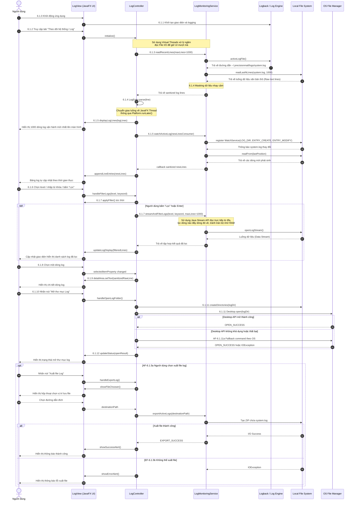

# TÀI LIỆU ĐẶC TẢ CHI TIẾT USE CASE

## HỆ THỐNG GỬI MAIL TỰ ĐỘNG TRÊN DESKTOP (DESKTOP EMAIL SYSTEM)

**Mã tài liệu:** UC-SPEC-06
 
**Tiêu chuẩn áp dụng:** IEEE Std 830-1998 / IEEE Std 29148-2018
 
**Trạng thái:** Hoàn thiện

### 1\. Thông tin chung (General Information)

* **Use Case ID (Mã định danh Use case):** UC-06 (Ánh xạ trực tiếp từ yêu cầu nghiệp vụ UR-09, UR-10, UR-11, UR-12, UR-13 trong BRD)
* **Use Case Name (Tên Use case):** Theo dõi log hệ thống (System Log Monitoring)
* **Description (Mô tả chức năng):** Cung cấp giao diện quản trị trực quan cho phép người dùng trực tiếp theo dõi, lọc, tìm kiếm và truy vấn các sự kiện vận hành của hệ thống (ở các cấp độ INFO, WARN, ERROR) được ghi nhận thời gian thực từ thư mục log cục bộ. Hỗ trợ tính năng mở nhanh thư mục lưu trữ log trên hệ điều hành và xuất báo cáo sự cố khi cần thiết.
* **Actor(s) (Các tác nhân tham gia):** Người dùng (User / Administrator)
* **Priority (Mức độ ưu tiên):** Trung bình (Medium)
* **Trigger (Điều kiện kích hoạt):** Người dùng khởi động ứng dụng và chọn mục "Log hệ thống" (System Logs) trên thanh menu điều hướng chính của giao diện JavaFX.

### 2\. Điều kiện Tiền - Hậu (Pre & Post-Conditions)

* **Pre-Condition(s) (Điều kiện tiên quyết):**
    1.  Ứng dụng đã được cài đặt trên máy trạm tương thích (Windows 10/11 hoặc Linux LTS) có JVM 21.
    2.  Người dùng có quyền khởi chạy ứng dụng và truy cập giao diện chính.
* **Post-Condition(s) (Trạng thái hệ thống sau khi thành công):**
    1.  Dữ liệu log được tải và kết xuất chính xác lên giao diện người dùng mà không làm rò rỉ bất kỳ thông tin mật khẩu thô nào.
    2.  Các sự kiện log mới phát sinh trong quá trình chạy ngầm (gửi thư, lập lịch) được tự động cập nhật liên tục lên màn hình giám sát.

### 3\. Luồng sự kiện (Flow of Events)

#### 3.1 Basic Flow (Luồng Use case chính - Truy vấn & Xem log thời gian thực)

Để đáp ứng yêu cầu truy vết của IEEE Std 29148-2018, tài liệu sử dụng quy ước: `6.1.x` là bước Basic Flow; `AF-6.1.x[a-z]` và `EF-6.1.x[a-z]` chỉ rõ bước Basic Flow nơi luồng thay thế hoặc ngoại lệ phát sinh.

1.  **6.1.0:** Người dùng khởi động ứng dụng PrecisionMail.
2.  **6.1.1:** Hệ thống khởi tạo giao diện chính, SLF4J/Logback và cơ chế ghi tệp log cục bộ.
3.  **6.1.2:** Người dùng chọn tab "Log hệ thống" trên thanh điều hướng của giao diện.
4.  **6.1.3:** Hệ thống kích hoạt Virtual Thread để đọc bất đồng bộ tối đa $N_{\text{lines}} = 1000$ dòng nhật ký mới nhất từ `~/.precisionmail/logs/system.log`.
5.  **6.1.4:** Hệ thống che thông tin nhạy cảm và phân tích từng dòng dữ liệu theo định dạng cấu trúc tiêu chuẩn:
$$ 
\text{[Timestamp] [LogLevel] [Thread] [Class:Line] - Message} 
$$
6.  **6.1.5:** Hệ thống hiển thị danh sách log lên `TableView`, tô màu theo cấp độ và kích hoạt `WatchService` để tự động nạp các dòng log mới theo thời gian thực.
7.  **6.1.6:** Người dùng nhập từ khóa, chọn cấp độ log hoặc nhấn nút **"Lọc"**.
8.  **6.1.7:** Hệ thống lọc tức thời trên dữ liệu đang hiển thị; khi người dùng nhấn **"Lọc"** hoặc Enter, hệ thống đọc và lọc streaming tối đa 1000 kết quả mới nhất từ tệp log, sau đó cập nhật bảng.
9.  **6.1.8:** Người dùng chọn một dòng log bất kỳ.
10. **6.1.9:** Hệ thống hiển thị toàn bộ nội dung dòng log đã được che thông tin nhạy cảm trong khung chi tiết.
11. **6.1.10:** Người dùng nhấn nút **"Mở thư mục Log"** (Open Log Folder).
12. **6.1.11:** Hệ thống tạo thư mục log nếu chưa tồn tại và gọi Java Desktop API (`Desktop.open`) để mở thư mục.
13. **6.1.12:** Hệ thống cập nhật trạng thái trên UI: *"Đã mở thư mục log: \<logDir\>"*. Use case kết thúc thành công.

#### 3.2 Alternative Flow (Luồng thay thế)

* **AF-6.1.3a - Tệp log hiện hành chưa tồn tại:**
    1. Tại bước **6.1.3**, service trả về danh sách rỗng thay vì phát sinh ngoại lệ.
    2. Hệ thống hiển thị bảng log rỗng và tiếp tục kích hoạt `WatchService`.
    3. Luồng quay lại bước **6.1.5**; log mới sẽ được hiển thị khi tệp `system.log` được tạo hoặc thay đổi.
* **AF-6.1.5a - Xuất tập tin log phục vụ hỗ trợ kỹ thuật:**
    1. Sau bước **6.1.5**, người dùng nhấn nút **"Xuất file Log"**.
    2. Hệ thống mở `FileChooser`; người dùng chọn đường dẫn đích và nhấn **"Save"**.
    3. Hệ thống nén tệp log hiện hành thành tệp `.zip` trên Virtual Thread.
    4. Hệ thống hiển thị thông báo: *"Xuất tập tin nhật ký kỹ thuật thành công\!"* và quay lại bước **6.1.5**.
* **AF-6.1.11a - Mở thư mục log bằng fallback theo hệ điều hành:**
    1. Tại bước **6.1.11**, nếu Desktop API không khả dụng hoặc mở thư mục thất bại, hệ thống thử lệnh theo hệ điều hành trên Virtual Thread:
       Windows dùng `explorer`; macOS dùng `open`; Linux lần lượt dùng `xdg-open`, `gio open`, `kde-open`, `gnome-open`.
    2. Khi một lệnh được kích hoạt thành công, luồng quay lại bước **6.1.12**.

#### 3.3 Exception Flow (Luồng ngoại lệ)

* **EF-6.1.3a - Không thể đọc tệp log:**
    1. Tại bước **6.1.3**, hệ thống không thể đọc tệp do thiếu quyền, tệp bị khóa hoặc lỗi I/O.
    2. Hệ thống bắt `IOException`, dừng luồng đọc, xóa dữ liệu bảng và hiển thị: *"Không thể truy cập tệp tin nhật ký hệ thống cục bộ. Vui lòng kiểm tra lại quyền ghi tệp trong thư mục cài đặt."*.
    3. Use case kết thúc không thành công.
* **EF-6.1.3b - Dung lượng tệp log vượt ngưỡng hiển thị an toàn:**
    * Kích thước tệp log hiện hành vượt quá giới hạn an toàn để tải trực tiếp lên giao diện đồ họa cùng một lúc:
    $$ \text{Size}_{\text{log}} > 10 \text{ MB} $$
    * Hệ thống chỉ giữ 1000 dòng cuối cùng và hiển thị cảnh báo tooltip: *"Tệp nhật ký quá lớn. Hệ thống chỉ hiển thị 1000 dòng mới nhất để tối ưu hóa hiệu năng."*.
    * Luồng tiếp tục tại bước **6.1.4**.
* **EF-6.1.5a - Không thể kích hoạt theo dõi log thời gian thực:**
    1. Tại bước **6.1.5**, hệ thống không thể đăng ký `WatchService`.
    2. Hệ thống giữ dữ liệu đã tải, hiển thị trạng thái *"Không thể kích hoạt theo dõi log thời gian thực."* và cho phép người dùng tiếp tục thao tác thủ công tại bước **6.1.6**.
* **EF-6.1.5b - Không thể xuất tệp log:**
    1. Trong luồng **AF-6.1.5a**, tệp log không tồn tại hoặc hệ thống không thể ghi tệp ZIP đến đường dẫn đích.
    2. Hệ thống bắt `IOException`, ghi `ERROR`, hiển thị thông báo lỗi xuất tệp và quay lại bước **6.1.5**.
* **EF-6.1.11a - Không thể mở thư mục log bằng Desktop API và fallback OS:**
    1. Tại bước **6.1.11** hoặc luồng **AF-6.1.11a**, mọi cơ chế mở thư mục đều thất bại.
    2. Hệ thống ghi `WARN`, cập nhật trạng thái và hiển thị: *"Không thể mở thư mục chứa log bằng trình quản lý tệp mặc định."*.
    3. Use case kết thúc không thành công.

### 4\. Quy tắc Nghiệp vụ (Business Rules)

* **BR-06-01 (Mặt nạ bảo mật thông tin nhạy cảm - Data Masking):** Nhằm tuân thủ tuyệt đối tiêu chuẩn bảo vệ dữ liệu cá nhân người dùng (UR-13), trước khi hiển thị bất kỳ dòng log nào lên giao diện, hệ thống bắt buộc phải áp dụng bộ lọc regex để kiểm tra và che dấu (Masking) các trường nhạy cảm:
    * Mật khẩu ứng dụng (App Password) phải được chuyển thành chuỗi: \[PROTECTED\_PASSWORD\].
    * Địa chỉ email của khách hàng nhận thư phải được làm mờ: rec\*\*\*@domain.com.
* **BR-06-02 (Quy tắc xoay vòng tự động - Log Rotation):** Để bảo vệ tài nguyên ổ đĩa cứng của máy trạm không bị đầy tràn sau thời gian dài vận hành:
    * Dung lượng tối đa của một tệp tin log hiện hành không được vượt quá:
    $$ S_{\text{file}} = 10 \text{ MB} $$
    * Khi đạt ngưỡng, hệ thống tự động kích hoạt tiến trình nén tệp log cũ thành định dạng .gz (ví dụ: app-log-2026-05-17.1.log.gz) và khởi tạo một tệp log trống mới để tiếp tục ghi nhận sự kiện.
    * Tổng dung lượng lưu trữ tích lũy cho toàn bộ thư mục chứa log tuyệt đối không vượt quá: 
    $$ S_{\text{max\_total}} = 200 \text{ MB} $$
  Nếu vượt quá ngưỡng này, hệ thống Logback tự động thực hiện thuật toán xóa bỏ các tệp tin nén cũ nhất (FIFO).

### 5\. Yêu cầu phi chức năng (Non-Functional Requirements)

* **NFR-06-01 (Hiệu năng xử lý chuỗi và render đồ họa):** Thời gian lọc dữ liệu theo từ khóa hoặc phân tích cú pháp để hiển thị danh sách log phải nhỏ hơn $0.1 \text{ giây}$. Toàn bộ hoạt động đọc đĩa cứng và phân tích cú pháp chuỗi log phải chạy trên Virtual Threads của JDK 21 nhằm duy trì giao diện đồ họa JavaFX luôn đạt tần số quét 60 FPS ổn định, không gây trễ nải UI.
* **NFR-06-02 (Thread-safe cho tiến trình ghi log):** Việc ghi nhận các dòng log vận hành của các module nghiệp vụ khác (gửi thư, lên lịch) xuống tệp tin text phải được thực hiện thông qua cơ chế bất đồng bộ của Logback (AsyncAppender), đảm bảo tiến trình gửi mail hoặc tương tác UI của người dùng không bao giờ bị nghẽn do hoạt động ghi log xuống đĩa cứng (Disk I/O Block).

### 6. Sequence Diagram

