# TÀI LIỆU HIỆN THỰC MÃ NGUỒN UC-06

## 1. Thông tin tài liệu

| Thuộc tính | Giá trị |
| --- | --- |
| Mã tài liệu | UC06-IMPL |
| Use Case | UC-06 - Theo dõi log hệ thống |
| Chuẩn áp dụng | IEEE Std 29148-2018, IEEE Std 1016-2009 |
| Phạm vi | Trình bày hiện thực mã nguồn cho chức năng xem log hệ thống, lọc log, theo dõi log thời gian thực, mở thư mục log, xuất file log và bảo vệ dữ liệu nhạy cảm trong log |
| Nguồn tham chiếu | `docs/implementation_guide.md`, `docs/UC_06.md`, mã nguồn trong `src/main/java` và `src/main/resources` |

## 2. Tổng quan hiện thực

UC-06 được hiện thực bằng màn hình `system-logs.fxml` và controller `LogController`. Khi người dùng mở mục "Log hệ thống" từ sidebar hoặc menu, controller tải tối đa 1000 dòng log mới nhất từ `~/.precisionmail/logs/system.log`, phân tích từng dòng thành `LogEntry`, hiển thị lên `TableView` và tự động theo dõi thay đổi tệp log bằng `WatchService`.

Các thao tác đọc file, lọc file, theo dõi thay đổi, mở thư mục và xuất file ZIP đều chạy trên `AppExecutors.io()` dùng Virtual Thread của JDK 21. JavaFX Application Thread chỉ cập nhật `ObservableList`, `TableView`, `TextArea`, tooltip và alert thông qua `Platform.runLater()`.

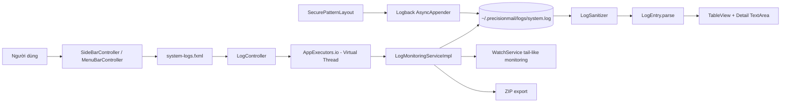

## 3. Ánh xạ kiến trúc sang mã nguồn

### 3.1 Cấu trúc gói liên quan UC-06

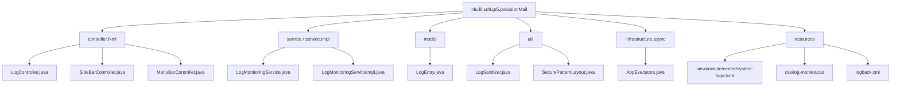

### 3.2 Bảng ánh xạ thành phần thiết kế - mã nguồn

| Thành phần UC-06 | Vai trò thiết kế | Tệp hiện thực | Trách nhiệm chính |
| --- | --- | --- | --- |
| LogView | Giao diện theo dõi log | `src/main/resources/nlu/fit/soft/gr5/precisionMail/view/include/center/system-logs.fxml` | Khai báo bộ lọc level, ô keyword, bảng log, vùng chi tiết, nút làm mới, mở thư mục và xuất file |
| SideBarController | Điều hướng sidebar | `src/main/java/nlu/fit/soft/gr5/precisionMail/controller/fxml/SideBarController.java` | Điều hướng tới `center/system-logs.fxml` khi người dùng chọn mục log |
| MenuBarController | Điều hướng menu | `src/main/java/nlu/fit/soft/gr5/precisionMail/controller/fxml/MenuBarController.java` | Cho phép mở màn hình log từ menu ứng dụng |
| LogController | Điều phối UI | `src/main/java/nlu/fit/soft/gr5/precisionMail/controller/fxml/LogController.java` | Tải log, lọc log, cập nhật bảng, hiển thị chi tiết, quản lý watcher, mở thư mục log, xuất ZIP |
| LogMonitoringService | Hợp đồng nghiệp vụ log | `src/main/java/nlu/fit/soft/gr5/precisionMail/service/LogMonitoringService.java` | Định nghĩa API đọc log, lọc log, export log, watch log và truy xuất đường dẫn log |
| LogMonitoringServiceImpl | Nghiệp vụ đọc/giám sát log | `src/main/java/nlu/fit/soft/gr5/precisionMail/service/impl/LogMonitoringServiceImpl.java` | Đọc 1000 dòng cuối, lọc streaming, theo dõi file bằng `WatchService`, xuất ZIP |
| LogEntry | Mô hình hiển thị log | `src/main/java/nlu/fit/soft/gr5/precisionMail/model/LogEntry.java` | Parse log line theo pattern `[timestamp] [level] [thread] [source] - message` |
| LogSanitizer | Bảo vệ dữ liệu nhạy cảm | `src/main/java/nlu/fit/soft/gr5/precisionMail/util/LogSanitizer.java` | Mask email và các trường password/token/secret trước khi hiển thị hoặc ghi log |
| SecurePatternLayout | Layout log an toàn | `src/main/java/nlu/fit/soft/gr5/precisionMail/util/SecurePatternLayout.java` | Bọc Logback `PatternLayout` và sanitize nội dung log trước khi ghi file |
| Logback configuration | Ghi log bất đồng bộ và xoay vòng | `src/main/resources/logback.xml` | Cấu hình `AsyncAppender`, `RollingFileAppender`, `maxFileSize=10MB`, `totalSizeCap=200MB` |
| AppExecutors | Hạ tầng bất đồng bộ | `src/main/java/nlu/fit/soft/gr5/precisionMail/infrastructure/async/AppExecutors.java` | Cung cấp `Executors.newVirtualThreadPerTaskExecutor()` cho File I/O |

## 4. Luồng hiện thực UC-06

### 4.1 Luồng mở màn hình và tải 1000 dòng log mới nhất

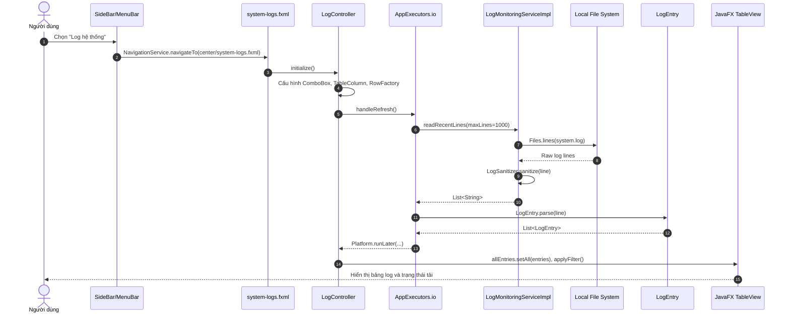

Cơ chế đọc log không đưa toàn bộ file vào bảng UI. `LogMonitoringServiceImpl.readRecentLines()` dùng `ArrayDeque` có kích thước tối đa `maxLines`; khi vượt ngưỡng, dòng cũ nhất bị loại bỏ. Nhờ đó giao diện chỉ giữ 1000 dòng mới nhất, phù hợp EF-06-02.

### 4.2 Luồng theo dõi log thời gian thực

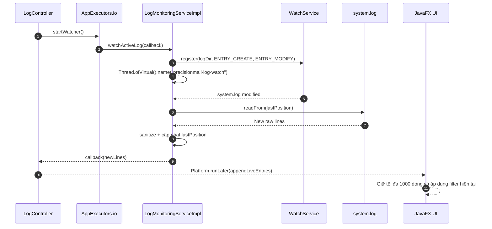

`LogController.shutdown()` đóng `LogWatchRegistration` khi view bị thay thế. Cơ chế này tránh để `WatchService` tiếp tục chạy sau khi người dùng rời màn hình log.

### 4.3 Luồng lọc theo level và keyword

```mermaid
flowchart TD
    Criteria[Level + Keyword] --> Mode{Nguồn lọc}
    Mode -->|Tự động khi nhập/chọn| InMemory[applyFilter trên allEntries]
    Mode -->|Bấm nút Lọc / Enter| Async[AppExecutors.io]
    Async --> Stream[streamAndFilterLogs]
    Stream --> Read[Files.lines(system.log)]
    Read --> Sanitize[LogSanitizer.sanitize]
    Sanitize --> Level{Khớp level?}
    Level -->|Không| Drop[Bỏ qua]
    Level -->|Có| Keyword{Chứa keyword?}
    Keyword -->|Không| Drop
    Keyword -->|Có| Tail[Giữ trong ArrayDeque tối đa 1000 dòng]
    Tail --> Parse[LogEntry.parse]
    Parse --> UI[Platform.runLater visibleEntries.setAll]
    InMemory --> UI
```

Controller hỗ trợ hai kiểu lọc. Khi người dùng đổi `ComboBox` hoặc gõ keyword, `applyFilter()` lọc trên danh sách đang hiển thị để phản hồi nhanh. Khi người dùng bấm "Lọc" hoặc nhấn Enter, `handleFilterLogs()` đọc streaming từ file log để lấy kết quả mới nhất trên đĩa.

### 4.4 Luồng xem chi tiết dòng log

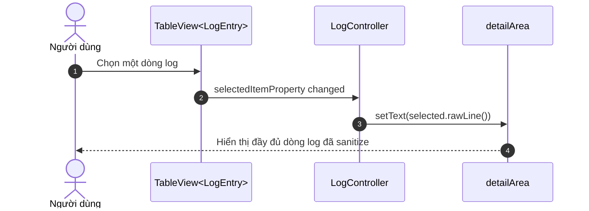

Chi tiết log dùng `rawLine()` sau khi đã được sanitize ở tầng đọc file hoặc tầng ghi Logback, nên nội dung hiển thị không làm lộ app password, token, secret hoặc email đầy đủ.

### 4.5 Luồng mở thư mục log

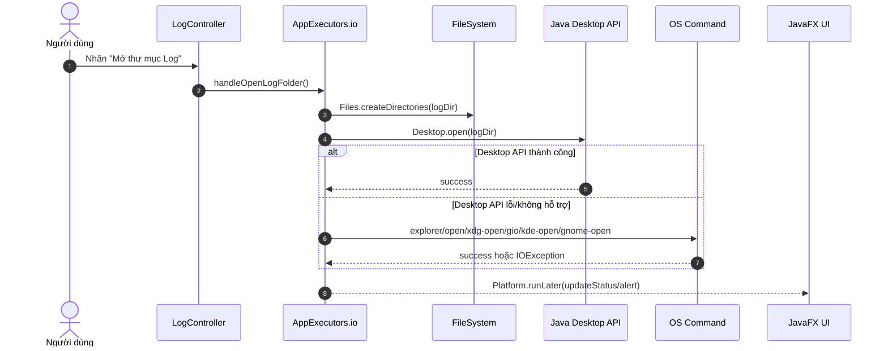

Fallback theo hệ điều hành được hiện thực trong `openDirectoryCommands(Path directory)`: Windows dùng `explorer`, macOS dùng `open`, Linux lần lượt thử `xdg-open`, `gio open`, `kde-open`, `gnome-open`.

### 4.6 Luồng xuất file log phục vụ hỗ trợ kỹ thuật

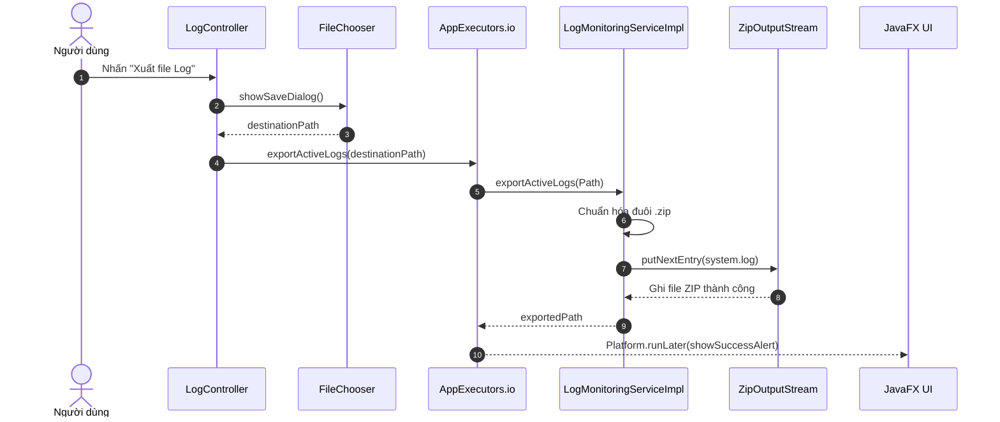

Nếu file log hiện hành chưa tồn tại hoặc thư mục đích không ghi được, service ném `IOException`; controller bắt lỗi, ghi log `ERROR` và hiển thị thông báo lỗi cho người dùng.

## 5. Hiện thực công nghệ cốt lõi

### 5.1 Bất đồng bộ hóa File I/O bằng Virtual Thread

UC-06 đưa các thao tác I/O ra khỏi JavaFX Application Thread qua `AppExecutors.io()`:

```java
private static final ExecutorService IO_EXECUTOR =
        Executors.newVirtualThreadPerTaskExecutor();
```

Trong `LogController`, các hàm `handleRefresh()`, `handleFilterLogs()`, `handleOpenLogFolder()`, `handleExportLog()` và `startWatcher()` đều submit công việc nền vào executor này. Sau khi có kết quả, UI được cập nhật bằng `Platform.runLater()`.

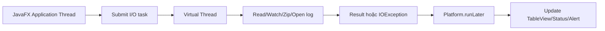

### 5.2 Bảo vệ dữ liệu nhạy cảm bằng LogSanitizer

Quy tắc BR-06-01 được hiện thực ở hai lớp:

| Lớp bảo vệ | Thành phần | Cơ chế |
| --- | --- | --- |
| Trước khi ghi file | `SecurePatternLayout` trong `logback.xml` | Gọi `LogSanitizer.sanitize(super.doLayout(event))` trước khi Logback ghi ra `system.log` |
| Trước khi hiển thị UI | `LogMonitoringServiceImpl` | Sanitize lại từng dòng khi đọc file hoặc đọc phần log mới phát sinh |

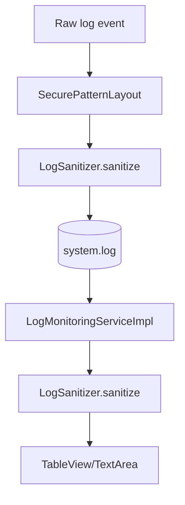

`LogSanitizer` dùng regex để chuyển các trường `password`, `appPassword`, `pass`, `token`, `secret` thành `[PROTECTED_PASSWORD]` và làm mờ email theo dạng `abc***@domain.com`.

### 5.3 Ghi log bất đồng bộ và xoay vòng file bằng Logback

`logback.xml` dùng `AsyncAppender` bọc `RollingFileAppender` để giảm ảnh hưởng của Disk I/O lên các use case nghiệp vụ như gửi mail và lập lịch.

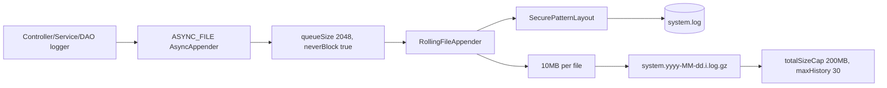

Các ràng buộc chính:

| Ràng buộc | Giá trị hiện thực |
| --- | --- |
| File log hiện hành | `${user.home}/.precisionmail/logs/system.log` |
| Pattern log | `[%d] [%level] [%thread] [%class:%line] - %msg%n%ex` |
| Kích thước tối đa mỗi file | `10MB` |
| Dung lượng tối đa toàn bộ log | `200MB` |
| Thời gian lưu lịch sử | `30` ngày |
| Queue ghi log bất đồng bộ | `2048` sự kiện |
| Chính sách không chặn | `neverBlock=true` |

## 6. Hiện thực giao diện và trình bày dữ liệu

### 6.1 Thành phần giao diện

`system-logs.fxml` định nghĩa các thành phần chính:

| Thành phần UI | `fx:id` | Vai trò |
| --- | --- | --- |
| Bộ lọc level | `levelComboBox` | Chọn `ALL`, `ERROR`, `WARN`, `INFO`, `DEBUG` |
| Ô tìm kiếm | `keywordField` | Tìm theo lớp, thread hoặc nội dung lỗi |
| Bảng log | `logTable` | Hiển thị danh sách `LogEntry` |
| Cột thời gian | `timestampColumn` | Hiển thị timestamp đã parse |
| Cột level | `levelColumn` | Hiển thị cấp độ log |
| Cột thread | `threadColumn` | Hiển thị tên thread |
| Cột nguồn | `sourceColumn` | Hiển thị `Class:Line` |
| Cột message | `messageColumn` | Hiển thị nội dung log |
| Vùng chi tiết | `detailArea` | Hiển thị toàn bộ dòng log được chọn |
| Trạng thái | `statusLabel` | Báo tình trạng tải/lọc/xuất/mở thư mục |

### 6.2 Tô màu theo cấp độ log

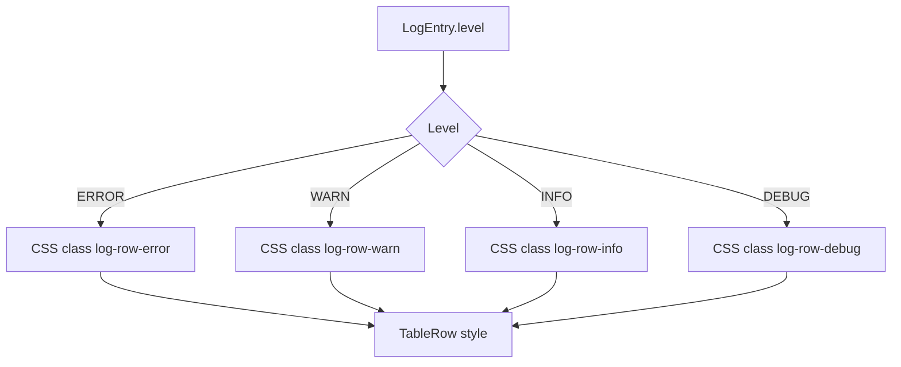

`log-monitor.css` quy định màu nền khác nhau cho từng cấp độ: `ERROR` dùng nền đỏ nhạt, `WARN` dùng vàng nhạt, `INFO` dùng trắng và `DEBUG` dùng xám nhạt. Việc tô màu được gắn trong `LogController.styleRow()`.

## 7. Xử lý ngoại lệ và giới hạn tài nguyên

| Luồng ngoại lệ | Cơ chế hiện thực | Phản hồi UI |
| --- | --- | --- |
| EF-06-01: Không đọc được file log | `handleRefresh()` bắt `IOException` từ `readRecentLines()` | Xóa bảng và hiển thị thông báo không thể truy cập tệp nhật ký |
| EF-06-02: File log lớn hơn 10 MB | `isActiveLogOversized()` kiểm tra `Files.size(ACTIVE_LOG) > 10MB` | Chỉ hiển thị 1000 dòng cuối và đặt tooltip cảnh báo |
| EF-06-03: Không mở được thư mục log | `openDirectory()` thử Desktop API rồi fallback OS command; nếu đều lỗi thì ném `IOException` | Hiển thị alert "Không thể mở thư mục chứa log" |
| Lỗi watcher | `startWatcher()` bắt `IOException` khi đăng ký `WatchService` | Cập nhật status "Không thể kích hoạt theo dõi log thời gian thực" |
| Lỗi export ZIP | `handleExportLog()` bắt `IOException` từ `exportActiveLogs()` | Hiển thị alert lỗi xuất file log |

## 8. Truy vết yêu cầu - hiện thực

| Mã yêu cầu UC-06 | Nội dung | Thành phần hiện thực | Trạng thái |
| --- | --- | --- | --- |
| S6.1 | Người dùng mở tab/mục log hệ thống | `SideBarController.handleLogsBtn()`, `MenuBarController.handleSystemLogs()` | Đã hiện thực |
| S6.2 | Đọc 1000 dòng log mới nhất | `LogController.handleRefresh()`, `LogMonitoringServiceImpl.readRecentLines()` | Đã hiện thực |
| S6.3 | Parse log theo định dạng chuẩn | `LogEntry.parse()` | Đã hiện thực |
| S6.4 | Hiển thị log lên bảng có màu theo level | `system-logs.fxml`, `LogController.styleRow()`, `log-monitor.css` | Đã hiện thực |
| S6.5 | Theo dõi log thời gian thực | `LogMonitoringServiceImpl.watchActiveLog()`, `WatchService`, `Thread.ofVirtual()` | Đã hiện thực |
| S6.6-S6.7 | Lọc theo level và keyword | `LogController.applyFilter()`, `handleFilterLogs()`, `streamAndFilterLogs()` | Đã hiện thực |
| S6.8 | Xem chi tiết log được chọn | `selectedItemProperty` cập nhật `detailArea` | Đã hiện thực |
| S6.9-S6.12 | Mở thư mục log và fallback OS | `handleOpenLogFolder()`, `openDirectory()`, `openDirectoryCommands()` | Đã hiện thực |
| AF-06-01 | Xuất file log dạng ZIP | `handleExportLog()`, `exportActiveLogs()` | Đã hiện thực |
| AF-06-02 | Mở thư mục bằng fallback theo hệ điều hành | `Desktop.open()` kết hợp `explorer/open/xdg-open/gio/kde-open/gnome-open` | Đã hiện thực |
| EF-06-01 | Không tìm thấy/không đọc được file log | Trả `List.of()` nếu file chưa tồn tại; bắt `IOException` nếu lỗi đọc | Đã hiện thực |
| EF-06-02 | Tránh tràn RAM khi file log lớn | Ngưỡng `SAFE_UI_LOG_SIZE_BYTES = 10MB`, `ArrayDeque` tối đa 1000 dòng | Đã hiện thực |
| EF-06-03 | Không mở được thư mục log | Bắt `IOException`, ghi `WARN`, hiển thị alert lỗi | Đã hiện thực |
| BR-06-01 | Mask password, token, secret và email | `LogSanitizer`, `SecurePatternLayout`, sanitize khi đọc file | Đã hiện thực |
| BR-06-02 | Log rotation 10MB/file, 200MB tổng | `logback.xml` với `SizeAndTimeBasedRollingPolicy` | Đã hiện thực |
| NFR-06-01 | File I/O không khóa UI | `AppExecutors.io()` Virtual Thread + `Platform.runLater()` | Đã hiện thực |
| NFR-06-02 | Ghi log bất đồng bộ | `AsyncAppender`, `queueSize=2048`, `neverBlock=true` | Đã hiện thực |

## 9. Rào cản kỹ thuật và giải pháp

| Rào cản | Ảnh hưởng | Giải pháp hiện thực |
| --- | --- | --- |
| File log tăng lớn sau thời gian dài vận hành | Có thể gây tốn RAM nếu đọc toàn bộ vào UI | Giới hạn 1000 dòng cuối bằng `ArrayDeque`, cảnh báo khi file lớn hơn 10 MB |
| Disk I/O khi ghi log có thể làm chậm luồng nghiệp vụ | Gửi mail/lập lịch có thể bị nghẽn nếu ghi log đồng bộ | Dùng Logback `AsyncAppender` với `neverBlock=true` |
| Log có thể chứa email, password hoặc token từ exception/message | Rủi ro lộ dữ liệu cá nhân trên file và UI | Sanitize ở cả `SecurePatternLayout` và `LogMonitoringServiceImpl` |
| Theo dõi file log thời gian thực cần tránh rò rỉ thread/watcher | Watcher còn chạy sau khi rời màn hình gây lãng phí tài nguyên | `LogWatchRegistration.close()` đóng `WatchService` và interrupt virtual thread |
| Java Desktop API không khả dụng trên một số Linux/headless session | Người dùng không mở được thư mục log | Fallback command theo OS: `explorer`, `open`, `xdg-open`, `gio`, `kde-open`, `gnome-open` |

## 10. Kết luận hiện thực

Phần hiện thực UC-06 đã chuyển đặc tả "Theo dõi log hệ thống" thành màn hình JavaFX có khả năng tải 1000 dòng log mới nhất, lọc theo level/keyword, xem chi tiết dòng log, tự động cập nhật log thời gian thực, mở thư mục log và xuất file ZIP phục vụ hỗ trợ kỹ thuật.

Thiết kế hiện thực đáp ứng các yêu cầu chính của chuẩn IEEE về truy vết giữa yêu cầu và mã nguồn: giao diện được tách trong FXML/CSS, controller điều phối UI, service xử lý File I/O và ZIP, model chuẩn hóa log entry, utility bảo vệ dữ liệu nhạy cảm, còn Logback chịu trách nhiệm ghi log bất đồng bộ và xoay vòng dung lượng. Các giới hạn 1000 dòng, 10 MB/file và 200 MB tổng dung lượng log giúp UC-06 vận hành ổn định trong môi trường desktop dài hạn.
