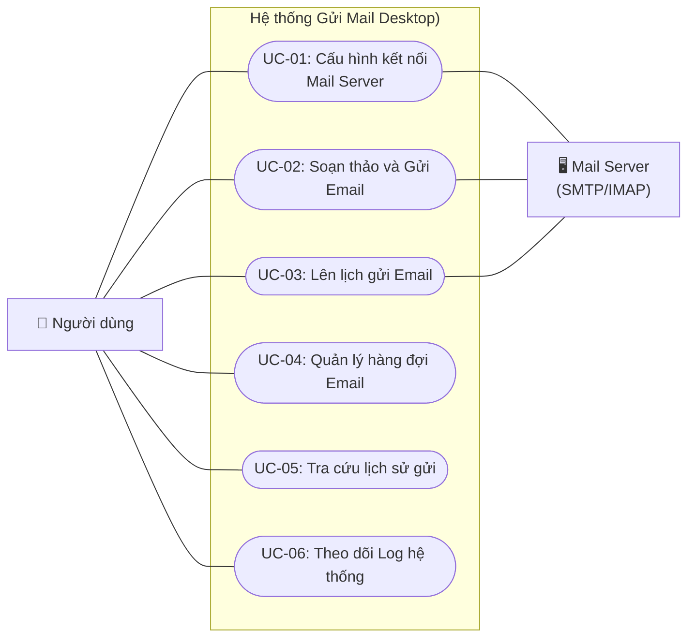
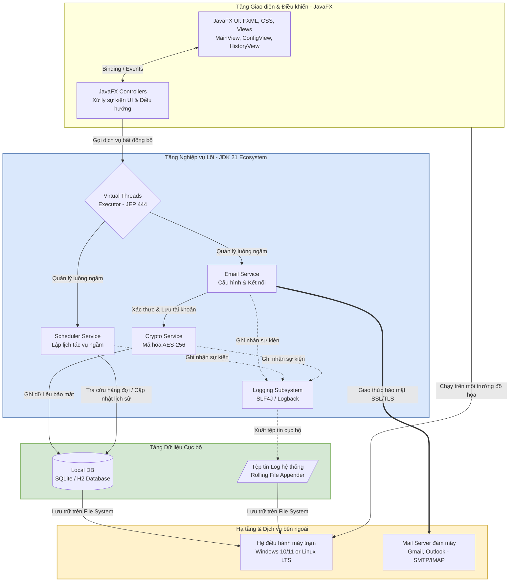

# TÀI LIỆU PHÂN TÍCH & THIẾT KẾ (ANALYSIS & DESIGN DOCUMENT)

## 1. Use Case Diagram tổng thể 

## 2. System Architecture

### 1. Tầng Giao diện (Presentation Layer)

* Sử dụng mô hình **MVC (Model-View-Controller)** tích hợp sẵn của JavaFX.
* `UI` chịu trách nhiệm render giao diện bằng tệp cấu hình cấu trúc FXML và định dạng CSS.
* `Controllers` đóng vai trò tiếp nhận sự kiện kích hoạt từ chuột/bàn phím của người dùng, đóng gói dữ liệu và chuyển giao xuống tầng xử lý nghiệp vụ mà không trực tiếp can thiệp vào logic mạng hay cơ sở dữ liệu.

### 2. Tầng Nghiệp vụ Lõi (Business Logic Layer)

* **Virtual Threads (Hạ tầng luồng ảo - JEP 444 của JDK 21):** Điểm mấu chốt công nghệ. Do việc kết nối mạng (SMTP/IMAP) và truy vấn I/O từ ổ đĩa là các tác vụ gây nghẽn (Blocking I/O), hệ thống sử dụng Virtual Threads để xử lý song song hàng nghìn tác vụ gửi mail cùng lúc mà không làm tiêu tốn tài nguyên phần cứng của máy trạm và tuyệt đối không gây đóng băng giao diện chính.
* **Crypto Service:** Đảm bảo nguyên tắc an toàn thông tin. Lớp này nhận mật khẩu thô từ Controller, áp dụng thuật toán đối xứng mã hóa để đảm bảo dữ liệu ghi xuống đĩa luôn ở trạng thái an toàn.

### 3. Tầng Dữ liệu Cục bộ (Local Data Layer)

* **Local DB:** Sử dụng một kiến trúc cơ sở dữ liệu nhúng nhẹ (Embedded) như SQLite hoặc H2. Giúp ứng dụng chạy độc lập (Standalone) hoàn toàn, không cần người dùng cài đặt thêm hệ quản trị cơ sở dữ liệu phức tạp (như MySQL hay SQL Server).
* **Log Subsystem (Hệ thống Log ghi nhận):** Tách biệt việc lưu dữ liệu nghiệp vụ (trong DB) và dữ liệu vận hành (ra file text .log có cơ chế xoay vòng tự động - Rolling).

### 4. Ranh giới hệ thống & Tác nhân ngoài (System Boundary)

* Ứng dụng đóng vai trò là một **Email Client**. Ranh giới của hệ thống kết thúc tại điểm phát tín hiệu mạng Socket kết nối qua TLS/SSL tới cổng `465` hoặc `587` của các `Mail Server` bên ngoài quốc tế.

