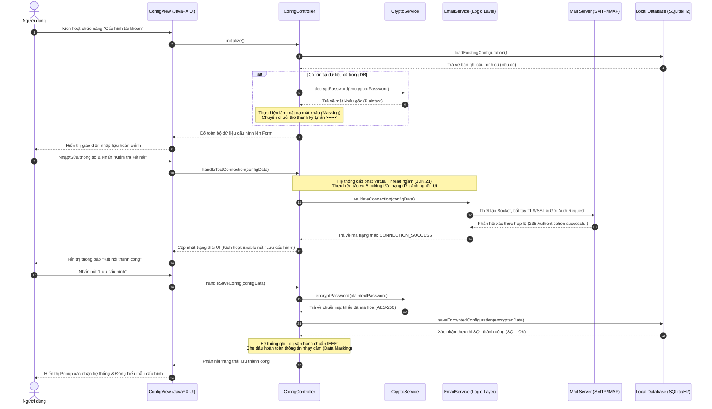

# TÀI LIỆU ĐẶC TẢ CHI TIẾT USE CASE

## HỆ THỐNG GỬI MAIL TỰ ĐỘNG TRÊN DESKTOP (DESKTOP EMAIL SYSTEM)

**Mã tài liệu:** UC-SPEC-01
 
**Tiêu chuẩn áp dụng:** IEEE Std 830-1998 / IEEE Std 29148-2018
 
**Trạng thái:** Hoàn thiện

### 1\. Thông tin chung (General Information)

* **Use Case ID (Mã định danh Use case):** UC-01 (Ánh xạ trực tiếp từ yêu cầu nghiệp vụ UR-01 trong BRD)
* **Use Case Name (Tên Use case):** Cấu hình kết nối Mail Server
* **Description (Mô tả chức năng):** Cung cấp giao diện trực quan cho phép người dùng cấu hình, kiểm tra khả năng bắt tay (handshake) và lưu trữ thông số kết nối Mail Server (SMTP/IMAP). Các dữ liệu nhạy cảm như Mật khẩu ứng dụng (App Password) sẽ được mã hóa an toàn ở mức Client trước khi lưu vào Cơ sở dữ liệu cục bộ.
* **Actor(s) (Các tác nhân tham gia):** Người dùng (User), Mail Server (SMTP/IMAP Server)
* **Priority (Mức độ ưu tiên):** Tối cao (High / Critical)
* **Trigger (Điều kiện kích hoạt):** Người dùng nhấn chọn chức năng "Cấu hình tài khoản" hoặc "Cài đặt kết nối" trên thanh điều khiển của ứng dụng JavaFX.

### 2\. Điều kiện Tiền - Hậu (Pre & Post-Conditions)

* **Pre-Condition(s) (Điều kiện tiên quyết):**

    1.  Ứng dụng đã được khởi động thành công trên máy trạm (Hệ điều hành Windows 10/11 hoặc Linux LTS) dưới môi trường thực thi JVM 21.
    2.  Người dùng đã sở hữu tài khoản email hợp lệ và đã kích hoạt tính năng **Mật khẩu ứng dụng (App Password)** từ nhà cung cấp dịch vụ Email (Gmail, Outlook, Yahoo, v.v.).
    3.  Máy trạm có kết nối mạng Internet hoạt động bình thường tại thời điểm cấu hình để thực hiện kiểm tra (Test Connection).

* **Post-Condition(s) (Trạng thái hệ thống sau khi thành công):**

    1.  Các thông số cấu hình kết nối được xác thực thành công bởi Mail Server.
    2.  Bản ghi cấu hình được mã hóa an toàn thông qua thuật toán AES-256 và lưu trữ thành công vào cơ sở dữ liệu cục bộ (SQLite/H2).
    3.  Trạng thái kết nối của hệ thống chuyển sang "Sẵn sàng" (Ready), cho phép người dùng truy cập và sử dụng các tính năng phụ thuộc (UC-02 - Soạn thảo và gửi email, UC-03 - Lập lịch gửi).
    4.  Nhật ký hệ thống (System Log) ghi nhận sự kiện thiết lập cấu hình thành công ở cấp độ INFO mà không để lộ thông tin nhạy cảm.

### 3\. Luồng sự kiện (Flow of Events)

#### 3.1 Basic Flow (Luồng Use case chính)

1.  **S1.1:** Người dùng chọn chức năng "Cấu hình tài khoản" trên giao diện điều khiển chính.
2.  **S1.2:** Hệ thống truy vấn DB cục bộ:
    * *Trường hợp đã có cấu hình cũ:* Hệ thống sử dụng Crypto Service giải mã thông tin cấu hình và hiển thị dữ liệu lên form (riêng Mật khẩu ứng dụng hiển thị dưới dạng ký tự ẩn ••••••).
    * *Trường hợp chưa có cấu hình:* Hệ thống hiển thị biểu mẫu trống hoàn toàn.
3.  **S1.3:** Người dùng nhập hoặc chỉnh sửa các thông số cấu hình:
    * Địa chỉ máy chủ gửi thư (SMTP Server Host) và Cổng gửi (SMTP Port).
    * Địa chỉ máy chủ nhận thư (IMAP Server Host) và Cổng nhận (IMAP Port).
    * Phương thức bảo mật mã hóa (SSL hoặc TLS).
    * Địa chỉ Email người gửi (Sender Email).
    * Mật khẩu ứng dụng (App Password).
4.  **S1.4:** Người dùng nhấn nút **"Kiểm tra kết nối"** (Test Connection).
5.  **S1.5:** Hệ thống vô hiệu hóa tạm thời toàn bộ các trường nhập liệu trên form và hiển thị hoạt ảnh quay vòng (Progress Indicator). Đồng thời, khởi tạo một tiến trình ngầm bất đồng bộ (JavaFX Task kết hợp với Virtual Threads của JDK 21).
6.  **S1.6:** Tiến trình ngầm thiết lập kết nối Socket mã hóa và thực hiện bắt tay xác thực (TLS/SSL Handshake & Authentication) với Mail Server từ xa qua các thông số người dùng vừa nhập.
7.  **S1.7:** Mail Server tiếp nhận yêu cầu, kiểm tra tài khoản thành công và trả về tín hiệu xác nhận kết nối ổn định (ví dụ: mã phản hồi SMTP 235 Authentication successful).
8.  **S1.8:** Hệ thống cập nhật giao diện JavaFX UI: Giải phóng trạng thái khóa của biểu mẫu, ẩn hoạt ảnh quay vòng, hiển thị thông báo "Kiểm tra kết nối thành công\!" và kích hoạt (Enable) nút **"Lưu cấu hình"**.
9.  **S1.9:** Người dùng nhấn nút **"Lưu cấu hình"** (Save Configuration).
10. **S1.10:** Hệ thống chuyển giao mật khẩu ứng dụng thô cho dịch vụ mã hóa Crypto Service để băm và mã hóa bằng thuật toán đối xứng AES-256 với khóa động.
11. **S1.11:** Hệ thống lưu bản ghi thông số kết nối (đã mã hóa mật khẩu) vào DB cục bộ bằng một cơ chế giao dịch an toàn (Transaction-safe).
12. **S1.12:** Hệ thống hiển thị hộp thoại thông báo "Lưu cấu hình thành công\!", tự động đóng biểu mẫu cài đặt và ghi log sự kiện INFO vào tệp log cục bộ.

#### 3.2 Alternative Flow (Luồng thay thế)

* **AF-01-01: Hủy bỏ thiết lập cấu hình:**
    * Tại bất kỳ thời điểm nào trước bước S1.9, người dùng có thể bấm nút "Hủy bỏ" (Cancel) hoặc nút đóng (X) trên góc cửa sổ.
    * Nếu phát hiện có sự thay đổi dữ liệu so với ban đầu, hệ thống hiển thị hộp thoại cảnh báo: *"Mọi thay đổi chưa lưu sẽ bị mất. Bạn có chắc chắn muốn thoát?"*.
    * Người dùng xác nhận "Có", hệ thống đóng biểu mẫu, giải phóng tài nguyên bộ nhớ đệm và quay lại màn hình chính mà không ghi đè dữ liệu cũ trong Database. Nếu chọn "Không", biểu mẫu giữ nguyên hiện trạng nhập liệu để người dùng tiếp tục.

#### 3.3 Exception Flow (Luồng ngoại lệ)

* **EF-01-01: Dữ liệu đầu vào không hợp lệ (Xảy ra tại bước S1.4 hoặc S1.9):**

    * Hệ thống thực hiện kiểm tra ràng buộc dữ liệu tại Client (Client-side validation):
        * Kiểm tra định dạng Email theo biểu thức chính quy (Regex Regex).
        * Kiểm tra định dạng Port gửi/nhận đảm bảo là ký tự số nguyên nằm trong khoảng:
    $$
        1 \le \text{Port} \le 65535
    $$
    * Nếu phát hiện lỗi trống trường hoặc sai định dạng, hệ thống hủy tiến trình kết nối, đánh dấu viền đỏ trường nhập liệu bị lỗi, hiển thị thông báo tooltip trực quan (ví dụ: *"Cổng kết nối không hợp lệ. Vui lòng nhập giá trị từ 1 đến 65535."*) và tiếp tục vô hiệu hóa nút "Lưu cấu hình".

* **EF-01-02: Mail Server từ chối xác thực tài khoản (Xảy ra tại bước S1.7):**

    * Mail Server từ chối yêu cầu đăng nhập do sai tên tài khoản, sai mật khẩu ứng dụng hoặc do tài khoản chưa được kích hoạt quyền truy cập ứng dụng bên thứ ba.
    * Hệ thống nhận dạng lỗi xác thực mạng (bắt ngoại lệ AuthenticationFailedException).
    * Khôi phục trạng thái hoạt động của UI (mở khóa các trường nhập), tắt hoạt ảnh tải và hiển thị thông báo lỗi chi tiết: *"Xác thực thất bại. Vui lòng kiểm tra lại địa chỉ Email và Mật khẩu ứng dụng."*. Ghi nhận log cảnh báo WARN.

* **EF-01-03: Mất kết nối mạng hoặc Timeout (Xảy ra tại bước S1.6):**

    * Hệ thống không thể kết nối tới Socket đích do không có mạng Internet, sai địa chỉ Host Server hoặc tường lửa (Firewall) chặn cổng kết nối.
    * Để tránh ứng dụng chờ đợi vô hạn, hệ thống áp dụng giới hạn thời gian chờ tối đa:
    $$
      T_{\text{timeout}} \le 10 \text{ giây}
    $$
    * Khi quá thời gian hoặc bắt được ngoại lệ ConnectException/SocketTimeoutException, hệ thống dừng tiến trình ngầm, khôi phục UI và hiển thị thông báo: *"Không thể kết nối tới máy chủ. Vui lòng kiểm tra lại đường truyền Internet và thông số Port."*. Ghi nhận log cảnh báo WARN.

* **EF-01-04: Lỗi ghi cơ sở dữ liệu cục bộ (Xảy ra tại bước S1.11):**

    * Database SQLite/H2 cục bộ bị khóa quyền ghi (do tiến trình khác chiếm dụng) hoặc ổ đĩa máy trạm bị đầy.
    * Hệ thống bắt ngoại lệ SQL (SQLException), khôi phục (Rollback) giao dịch để bảo toàn tính toàn vẹn dữ liệu.
    * Hiển thị thông báo lỗi hệ thống: *"Lỗi ghi dữ liệu. Không thể lưu cấu hình xuống ổ đĩa cục bộ. Vui lòng thử lại."* và ghi nhận log lỗi nghiêm trọng ở cấp độ ERROR kèm Stacktrace.

### 4. Quy tắc Nghiệp vụ (Business Rules)

* **BR-01-01 (Mã hóa lưu trữ an toàn):** Mật khẩu ứng dụng (App Password) tuyệt đối không được ghi nhận dưới dạng văn bản thường (Plaintext) tại Database cục bộ hay bất kỳ tệp tin cấu hình tạm thời nào. Hệ thống bắt buộc sử dụng thuật toán **AES-256** với khóa bí mật (Secret Key) được sinh động liên kết với các thông số phần cứng duy nhất của máy trạm (Hardware-bound encryption như CPU ID, Motherboard UUID), ngăn chặn triệt để hành vi sao chép tệp tin Database sang máy trạm khác để đánh cắp mật khẩu.
* **BR-01-02 (Tự động gợi ý cổng Port thông minh):** Để giảm thiểu lỗi nhập liệu từ người dùng, khi người dùng lựa chọn Giao thức mã hóa bảo mật, hệ thống tự động điền gợi ý các cổng Port tiêu chuẩn:
    * Nếu chọn SMTP + SSL: Cổng tự động gán là $465$.
    * Nếu chọn SMTP + TLS: Cổng tự động gán là $587$.
    * Nếu chọn IMAP + SSL: Cổng tự động gán là $993$.
* **BR-01-03 (Bảo mật hiển thị giao diện):** Trường nhập liệu Mật khẩu ứng dụng bắt buộc phải sử dụng thành phần PasswordField của JavaFX, ẩn hoàn toàn các ký tự khi người dùng thao tác gõ phím. Không hỗ trợ tính năng sao chép (Copy) từ trường này.
* **BR-01-04 (Bảo mật thông tin Log hệ thống):** Tuân thủ chặt chẽ UR-13 và BR-02-03. Tuyệt đối không được in mật khẩu thô hoặc băm ra tệp log. Địa chỉ email khi ghi nhận vào log phải được làm mờ (Masking) theo định dạng: Chỉ hiển thị $3$ ký tự đầu của phần tên người dùng và tên miền nhà cung cấp (Ví dụ: sen\*\*\*@gmail.com).

### 5. Yêu cầu phi chức năng (Non-Functional Requirements)

* **NFR-01-01 (Giữ mượt giao diện đồ họa):** Tác vụ thực hiện Test Connection và lưu trữ I/O tuyệt đối không được chạy trên luồng giao diện chính (JavaFX Application Thread). Toàn bộ tiến trình mạng phải được đóng gói vào các luồng ảo (Virtual Threads - JEP 444) để giao diện người dùng luôn duy trì tần số quét 60 FPS mượt mà.
* **NFR-01-02 (Hiệu năng phản hồi nút bấm):** Thời gian phản hồi xử lý sự kiện đóng mở form, click chuột phải nhỏ hơn . Thời gian tối đa cho một tiến trình kiểm tra mạng kết nối (khi không xảy ra lỗi) không được vượt quá .
* **NFR-01-03 (Dọn dẹp bộ nhớ đệm):** Sau khi luồng kiểm tra kết nối hoàn tất hoặc bị hủy bỏ, hệ thống phải thực hiện dọn dẹp (Garbage Collection gợi ý hoặc hủy tham chiếu đối tượng Socket) để giải phóng bộ nhớ RAM tức thì, đảm bảo lượng RAM tiêu hao của ứng dụng không tăng đột biến.

### 6. Sequence Diagram
