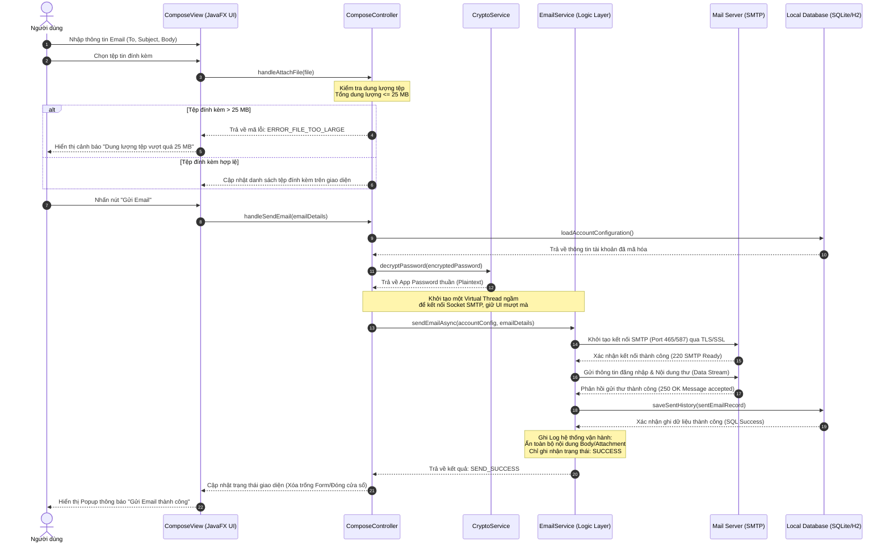

# **TÀI LIỆU ĐẶC TẢ CHI TIẾT USE CASE**

## **HỆ THỐNG GỬI MAIL TỰ ĐỘNG TRÊN DESKTOP (DESKTOP EMAIL SYSTEM)**

**Mã tài liệu:** UC-SPEC-02 
 
**Tiêu chuẩn áp dụng:** IEEE Std 830-1998 / IEEE Std 29148-2018 
 
**Trạng thái:** Hoàn thiện

### **1. Thông tin chung (General Information)**

* **Use Case ID (Mã định danh Use case):** UC-02 (Ánh xạ trực tiếp từ yêu cầu nghiệp vụ UR-02, UR-03, UR-07, UR-08 trong BRD)
* **Use Case Name (Tên Use case):** Soạn thảo và Gửi Email
* **Description (Mô tả chức năng):** Cung cấp giao diện cho phép người dùng soạn thảo nội dung email (hỗ trợ định dạng rich-text HTML), thêm danh sách người nhận (To, Cc, Bcc), đính kèm tệp tin cục bộ và thực hiện gửi email ngay lập tức. Hệ thống sẽ xử lý gửi bất đồng bộ ngầm, lưu lịch sử và ghi log hệ thống.
* **Actor(s) (Các tác nhân tham gia):** Người dùng (User), Mail Server (SMTP)
* **Priority (Mức độ ưu tiên):** Tối cao (High / Critical)
* **Trigger (Điều kiện kích hoạt):** Người dùng nhấp chọn chức năng "Soạn thư" (Compose Email) trên bảng điều khiển giao diện chính của JavaFX.

### **2. Điều kiện Tiền - Hậu (Pre & Post-Conditions)**

* **Pre-Condition(s) (Điều kiện tiên quyết):**

    1.  Ứng dụng đang vận hành ổn định trên máy trạm của người dùng.
    2.  Người dùng đã cấu hình tài khoản gửi thành công trong hệ thống (Hoàn tất **UC-01** và có bản ghi cấu hình hợp lệ trong Database cục bộ).
    3.  Máy trạm có kết nối mạng Internet hoạt động bình thường.

* **Post-Condition(s) (Trạng thái hệ thống sau khi thành công):**

    1.  Email được chuyển trạng thái "Đã gửi" và truyền tải thành công tới Mail Server trung gian thông qua giao thức SMTP bảo mật.
    2.  Một bản ghi lịch sử gửi thư được tạo mới trong Cơ sở dữ liệu cục bộ (SQLite/H2) chứa đầy đủ siêu dữ liệu (Metadata): Người nhận, Tiêu đề, Thời gian gửi thực tế, và Trạng thái "Thành công".
    3.  Các tệp tin đính kèm (nếu có) được hệ thống ghi nhận đường dẫn cục bộ phục vụ cho việc xem lại.
    4.  Nhật ký hệ thống (System Log) ghi nhận tiến trình gửi thành công với định dạng chuẩn SLF4J/Logback.

### **3. Luồng sự kiện (Flow of Events)**

#### **3.1 Basic Flow (Luồng Use case chính)**

1.  **S2.1:** Người dùng nhấp chọn nút "Soạn thư" trên giao diện.
2.  **S2.2:** Hệ thống hiển thị biểu mẫu soạn thảo email trống gồm các trường nhập liệu:
    * Người nhận chính (To)
    * Đồng gửi (Cc)
    * Đồng gửi ẩn danh (Bcc)
    * Tiêu đề thư (Subject)
    * Bộ soạn thảo văn bản giàu định dạng (Rich-text HTML Editor)
    * Danh sách đính kèm (Attachment List) và nút "Đính kèm tệp"
3.  **S2.3:** Người dùng nhập địa chỉ email người nhận vào các trường To, Cc, Bcc.
4.  **S2.4:** Người dùng nhập tiêu đề và soạn thảo nội dung email (có thể sử dụng các công cụ định dạng chữ in đậm, in nghiêng, chèn link, màu sắc từ Rich-text Editor).
5.  **S2.5:** Người dùng nhấn nút "Đính kèm tệp" (Attach File).
6.  **S2.6:** Hệ thống mở trình chọn tệp mặc định của Hệ điều hành (FileDialog). Người dùng chọn một hoặc nhiều tệp từ máy trạm.
7.  **S2.7:** Hệ thống tính toán tổng dung lượng các tệp được chọn. Nếu thỏa mãn quy tắc, danh sách các tệp đính kèm sẽ hiển thị trực quan dưới cuối biểu mẫu cùng dung lượng chi tiết.
8.  **S2.8:** Người dùng nhấn nút **"Gửi ngay"** (Send Now).
9.  **S2.9:** Hệ thống vô hiệu hóa tạm thời các nút bấm trên biểu mẫu soạn thảo (Gửi, Đính kèm) để tránh người dùng thao tác trùng lặp. Đồng thời, khởi tạo một tiến trình bất đồng bộ ngầm (JavaFX Service kết hợp với Virtual Threads của JDK 21).
10. **S2.10:** Hệ thống kết nối cơ sở dữ liệu để lấy và giải mã thông tin kết nối tài khoản (App Password) bằng dịch vụ Crypto Service.
11. **S2.11:** Tiến trình ngầm chuyển đổi dữ liệu email thành đối tượng MimeMessage tiêu chuẩn, thiết lập phiên kết nối SMTP (SSL/TLS) và thực hiện truyền tải dữ liệu tới Mail Server.
12. **S2.12:** Mail Server tiếp nhận thành công và trả về mã xác nhận truyền tải thành công.
13. **S2.13:** Hệ thống tự động lưu trữ thông tin email vừa gửi vào bảng lịch sử cục bộ của DB với trạng thái "Thành công".
14. **S2.14:** Hệ thống cập nhật giao diện JavaFX UI: Giải phóng trạng thái khóa của biểu mẫu, làm sạch toàn bộ dữ liệu vừa soạn thảo, hiển thị thông báo "Email đã được gửi thành công" và ghi nhận Log INFO vào tệp log cục bộ.

#### **3.2 Alternative Flow (Luồng thay thế)**

* **AF-02-01: Hủy soạn thảo thư:**
    * Tại bất kỳ thời điểm nào trước bước S2.8, người dùng có thể nhấn nút "Hủy soạn" hoặc biểu tượng đóng biểu mẫu.
    * Hệ thống sẽ hiển thị một hộp thoại cảnh báo: *"Nội dung thư đang soạn thảo sẽ bị mất. Bạn có chắc chắn muốn thoát?"*.
    * Nếu người dùng xác nhận "Có", hệ thống đóng biểu mẫu, giải phóng bộ nhớ đệm và đưa người dùng về màn hình làm việc chính. Nếu chọn "Không", hệ thống giữ nguyên hiện trạng soạn thảo để người dùng tiếp tục.

#### **3.3 Exception Flow (Luồng ngoại lệ)**

* **EF-02-01: Địa chỉ Email nhận không đúng định dạng (Xảy ra tại bước S2.8):**

    * Hệ thống áp dụng biểu thức chính quy (Regex Regex) để kiểm tra tất cả các địa chỉ email nhập vào các trường To, Cc, Bcc.
    * Nếu phát hiện bất kỳ địa chỉ nào sai định dạng, hệ thống sẽ dừng tiến trình gửi, đánh dấu viền đỏ trường nhập liệu tương ứng, và hiển thị thông báo lỗi chi tiết: *"Địa chỉ email \[abc\] không hợp lệ. Vui lòng kiểm tra lại."*.

* **EF-02-02: Dung lượng tệp đính kèm vượt quá giới hạn cho phép (Xảy ra tại bước S2.6 - S2.7):**

    * Khi người dùng chọn tệp, hệ thống tính toán tổng dung lượng của tất cả các tệp đính kèm trong danh sách:
  $$
  \sum_{i=1}^{n} \text{Size}(\text{File}_i) > 25 \text{ MB}
  $$
      *(Trong đó: $25 \text{ MB} = 25 \times 1,048,576 \text{ bytes} = 26,214,400 \text{ bytes}$)*.
    * Nếu tổng dung lượng lớn hơn , hệ thống sẽ ngay lập tức từ chối đính kèm tệp vừa chọn, giữ nguyên danh sách cũ và hiển thị thông báo cảnh báo trực quan: *"Tổng dung lượng tệp đính kèm vượt quá giới hạn cho phép (Tối đa 25MB). Vui lòng loại bỏ bớt tệp."*.

* **EF-02-03: Không có kết nối mạng Internet (Xảy ra tại bước S2.9 - S2.11):**

    * Tiến trình ngầm phát hiện lỗi không thể phân giải tên miền (DNS Host Unknown) hoặc mất kết nối vật lý (java.net.ConnectException).
    * Hệ thống khôi phục trạng thái hoạt động của giao diện, ghi nhận thông tin thư vào DB cục bộ với trạng thái "Thất bại - Lỗi kết nối mạng".
    * Hiển thị thông báo trên UI: *"Gửi email thất bại. Vui lòng kiểm tra kết nối Internet của máy trạm."* và ghi nhận log ở cấp độ WARN.

* **EF-02-04: Lỗi từ chối từ Mail Server SMTP (Xảy ra tại bước S2.12):**

    * Mail Server từ chối xử lý truyền tải do lỗi hạn ngạch (Rate Limit), lỗi tài khoản bị khóa tạm thời hoặc nội dung bị lọc spam.
    * Hệ thống bắt các mã lỗi SMTP (MessagingException / SMTPSendFailedException).
    * Ghi nhận thông tin thư vào lịch sử DB cục bộ với trạng thái "Thất bại" kèm mã lỗi chi tiết từ server.
    * Hiển thị thông báo: *"Gửi thư thất bại. Mail Server phản hồi lỗi: \[Nội dung lỗi chi tiết\]"* và ghi nhận log ở cấp độ ERROR.

### **4. Quy tắc Nghiệp vụ (Business Rules)**

* **BR-02-01 (Giới hạn đính kèm):** Tổng dung lượng các tệp đính kèm cho một email gửi đi tuyệt đối không được vượt ngưỡng tối đa . Quy tắc này phải được tính toán và kiểm tra ngay tại máy trạm (Client-side validation) để tối ưu hóa tài nguyên mạng trước khi thực hiện kết nối SMTP.
* **BR-02-02 (Ràng buộc người nhận):** Email gửi đi bắt buộc phải có ít nhất một địa chỉ người nhận hợp lệ tại một trong ba trường: To, hoặc Cc, hoặc Bcc. Trường Tiêu đề (Subject) và Nội dung (Body) có thể để trống nhưng hệ thống phải hiển thị cảnh báo xác nhận của người dùng trước khi gửi thư trống.
* **BR-02-03 (Bảo mật nội dung Log):** Nhằm bảo mật thông tin cá nhân và dữ liệu riêng tư (Tuân thủ UR-13):
    * Tuyệt đối không được ghi nội dung chi tiết của phần Body thư, tệp tin đính kèm thô, hoặc danh sách đầy đủ các người nhận vào tệp tin log hệ thống dưới dạng text thường.
    * Log hệ thống chỉ được phép ghi nhận siêu dữ liệu an toàn dạng:
      `"User [sender@email.com] sent an email with Subject length [X] and [Y] attachments. Status: SUCCESS"`

### **5. Yêu cầu phi chức năng (Non-Functional Requirements)**

* **NFR-02-01 (Xử lý bất đồng bộ ngầm - Multi-threading):** Tác vụ soạn thảo và bấm nút gửi hoàn toàn không được gây ảnh hưởng tới luồng xử lý đồ họa chính (JavaFX Application Thread). Giao diện người dùng phải giữ nguyên phản hồi 60 FPS, cho phép thu nhỏ cửa sổ hoặc chuyển sang xem trang lịch sử trong lúc tiến trình gửi ngầm đang chạy.
* **NFR-02-02 (Tính toàn vẹn dữ liệu - Data Integrity):** Quy trình cập nhật trạng thái thư gửi và ghi lịch sử vào Database cục bộ phải thực hiện theo cơ chế giao dịch (Transaction-safe) để tránh tình trạng email đã gửi đi thành công nhưng cơ sở dữ liệu lịch sử cục bộ lại không ghi nhận được hoặc ngược lại.
* **NFR-02-03 (Tối ưu hóa tài nguyên RAM):** Đối với các tệp đính kèm dung lượng lớn sát ngưỡng , hệ thống phải truyền tải theo cơ chế luồng dữ liệu (Streaming/Chunking API) trong gói JavaMail thay vì nạp toàn bộ tệp tin vào bộ nhớ đệm RAM cùng lúc, đảm bảo mức tiêu thụ tài nguyên RAM của app luôn giữ ở mức an toàn dưới .

### **6. Sequence Diagram**
