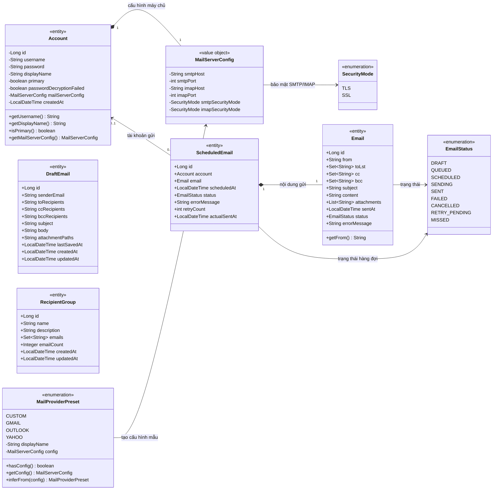

# PrecisionMail - Class Diagram các model chính

Sơ đồ dưới đây mô tả các model nghiệp vụ chính trong package
`nlu.fit.soft.gr5.precisionMail.model`.

## Ghi chú quan hệ

- `Account` sở hữu một `MailServerConfig`; cấu hình này được lưu cùng bản ghi tài khoản.
- `ScheduledEmail` chứa nội dung `Email` và có thể tham chiếu một `Account`. Cột
  `scheduled_emails.account_id` trong SQLite cho phép giá trị `NULL`.
- `Email` đại diện lịch sử thư đã gửi, còn `ScheduledEmail` đại diện thư trong hàng
  đợi/lập lịch. Hai model dùng chung `EmailStatus`.
- `DraftEmail` và `RecipientGroup` hiện lưu địa chỉ email bằng `String`/`Set<String>`;
  chúng không có tham chiếu object hoặc khóa ngoại trực tiếp đến model khác.
- Các model hỗ trợ như `ConnectionTestResult`, `ConnectionTestProgress` và `LogEntry`
  không nằm trong phạm vi sơ đồ model nghiệp vụ chính.
