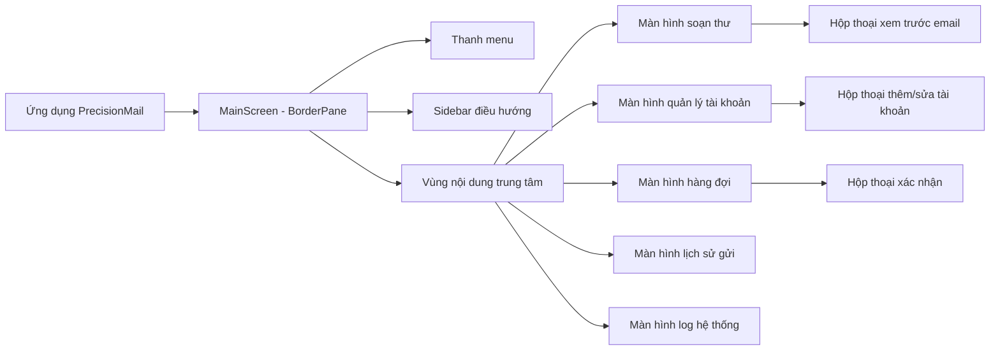
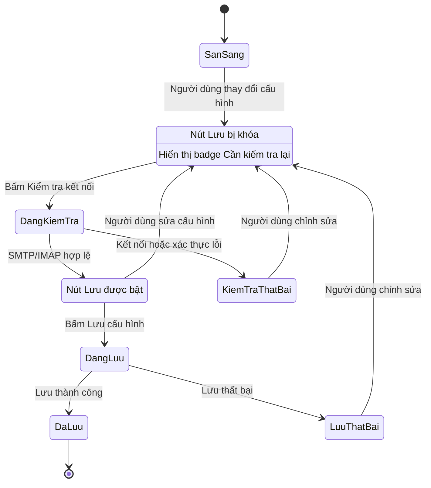
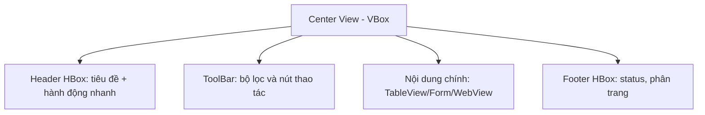

# Đặc tả thiết kế giao diện người dùng theo chuẩn IEEE

## PrecisionMail

| Trường | Giá trị                           |
| --- |-----------------------------------|
| Mã tài liệu | PM-UI-SPEC-001                    |
| Phiên bản | 1.0                               |
| Trạng thái | Bản nháp                          |
| Dự án | PrecisionMail                     |
| Phạm vi | Giao diện ứng dụng desktop JavaFX |
| Môi trường mục tiêu | JDK 25 / JavaFX 25                |
| Tác giả | Nguyễn Văn Anh Hàn                |
| Ngày cập nhật | 05/06/2026                        |

## Lịch sử thay đổi

| Phiên bản | Ngày | Mô tả | Người thực hiện    |
| --- | --- | --- |--------------------|
| 1.0 | 05/06/2026 | Tạo đặc tả giao diện theo cấu trúc IEEE-style bằng tiếng Việt | Nguyễn Văn Anh Hàn |

## Mục lục

1. Giới thiệu
2. Mô tả tổng quan giao diện
3. Kiến trúc thiết kế giao diện
4. Quy chuẩn thiết kế
5. Yêu cầu giao diện cụ thể
6. Yêu cầu responsive và thay đổi kích thước
7. Yêu cầu khả dụng và khả năng tiếp cận
8. Yêu cầu phản hồi và xử lý lỗi
9. Ma trận truy vết
10. Danh sách kiểm tra nghiệm thu
11. Phụ lục

## 1. Giới thiệu

### 1.1 Mục đích

Tài liệu này đặc tả quy chuẩn thiết kế giao diện người dùng cho ứng dụng **PrecisionMail**. Nội dung bao gồm bảng màu, kiểu chữ, khoảng cách, bố cục, trạng thái tương tác, quy tắc responsive, tiêu chí nghiệm thu và ma trận truy vết yêu cầu giao diện.

Tài liệu được trình bày theo cấu trúc IEEE-style: yêu cầu được đánh mã, có mức ưu tiên, có tiêu chí nghiệm thu và có thể kiểm thử.

### 1.2 Phạm vi

Tài liệu áp dụng cho toàn bộ giao diện JavaFX của PrecisionMail, bao gồm:

- Màn hình chính của ứng dụng.
- Thanh menu.
- Sidebar điều hướng.
- Màn hình soạn thư.
- Hộp thoại cấu hình tài khoản SMTP/IMAP.
- Màn hình quản lý danh sách tài khoản.
- Màn hình hàng đợi gửi thư.
- Màn hình lịch sử gửi thư.
- Màn hình log hệ thống.
- Hộp thoại xác nhận, thông báo lỗi và thông báo thành công.

### 1.3 Đối tượng sử dụng tài liệu

| Đối tượng | Mục đích sử dụng |
| --- | --- |
| Lập trình viên | Cài đặt giao diện bằng FXML, JavaFX Controller và CSS. |
| Người kiểm thử | Kiểm tra tính nhất quán, trạng thái giao diện và tiêu chí nghiệm thu. |
| Người thiết kế | Duy trì màu sắc, font chữ, bố cục và trải nghiệm người dùng. |
| Giảng viên/người đánh giá | Đánh giá mức độ đầy đủ và khả năng bảo trì của thiết kế giao diện. |

### 1.4 Thuật ngữ và viết tắt

| Thuật ngữ | Định nghĩa |
| --- | --- |
| UI | User Interface - giao diện người dùng. |
| FXML | Định dạng XML dùng để mô tả giao diện JavaFX. |
| CSS | Tập tin định nghĩa style cho giao diện JavaFX. |
| Token thiết kế | Giá trị chuẩn được đặt tên cho màu sắc, font, spacing hoặc trạng thái. |
| Hành động chính | Hành động quan trọng nhất trong một màn hình hoặc hộp thoại. |
| Hành động nguy hiểm | Hành động có thể gây mất dữ liệu hoặc thay đổi không dễ hoàn tác. |
| Responsive | Khả năng giao diện co giãn hợp lý khi thay đổi kích thước cửa sổ desktop. |
| Tooltip | Chú thích hiển thị khi người dùng trỏ vào thành phần giao diện. |

### 1.5 Tài liệu tham khảo

| Tài liệu | Mô tả |
| --- | --- |
| IEEE 830 / IEEE-style SRS | Dùng làm định hướng cấu trúc tài liệu đặc tả. |
| JavaFX 25 Documentation | Tài liệu kỹ thuật cho framework giao diện. |
| `style.css` | CSS nền tảng của ứng dụng. |
| `sidebar.css` | CSS cho sidebar. |
| `compose-mail.css` | CSS cho màn hình soạn thư. |
| `log-monitor.css` | CSS cho màn hình log hệ thống. |
| Các file FXML trong `src/main/resources/.../view` | Cấu trúc giao diện hiện tại của ứng dụng. |

## 2. Mô tả tổng quan giao diện

### 2.1 Bối cảnh sản phẩm

PrecisionMail là ứng dụng desktop hỗ trợ cấu hình tài khoản email, soạn thư, gửi thư, lên lịch gửi, theo dõi hàng đợi, xem lịch sử gửi và giám sát log hệ thống. Giao diện phải ưu tiên thao tác nghiệp vụ, phản hồi trạng thái rõ ràng và bảo vệ dữ liệu nhạy cảm như App Password.

### 2.2 Lớp người dùng

| Lớp người dùng | Nhu cầu giao diện |
| --- | --- |
| Người dùng cuối | Cấu hình SMTP/IMAP, soạn thư, gửi thư, xem trạng thái gửi. |
| Người vận hành | Kiểm tra log, chẩn đoán lỗi gửi mail, quản lý tài khoản đã lưu. |
| Người kiểm thử | Kiểm tra validation, trạng thái UI, responsive và các luồng lỗi. |

### 2.3 Ràng buộc thiết kế

| Mã | Ràng buộc |
| --- | --- |
| UI-CON-001 | Giao diện phải tương thích với JavaFX 25. |
| UI-CON-002 | Ứng dụng phải chạy trên desktop Windows với JDK 25. |
| UI-CON-003 | Các tác vụ I/O dài phải chạy ngoài JavaFX Application Thread. |
| UI-CON-004 | App Password, khóa mã hóa và token không được hiển thị dạng plain text. |
| UI-CON-005 | Style dùng chung phải được đưa vào CSS khi có khả năng tái sử dụng. |

### 2.4 Giả định và phụ thuộc

| Mã | Giả định/phụ thuộc |
| --- | --- |
| UI-ASM-001 | Người dùng sử dụng ứng dụng trên màn hình desktop hoặc laptop. |
| UI-ASM-002 | Chiều rộng cửa sổ tối thiểu để sử dụng ổn định là 1024px. |
| UI-ASM-003 | Có thể dùng control mặc định của JavaFX nếu style vẫn nhất quán. |
| UI-ASM-004 | Ứng dụng sử dụng các layout chính: `BorderPane`, `VBox`, `HBox`, `GridPane`, `TableView`, `ToolBar`. |

## 3. Kiến trúc thiết kế giao diện

### 3.1 Sơ đồ cấu trúc giao diện

### 3.2 Sơ đồ trạng thái cấu hình tài khoản

### 3.3 Trách nhiệm các lớp giao diện

| Lớp | Trách nhiệm |
| --- | --- |
| FXML | Mô tả cấu trúc layout, control ID, spacing và thành phần giao diện. |
| CSS | Quy định màu sắc, font chữ, trạng thái hover/active/error và style dùng chung. |
| Controller | Xử lý sự kiện, validation, trạng thái async, status message và tương tác service. |
| Service | Xử lý nghiệp vụ ngoài UI, ví dụ kiểm tra kết nối, lưu tài khoản, gửi mail. |

## 4. Quy chuẩn thiết kế

### 4.1 Bảng màu chuẩn

| Mã token | Tên | Mã màu | Mục đích sử dụng |
| --- | --- | --- | --- |
| UI-COL-001 | Nền ứng dụng | `#FFFFFF` | Nền chính vùng nội dung. |
| UI-COL-002 | Nền sidebar | `#F6F8FC` | Nền thanh điều hướng trái. |
| UI-COL-003 | Nền phụ | `#F1F3F4` | Vùng phụ, dòng debug, empty state. |
| UI-COL-004 | Nền hover | `#DADCE0` | Hover item sidebar/nav. |
| UI-COL-005 | Nền active | `#C2E7FF` | Item đang chọn hoặc hành động nổi bật. |
| UI-COL-006 | Nền active hover | `#B3DEFF` | Hover trên item đang active. |
| UI-COL-007 | Nền thông tin nhẹ | `#E8F0FE` | Trạng thái thông tin hoặc hover nhẹ. |
| UI-COL-008 | Chữ chính | `#202124` | Label, nội dung bảng, text chính. |
| UI-COL-009 | Chữ phụ | `#5F6368` | Text phụ, item footer. |
| UI-COL-010 | Chữ mờ | `#80868B` | Section title, placeholder, mô tả phụ. |
| UI-COL-011 | Chữ active | `#001D35` | Text trên nền active. |
| UI-COL-012 | Chữ/viền lỗi | `#DC2626` | Validation, lỗi thao tác. |
| UI-COL-013 | Nền cảnh báo | `#FEF3C7` | Badge cảnh báo, cần kiểm tra lại. |
| UI-COL-014 | Chữ cảnh báo | `#92400E` | Text trên badge cảnh báo. |
| UI-COL-015 | Nền thành công | `#E6F4EA` | Phản hồi thành công. |
| UI-COL-016 | Chữ thành công | `#137333` | Text thành công. |
| UI-COL-017 | Nền lỗi | `#FCE8E6` | Dòng lỗi, vùng lỗi nhẹ. |
| UI-COL-018 | Viền mặc định | `#DADCE0` | Divider, border panel/sidebar. |
| UI-COL-019 | Viền input | `#BBBBBB` | Viền field mặc định. |
| UI-COL-020 | Viền focus | `#000000` | Viền field khi focus. |

### 4.2 Quy chuẩn font chữ

| Mã token | Tên | Font | Size | Weight | Mục đích |
| --- | --- | --- | --- | --- | --- |
| UI-TYP-001 | Font mặc định | `Segoe UI`, `Arial`, sans-serif | 13px | Regular | Control, label, nội dung bảng. |
| UI-TYP-002 | Tiêu đề màn hình | `Segoe UI`, `Arial`, sans-serif | 20px | Bold | Tiêu đề vùng nội dung. |
| UI-TYP-003 | Tiêu đề dialog | `Segoe UI`, `Arial`, sans-serif | 16px | Bold | Tiêu đề hộp thoại. |
| UI-TYP-004 | Chú thích/status | `Segoe UI`, `Arial`, sans-serif | 12px | Regular | Status, helper text. |
| UI-TYP-005 | Section sidebar | `Segoe UI`, `Arial`, sans-serif | 10px | Bold | Tiêu đề nhóm sidebar. |
| UI-TYP-006 | Text lỗi | `Segoe UI`, `Arial`, sans-serif | 11px | Regular | Label lỗi validation. |
| UI-TYP-007 | Monospace | `JetBrains Mono`, `Consolas`, monospace | 12px | Regular | Log, code, đường dẫn file. |

### 4.3 Quy chuẩn khoảng cách

| Mã token | Giá trị | Mục đích |
| --- | --- | --- |
| UI-SPC-001 | 2px | Khoảng cách rất nhỏ giữa label/section. |
| UI-SPC-002 | 4px | Padding nhỏ trong input/status. |
| UI-SPC-003 | 8px | Khoảng cách icon-text hoặc HBox nhỏ. |
| UI-SPC-004 | 10px | Khoảng cách toolbar và section. |
| UI-SPC-005 | 12px | Padding màn hình trung tâm, hgap form. |
| UI-SPC-006 | 14px | Spacing nội dung dialog. |
| UI-SPC-007 | 16px | Khoảng cách section/sidebar. |
| UI-SPC-008 | 18px | Padding dialog. |
| UI-SPC-009 | 24px | Radius item sidebar. |

### 4.4 Quy chuẩn bo góc

| Mã token | Giá trị | Mục đích |
| --- | --- | --- |
| UI-SHP-001 | 0px | Container nội dung mặc định. |
| UI-SHP-002 | 10px | Badge trạng thái. |
| UI-SHP-003 | 18px | Nút soạn thư. |
| UI-SHP-004 | 24px | Item sidebar. |
| UI-SHP-005 | 30px | Nút gửi thư. |

## 5. Yêu cầu giao diện cụ thể

### 5.1 Yêu cầu giao diện tổng quát

| Mã yêu cầu | Nội dung yêu cầu | Ưu tiên | Tiêu chí nghiệm thu |
| --- | --- | --- | --- |
| UI-GEN-001 | Ứng dụng phải sử dụng bảng màu chuẩn tại Mục 4.1. | Cao | Không phát sinh màu hard-code mới nếu chưa cập nhật tài liệu. |
| UI-GEN-002 | Ứng dụng phải sử dụng font và thang chữ tại Mục 4.2. | Cao | Tiêu đề, caption, bảng và log đúng kích thước quy định. |
| UI-GEN-003 | Ứng dụng phải ưu tiên màn hình thao tác nghiệp vụ, không dùng landing page trang trí. | Cao | Mỗi view mở ra đều cho phép thao tác trực tiếp. |
| UI-GEN-004 | Ứng dụng không được hiển thị dữ liệu nhạy cảm dạng plain text. | Rất cao | Password bị mask; log không lộ password/token. |
| UI-GEN-005 | Mỗi thao tác bất đồng bộ phải có phản hồi trạng thái rõ ràng. | Cao | Test/lưu/gửi/xuất file có trạng thái bắt đầu và kết thúc. |

### 5.2 Yêu cầu màn hình chính và điều hướng

| Mã yêu cầu | Nội dung yêu cầu | Ưu tiên | Tiêu chí nghiệm thu |
| --- | --- | --- | --- |
| UI-NAV-001 | Màn hình chính phải dùng `BorderPane` gồm menu bar, sidebar và vùng nội dung trung tâm. | Cao | Menu và sidebar không biến mất khi chuyển view. |
| UI-NAV-002 | Sidebar phải dùng nền `#F6F8FC` và viền phải `#DADCE0`. | Cao | CSS `.compose-left-sidebar` áp dụng đúng màu. |
| UI-NAV-003 | Item sidebar đang active phải dùng nền `#C2E7FF`, chữ `#001D35` và font bold. | Cao | View hiện tại được nhận biết rõ. |
| UI-NAV-004 | Sidebar có chiều rộng ưu tiên 200px và tối thiểu 180px. | Trung bình | Sidebar vẫn đọc được ở cửa sổ 1024px. |
| UI-NAV-005 | Nhãn điều hướng sidebar phải ngắn gọn, không bị cắt ở kích thước chuẩn. | Trung bình | Text không tràn trong sidebar. |

### 5.3 Yêu cầu hộp thoại cấu hình tài khoản

| Mã yêu cầu | Nội dung yêu cầu | Ưu tiên | Tiêu chí nghiệm thu |
| --- | --- | --- | --- |
| UI-ACC-001 | Hộp thoại cấu hình tài khoản phải dùng form `GridPane` hai cột. | Cao | Label nằm cột 0, input nằm cột 1. |
| UI-ACC-002 | Form phải có provider, display name, sender email, app password, primary account, SMTP host/port/security, IMAP host/port/security. | Cao | Tất cả field được hiển thị và có thể nhập khi phù hợp. |
| UI-ACC-003 | App Password phải sử dụng `PasswordField`. | Rất cao | Password không hiển thị plain text. |
| UI-ACC-004 | Nút Lưu phải bị khóa cho đến khi kiểm tra kết nối thành công. | Rất cao | Cấu hình chưa test không thể lưu. |
| UI-ACC-005 | Sau khi test thành công, mọi thay đổi cấu hình phải hiển thị badge `Cần kiểm tra lại`. | Cao | Badge xuất hiện và nút Lưu bị khóa. |
| UI-ACC-006 | Field lỗi phải có viền `#DC2626` và tooltip nêu lỗi cụ thể. | Cao | Người dùng biết field nào cần sửa. |
| UI-ACC-007 | Provider preset phải tự điền host, port và security mode tương ứng. | Cao | Gmail/Outlook/Yahoo cập nhật đúng cấu hình. |
| UI-ACC-008 | Nếu người dùng sửa host/port thủ công, provider phải chuyển sang `Custom`. | Trung bình | ComboBox provider đổi sang Custom. |
| UI-ACC-009 | Nếu không giải mã được App Password đã lưu, form phải để trống password và yêu cầu nhập lại. | Rất cao | Không hiển thị hoặc dùng chuỗi encrypted/raw. |

### 5.4 Yêu cầu màn hình quản lý tài khoản

| Mã yêu cầu | Nội dung yêu cầu | Ưu tiên | Tiêu chí nghiệm thu |
| --- | --- | --- | --- |
| UI-AMG-001 | Màn hình quản lý tài khoản phải hiển thị danh sách bằng `TableView`. | Cao | Bảng có cột mặc định, tên hiển thị, email, provider, SMTP, IMAP. |
| UI-AMG-002 | Màn hình phải có thao tác thêm, sửa, xóa, đặt mặc định và làm mới. | Cao | Các nút nằm trên toolbar. |
| UI-AMG-003 | Nút sửa/xóa/đặt mặc định phải bị khóa khi chưa chọn tài khoản. | Cao | Trạng thái nút phản ánh selection. |
| UI-AMG-004 | Xóa tài khoản phải có hộp thoại xác nhận. | Rất cao | Dialog mô tả hậu quả khi xóa. |
| UI-AMG-005 | Khi xóa tài khoản mặc định, dialog phải báo hệ thống sẽ chọn tài khoản khác làm mặc định nếu còn. | Cao | Nội dung xác nhận có cảnh báo này. |
| UI-AMG-006 | Khi danh sách rỗng, bảng phải hiển thị placeholder. | Trung bình | Empty state rõ ràng. |

### 5.5 Yêu cầu màn hình soạn thư

| Mã yêu cầu | Nội dung yêu cầu | Ưu tiên | Tiêu chí nghiệm thu |
| --- | --- | --- | --- |
| UI-CMP-001 | Màn hình soạn thư phải có chọn tài khoản gửi, người nhận, tiêu đề, nội dung, đính kèm, gửi, xem trước và lên lịch. | Cao | Các control chính có thể thao tác được. |
| UI-CMP-002 | Menu chọn tài khoản gửi phải hiển thị tên gợi nhớ và trạng thái mặc định nếu có. | Trung bình | Người dùng phân biệt được nhiều tài khoản. |
| UI-CMP-003 | Các nút gửi/lên lịch phải bị khóa trong khi đang xử lý gửi/lên lịch. | Cao | Không gửi trùng thao tác. |
| UI-CMP-004 | Khu vực đính kèm phải cho phép xem và loại bỏ file đã chọn. | Trung bình | Người dùng kiểm soát file trước khi gửi. |

### 5.6 Yêu cầu các màn hình dạng bảng

| Mã yêu cầu | Nội dung yêu cầu | Ưu tiên | Tiêu chí nghiệm thu |
| --- | --- | --- | --- |
| UI-TBL-001 | Màn hình danh sách phải có tiêu đề, toolbar, bảng và vùng status/footer. | Cao | History, queue, accounts, logs tuân thủ cấu trúc này. |
| UI-TBL-002 | `TableView` phải dùng `VBox.vgrow="ALWAYS"` khi nằm trong layout dọc. | Cao | Bảng co giãn theo chiều cao cửa sổ. |
| UI-TBL-003 | Bảng rỗng phải hiển thị placeholder. | Trung bình | Người dùng biết không có dữ liệu. |
| UI-TBL-004 | Double click trên dòng chỉ được dùng để xem chi tiết hoặc sửa, không dùng cho hành động nguy hiểm. | Trung bình | Không có xóa dữ liệu bằng double click. |

### 5.7 Yêu cầu màn hình log

| Mã yêu cầu | Nội dung yêu cầu | Ưu tiên | Tiêu chí nghiệm thu |
| --- | --- | --- | --- |
| UI-LOG-001 | Dòng log phải có màu khác nhau theo mức error, warn, info, debug. | Trung bình | CSS row class áp dụng đúng. |
| UI-LOG-002 | Nội dung log chi tiết phải dùng font monospace. | Trung bình | TextArea log dùng `JetBrains Mono` hoặc `Consolas`. |
| UI-LOG-003 | Log error phải dùng nền `#FCE8E6`. | Trung bình | Dòng lỗi dễ nhận biết. |
| UI-LOG-004 | Log warning phải dùng nền cảnh báo nhẹ. | Trung bình | Dòng warning dễ nhận biết. |

### 5.8 Yêu cầu hộp thoại và cảnh báo

| Mã yêu cầu | Nội dung yêu cầu | Ưu tiên | Tiêu chí nghiệm thu |
| --- | --- | --- | --- |
| UI-DLG-001 | Tiêu đề dialog phải nêu rõ tác vụ. | Cao | Ví dụ: `Thêm tài khoản`, `Sửa tài khoản`, `Xóa tài khoản`. |
| UI-DLG-002 | Dialog xác nhận hành động nguy hiểm phải có nút hành động cụ thể. | Cao | Nút xóa ghi `Xóa`, không dùng `OK`. |
| UI-DLG-003 | Dialog lỗi phải mô tả lỗi và hướng xử lý tiếp theo. | Cao | Người dùng biết cần sửa gì. |
| UI-DLG-004 | Alert thành công chỉ dùng cho thao tác quan trọng. | Trung bình | Thay đổi nhỏ dùng status label thay vì alert. |

## 6. Yêu cầu responsive và thay đổi kích thước

| Mã yêu cầu | Nội dung yêu cầu | Ưu tiên | Tiêu chí nghiệm thu |
| --- | --- | --- | --- |
| UI-RSP-001 | Ứng dụng phải sử dụng được ở cửa sổ rộng 1024px. | Cao | Sidebar, toolbar và nội dung chính không chồng nhau. |
| UI-RSP-002 | Sidebar phải giữ chiều rộng tối thiểu 180px. | Trung bình | Nhãn điều hướng vẫn đọc được. |
| UI-RSP-003 | Bảng ở vùng trung tâm phải co giãn theo chiều rộng và chiều cao còn lại. | Cao | `TableView` lấp đầy vùng nội dung còn trống. |
| UI-RSP-004 | Input trong form phải co giãn ngang bằng `hgrow="ALWAYS"` hoặc `maxWidth="Infinity"` khi phù hợp. | Trung bình | Field vẫn dễ nhập khi dialog thay đổi kích thước. |
| UI-RSP-005 | Hàng nút của dialog phải luôn nhìn thấy và không chồng lên nội dung form. | Cao | Nút thao tác vẫn truy cập được ở kích thước dialog mặc định. |

### 6.1 Breakpoint desktop tham chiếu

| Kích thước | Hành vi mong đợi |
| --- | --- |
| `>= 1280px` | Hiển thị đầy đủ sidebar, toolbar và các cột chính trong bảng. |
| `1024px - 1279px` | Luồng chính vẫn sử dụng được, cột phụ có thể thu hẹp. |
| `< 1024px` | Hỗ trợ tốt nhất có thể, không để nút quan trọng trong dialog bị mất. |

## 7. Yêu cầu khả dụng và khả năng tiếp cận

| Mã yêu cầu | Nội dung yêu cầu | Ưu tiên | Tiêu chí nghiệm thu |
| --- | --- | --- | --- |
| UI-ACCY-001 | Mỗi input quan trọng phải có label hiển thị rõ ràng. | Cao | Placeholder không thay thế label. |
| UI-ACCY-002 | Trạng thái không được chỉ phụ thuộc vào màu sắc. | Cao | Warning/error/success đều có text mô tả. |
| UI-ACCY-003 | Khi action bị disable vì cần người dùng thao tác thêm, phải có status giải thích. | Trung bình | Nút Lưu bị khóa có status cần kiểm tra lại. |
| UI-ACCY-004 | Tooltip phải dùng cho lỗi validation theo field. | Trung bình | Field lỗi có tooltip. |
| UI-ACCY-005 | Text và control không được chồng nhau ở kích thước cửa sổ hỗ trợ. | Cao | Kiểm tra trực quan tại 1024px và 1280px đạt. |

## 8. Yêu cầu phản hồi và xử lý lỗi

| Mã yêu cầu | Nội dung yêu cầu | Ưu tiên | Tiêu chí nghiệm thu |
| --- | --- | --- | --- |
| UI-FBK-001 | Thao tác async phải có progress hoặc status message. | Cao | Test/lưu/gửi/xuất file hiển thị bắt đầu và kết quả. |
| UI-FBK-002 | Validation fail phải giữ người dùng ở form và đánh dấu field lỗi. | Cao | Không gửi dữ liệu khi validation lỗi. |
| UI-FBK-003 | Lỗi kết nối phải phân biệt lỗi xác thực và lỗi mạng/máy chủ khi có thể. | Trung bình | Message giúp người dùng biết cần sửa gì. |
| UI-FBK-004 | Lỗi giải mã App Password phải yêu cầu nhập lại mật khẩu. | Rất cao | Không dùng raw/encrypted password. |
| UI-FBK-005 | Khi hủy thao tác xóa, dữ liệu không thay đổi và giao diện giữ trạng thái rõ ràng. | Trung bình | Danh sách không đổi, status hoặc dialog thể hiện hủy thao tác. |

## 9. Ma trận truy vết

| Nhóm yêu cầu UI | Use case/tính năng liên quan | Khu vực giao diện |
| --- | --- | --- |
| UI-ACC-001 đến UI-ACC-009 | UC-01 Cấu hình SMTP/IMAP | Hộp thoại thêm/sửa tài khoản |
| UI-AMG-001 đến UI-AMG-006 | UC-01 Quản lý danh sách tài khoản | Màn hình quản lý tài khoản |
| UI-CMP-001 đến UI-CMP-004 | UC-02 Soạn và gửi email | Màn hình soạn thư |
| UI-TBL-001 đến UI-TBL-004 | UC-03/UC-04/UC-05/UC-06 | Queue, History, Logs |
| UI-LOG-001 đến UI-LOG-004 | UC-06 Theo dõi log hệ thống | Màn hình log |
| UI-DLG-001 đến UI-DLG-004 | An toàn thao tác trên toàn app | Dialog và Alert |
| UI-RSP-001 đến UI-RSP-005 | Yêu cầu phi chức năng về responsive | Tất cả màn hình |
| UI-ACCY-001 đến UI-ACCY-005 | Yêu cầu phi chức năng về usability | Tất cả màn hình |

## 10. Danh sách kiểm tra nghiệm thu

| Mã kiểm tra | Nội dung kiểm tra | Phương pháp | Kết quả |
| --- | --- | --- | --- |
| UI-CHK-001 | Màu sắc khớp token thiết kế. | Kiểm tra CSS/FXML |  |
| UI-CHK-002 | Font size và font weight đúng quy định. | Kiểm tra CSS/FXML |  |
| UI-CHK-003 | Sidebar hiển thị trạng thái active rõ ràng. | Chạy app kiểm tra thủ công |  |
| UI-CHK-004 | Form cấu hình tài khoản hiển thị `Cần kiểm tra lại` khi sửa cấu hình. | Kiểm thử thủ công |  |
| UI-CHK-005 | Nút Lưu bị khóa trước khi test kết nối thành công. | Kiểm thử thủ công |  |
| UI-CHK-006 | Lỗi giải mã password không hiển thị raw password. | Kiểm thử dữ liệu lỗi |  |
| UI-CHK-007 | Xóa tài khoản yêu cầu xác nhận. | Kiểm thử thủ công |  |
| UI-CHK-008 | Bảng rỗng có placeholder. | Kiểm thử thủ công |  |
| UI-CHK-009 | Resize cửa sổ về 1024px không phá luồng chính. | Kiểm thử trực quan |  |
| UI-CHK-010 | Tác vụ dài không làm đứng UI. | Kiểm thử thủ công |  |

## 11. Phụ lục

### 11.1 CSS class được chấp thuận

| CSS class | Mục đích |
| --- | --- |
| `.compose-left-sidebar` | Container sidebar trái. |
| `.compose-button` | Nút soạn thư mới. |
| `.compose-button-active` | Trạng thái active của nút soạn thư. |
| `.sidebar-section-title` | Tiêu đề nhóm trong sidebar. |
| `.sidebar-nav-item` | Item điều hướng sidebar. |
| `.sidebar-nav-item-active` | Item điều hướng đang active. |
| `.sidebar-footer-item` | Item cuối sidebar như Tài khoản/Cài đặt. |
| `.underline-field` | Input dạng gạch dưới. |
| `.noline-field` | Input không viền. |
| `.send-btn` | Nút gửi thư. |
| `.error-label` | Label lỗi nhỏ. |
| `.error` | Viền lỗi chung. |
| `.log-row-error` | Dòng log mức error. |
| `.log-row-warn` | Dòng log mức warning. |
| `.log-row-info` | Dòng log mức info. |
| `.log-row-debug` | Dòng log mức debug. |

### 11.2 Quy tắc cài đặt giao diện

| Mã quy tắc | Nội dung |
| --- | --- |
| UI-RULE-001 | Màn hình trung tâm mới phải đặt trong `view/include/center` nếu không phải dialog. |
| UI-RULE-002 | Dialog mới phải đặt trong `view/dialog`. |
| UI-RULE-003 | Style dùng lại nhiều hơn một nơi phải đưa vào CSS thay vì inline style. |
| UI-RULE-004 | Inline style chỉ nên dùng cho badge/trạng thái một lần khi chưa có class chung. |
| UI-RULE-005 | Màu mới phải được thêm vào Mục 4.1 trước khi sử dụng. |
| UI-RULE-006 | Trạng thái workflow mới phải được thêm vào Mục 5 và Mục 10 trước khi release. |

### 11.3 Mẫu bố cục chuẩn cho màn hình trung tâm

