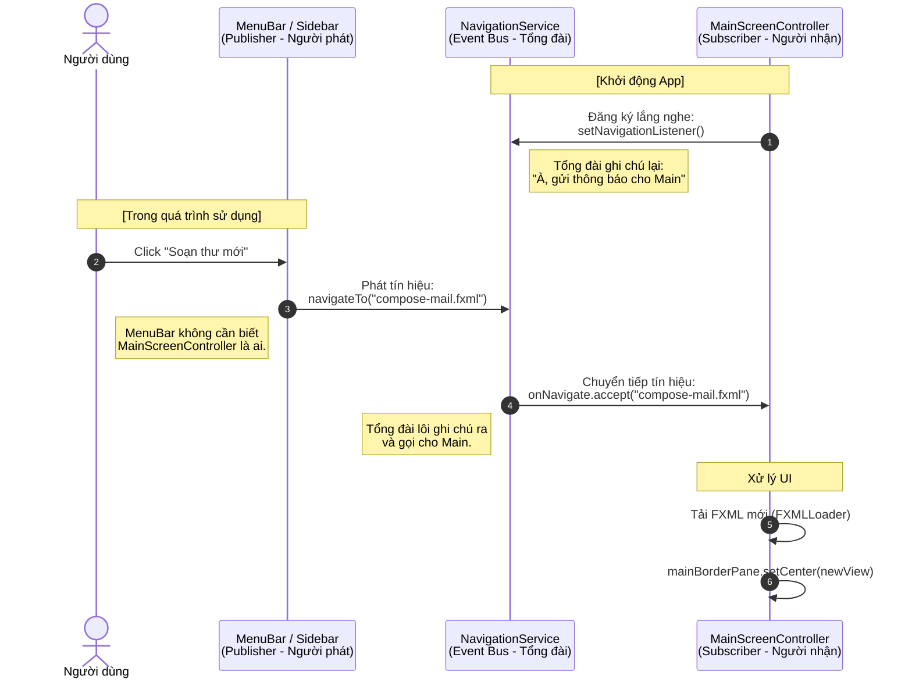

**Publisher - Subscriber** (Người phát - Người đăng ký), hay còn gọi là kiến trúc **Event Bus**.

Bạn có thể tưởng tượng `NavigationService` chính là một **Tổng đài viên**.
* **MainScreenController** là anh thợ chuyên thay màn hình, lúc nào cũng dặn dò: *"Có ai gọi thay màn hình thì hú tôi nhé"*.
* **MenuBar / Sidebar** là khách hàng, chỉ biết nhấc máy gọi Tổng đài: *"Tôi muốn xem trang Soạn Thư"*. Khách hàng không hề biết anh thợ tên gì hay ở đâu.

Dưới đây là sơ đồ trực quan hóa bằng Mermaid để bạn dễ hình dung dòng chảy của dữ liệu:

### Tại sao cơ chế này lại "thần kỳ" và tối ưu?

1. **Khử sự phụ thuộc (Decoupling):** Như bạn thấy trong sơ đồ, `MenuBar` (Publisher) gửi tín hiệu đi nhưng không bao giờ trỏ trực tiếp đến `MainScreenController` (Subscriber). Nhờ mũi tên đi qua `NavigationService`, bạn có thể xóa hẳn file `MainController` đi, viết lại một file mới, mà code ở `MenuBar` **không cần phải sửa một dòng nào**.
2. **Quyền lực của Singleton:** Vì `NavigationService` dùng mẫu thiết kế Singleton (chỉ có 1 bản sao duy nhất tồn tại trong suốt quá trình app chạy), nên dù bạn gọi `NavigationService.getInstance()` ở hàng trăm Controller khác nhau, chúng đều kết nối về đúng **một cái Tổng đài duy nhất**. Không có chuyện tín hiệu bị thất lạc.
3. **Mở rộng dễ dàng (Scalability):** Giả sử sau này bạn muốn khi đổi màn hình, app phải tự động phát một tiếng "Bíp" hoặc lưu lại lịch sử (History) để làm nút Back. Bạn chỉ cần sửa logic đúng ở một chỗ là bên trong hàm `MapsTo()` của `NavigationService`.

Kiến trúc này chính là nền tảng để các hệ thống lớn hoạt động mượt mà mà không bị rối rắm.

Bạn có muốn xem cách nâng cấp "Tổng đài" này để nó không chỉ truyền một cái tên màn hình, mà còn truyền được **cả một đối tượng Dữ liệu** (ví dụ: truyền chi tiết một bức thư từ danh sách Inbox sang trang Đọc thư) không?